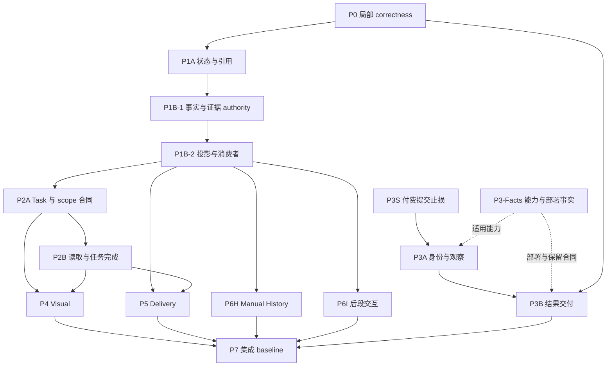

# Morpho Remediation Program Map

> 规划基线：2026-09-21，v1。范围、归属、依赖与停止规则在本文件收敛；所有 implementation package 均尚未开始。
> 当前 GitHub `main`：`0c04ec8e4c2a88023e845b731a2ae9bebbeb31d6`；本地 HEAD 相同，开始时工作区干净。
> 本文件是未来整改的执行地图，不是已实施架构，不是代码审计，也不是各 package 的完整 Implementation Plan。

## 1. 最终裁决与范围

现有材料足够冻结 remediation program，不需要新的专项审计，也不需要重新输入七份原审计。保留候选方案的主线，但作五项调整：

1. **P0 保持有界。** 合并无需新架构的底层和叶子 correctness fixes；涉及共享语义、schema、Runner 或 Provider 的问题仍归其领域 owner，不因为“代码少”塞入 P0。
2. **P1B 分为事实／证据 authority 与投影／消费者收敛两个 Plan。** 两者应由同一技术 owner 连续推进；前者在现有消费者上保留可运行适配，不交付无人使用的新模型。
3. **P2 分为 Task Contract 与读取／执行／完成闭环两个 Plan。** P2 定义逐动作目标与 scope，P4 消费并细化视觉语义；P2 消费 P1B 的事实资格，不另建 currentness。
4. **P3 独立为止损、执行身份与观察、结果交付三个 Plan。** Provider／宿主事实取证并行进行；不能让能力未知阻止安全止损，也不能把结果恢复并回整个 A+ 重写。
5. **P6 的人工历史与交互合同分开；P7 从第一包就提供验收规则，最后才建立正式 baseline。** 不把 Eval 平台建设放在开发前面。

共 **14 个可分别交付的主 Plan 单元**，另有一张 P3 事实前置清单、一项小型运维待办及 Deferred 清单。早期止损是所属 package 的有界里程碑，不重复登记为新缺陷或长期子系统。

Program goal：让既有产品任务在当前事实、实际输入、授权效果、本地保存、外部执行和交付之间保持一致；每个 package 能独立执行、复核和收口。

继续保留 Web / Next.js / React、browser-local Project Truth、tldraw projection、显式 domain actions、稳定对象／revision／DeliveryReference、single-Agent A+ 与现有确认边界。不上万能 Truth Service、Event Sourcing、第二 Runtime、通用 workflow engine 或新的长期任务事实库。

本地图接替 [2026-08 next-phase plan](./next-phase-implementation-plan-2026-08.md) 的后续工作排序；该文件中“下一步继续审计”等建议不作为本轮执行依据。已完成的历史工作不因此重新打开。

## 2. 证据基线与材料优先级

本轮直接核验了 `git ls-remote`、本地 Git identity、工作区、报告、canonical 索引及相关规则、关键模块位置和现有 CI 命令。`2e801ed..0c04ec8` **只新增下列两份 research 文档，共 881 行，没有源码、测试、依赖或 migration 变化**。因此现有审计可以作为当前代码的规划证据；没有逐项重新执行审计反例，也不声称重新验证了全部缺陷。

解释顺序：当前任务范围与 canonical 产品规则 → 当前实现事实 → 本地图对整改范围／依赖的裁决 → 对应审计的细节证据。发现真实冲突时只核验受影响合同，不重开全项目审计。

| Source ID | 材料与基线 | 用途 |
|---|---|---|
| CROSS | [Cross-Domain / C1–C11](../../temp/prompts/cross-domain-audit/Cross-Domain.md)，`2e801ed` | 去重问题、authority、引用生命周期、分阶段修复与兼容边界 |
| EXT | [External Side-Effect 完整报告](C:/Users/hasee/.codex/automations/1/audit-2026-09-21/review.md)，`2e801ed` | P3 的主要架构依据；优先于较早材料对外部幂等／取消的概括 |
| EVAL | [Real-World Project Eval](../research/real-world-project-eval-acceptance-architecture.md)，`2e801ed` | T1–T4、L0–L4、故障注入、归因、预算与停止条件；尚非已执行 gate |
| DESIGN | [Design Intelligence Review](../research/design-intelligence-capability-orchestration-review.md)，审查 `3e77491`，在 `0c04ec8` 入库 | F1–F7、Turn Task Contract 候选方向与正向可执行性 |
| TECH-A | [Foundational Review](C:/Users/hasee/.codex/visualizations/2026/09/20/01a0c00c-b6d3-7a01-b216-6f89bbf6f900/morpho-foundational-review-2026-09-21.md)，`2e801ed` | 事务 ACK 的实证、存储与提交边界演进、宿主限制 |
| TECH-B | [dr1.md](D:/Obsidian/Git/1/Morpho/dr1.md)，声明基线 `2e801ed` | 技术路线与 trigger 的第二判断；其中历史 filecite 标记不作为可独立追溯证据 |
| CANON | [Product index](../product/README_本次更新说明.md)、[Architecture index](../architecture/README.md)、[runbook](./runbook.md) | 产品 authority、现有实现与真实操作规范 |

外部／ignored 材料以本机路径定位，尚不具备另一台机器直接读取的条件。后续 session 在本机无需重索取；跨机器移交只携带当次 Plan 所需材料，不复制所有审计进本地图。精确文件指纹见文末。

两份底座报告的分歧裁决：TECH-A 建议较积极演进结构化存储，TECH-B 要求实测 trigger。共同确定的是当前事务 ACK 必须修复。近期采用“**ACK 立即修；整体迁移有优先级地暂缓**”。已知容量天花板与隔离容量实验不能等同于当前生产瓶颈；也不能把存储演进永久丢入无 owner 的 backlog。较旧性能数据不用于决定本轮迁移。

## 3. Work-package map

### 3.1 范围、修改面与独立验收

模块路径仅用于标识冲突面；文件级修改步骤在对应 Plan 冻结时依据新的 `main` 确定。

| ID / package | 包含什么；主要修改面 | 独立验收与停止点 |
|---|---|---|
| **P0 — Deterministic correctness** | IndexedDB transaction completion；重复 Gap ID；PPTX presentation 顺序；提取／二次截断元数据；多 query 来源限额分配。集中于 `indexedDbAssetStore.ts`、相关 ID builder、document parser 与 `webSearch.ts`。纯顺序／metadata 小修可同包分逻辑提交。 | request success 后 abort 不报保存成功，Assets／Recovery／restore 调用方正确收到失败；重复标签无重复 ID；顺序及覆盖元数据准确。事务语义用真实浏览器故障回归；不迁数据、不加存储依赖。 |
| **P1A — State / reference integrity** | 当前定义统一读取、空 Stage 清退、revision 不可变、事件“重复发生”和“重放”身份区分；删除／解绑／历史来源／pending dependency／stable reference 合同；现有 snapshot Undo 防覆盖。`workspace.ts`、`derivedState.ts`、validation、backup、相关领域命令与 `workspaceUndo.ts`。 | 合法动作后深校验、序列化往返及 Editable Backup 可恢复；保留历史和独立 AI／聊天编辑；隐藏当前定义不偷偷改用旧定义；Undo 危险路径显式阻止。此处不宣称完整 Undo/Redo 已完成。 |
| **P1B-1 — Truth / evidence authority** | 结构化 Decision effect、target/revision/currentness；语义声明替代／撤回／解决；来源解析及逐项 evidence qualification；Research item → conclusion 的真实证据继承；通用 Proposal 的 file/link/fragment 依赖 fingerprint 与应用检查；完整领域用例拥有引用与事件维护。`types.ts`、`decisionRecords.ts`、research／operations／source rules、schema migration。 | 对象事实、历史事件、已采用决定、候选和未知可区分；非法来源移除后不能继续 supported；Proposal 的相关来源变化不能漏判；迁移不反造历史；UI 与 Tool 路径到相同用例。提供已接入的领域查询及兼容适配。 |
| **P1B-2 — Projection / consumer convergence** | Memory、Stage、Continuity 逐项 scope／资格／review 元数据；统一当前事实读取；消除 Memory ↔ Continuity 循环；把领域投影完整性从偶然经过持久化 Hook 中移出。`projectMemory.ts`、`projectContinuity.ts`、`providerContextFrames.ts`、相关 consumers。 | 相同事实在 UI、Memory、Context、visual compiler、Delivery 读取一致；重复投影不制造等价 revision；A 方向偏好不流入 B；空投影清退；历史保留。领域各自解释后果，不收敛成通用 `isValid`。 |
| **P2A — Turn Task / scope / authority contract** | 小型内部任务合同：mixed intents、逐活动目标与来源、依赖读取、effect grants、预期产物；Strategy / Method / Context / Tool 一致；provider-visible tools 与本地 allowlist 同源；提取中立 Agent contract。`agentTaskStrategy.ts`、routing、authority、shared DTO、server provider contract。 | 至少一条真实既有 Runner 的 mixed-intent 路径接通；Compare A/B 与只用 A 生图范围分离；合法能力可执行，未授权能力不升级；简单任务无需复杂计划。不是只落 types，不新增调度器。 |
| **P2B — Input / reads / domain execution / fulfillment** | 实际输入清单和 coverage；对象／revision／document range／Delivery chapter／新图像素的有界读取；history/frame 裁剪、压缩后新请求重建；required reads；concept revise/split/merge 接线；基于真实回执的 task fulfillment。`agentTurnProductPreparationAPlus.ts`、read results、Tool executors、Runner、ProviderInputSnapshot。 | 检查最终请求及真实读取回执，不能只看准备对象；模型省略必读／生成／正确目标修订时不报完整完成；保留已有成果；已 terminal 不追加付费轮。新请求用更新后 Context，原请求恢复保持原 body。 |
| **P3S — Paid submission stop-loss** | 收紧 GrsAI、Text、Compaction 的 ambiguous POST retry、跨节点 fallback、SSE→buffered 再生成。修改 adapters 与必要的错误语义接线，覆盖共用 adapters 的 A+ 和独立入口。 | 模拟上游已接受但响应丢失／SSE 中断，不自动发第二笔生成；已有 partial effects 保留；未知与已确认失败区分。状态查询、同结果下载、同 settlement 的安全重试仍可用；不建设 escrow，不承诺 exactly-once。 |
| **P3A — Effect identity / execution observation** | logical effect + frozen request + Provider namespace；attempt 与 Provider task/response identity；先登记再观察；query/resume；未知与迟到成功；持久取消意图；可信 observation 写入；覆盖确认后非 A+ image 入口。相关 routes、Journal/RPC、adapters、recovery ports。 | 已知 task 在换实例／刷新后只观察同一执行；首次 id 丢失仍诚实未知；取消不等于退款或未执行；确认入口也具有稳定 effect identity。新旧记录／在途动作有版本兼容，不重跑历史 cleanup。 |
| **P3B — Result delivery / hosting contract** | Image/Text/Compaction 有限 escrow、redelivery、retention、访问控制、resultVersion/hash 与幂等 local ACK；Text tool claims 与结果共同形成可交付状态；Compaction 保留源基线；入口 body/duration 与部署合同一致。result store、handlers、client save/ACK 与 hosting config。 | Provider 完成、存储、Journal 绑定、传输、本地保存、ACK 各边界故障可解释；同结果重交付不重复本地效果或付费；没有持久结果不能声称可重交付。真实服务边界与宿主证据单独验收；不把 escrow 变成云端 Workspace。 |
| **P4 — Visual lineage / reference / observation** | 明确 identity parent、辅助 reference roles、exclusions、direction/branch；逐动作视觉范围；历史 Trace 因果；P2B 观察能力在视觉任务的接线。resolver、compiler、visual plan/generation metadata、relations/Trace。 | 重排辅助图不改变 parent/branch；明确排除有效；多参考仍可定位直接父版本；历史 Trace 不指向后来的图；实际像素与 provenance 一致；未观察不宣称验证。普通生图不自动批评／重生成。 |
| **P5 — Delivery / handoff** | Draft 生成时依赖基线与目标文案冲突；stable snapshots、refresh 后 copy review；Preparation／Context／Output 状态读取；引用排序、标题／隐藏／缺资产诊断与 archive 理由。`deliveryPreparation.ts`、draft 接线、delivery-output、archive。 | 原生成基线不在 Tool 返回时重采；旧 Draft 不覆盖后改文案；refresh 不偷偷改 caption；冻结素材不随源变化；输出准确呈现版本、依据、缺件及未验证内容。未证明的 provenance 标 unknown。 |
| **P6H — Manual History** | 用人工操作拥有的 before/after 变化集替代整份 Workspace 恢复；Undo/Redo 对称；导航返回独立；接入已确定的领域用例。`workspaceUndo.ts`、mutation/history controller、人工命令。 | 人工撤销不删除后来 AI 结果／消息、不重跑 Provider；相关字段后来被改时报告冲突；删除／恢复／状态／交付编辑可对称重做。默认会话内历史，不顺带新增持久历史服务。 |
| **P6I — Interaction contract** | 先修 overlay 快捷键归属、Proposal hide/discard、Delivery target 残留、Reader/Canvas selection 与 focus；后补 Cross 明确列出的 Research 推荐/保留、caption 审阅、Region 移动范围、异步注意力交接、按需关系／历史修订阅读、基础文本与整理合同。相关 UI/controller/tldraw surfaces。 | 真实组件 DOM／浏览器路径证明可见目标、选择与实际动作一致；推荐／摘录不自动确认结论；不偷改隐藏／淘汰语义；已列 canonical 场景逐项关闭。不扩展成工作台重设计。 |
| **P7 — Acceptance / baseline** | 先复用 EVAL 的独立 oracle、关键 checkpoint、故障与停止规则；每包增加最低成本切片；集成后建立 T1–T4 baseline、真实服务/模型/图像与人工接手证据。现有 tests/e2e、Eval-side artifacts。 | deterministic correctness 与设计质量分栏；失败可归因；记录全部尝试／预算／未运行项；足够证据即停止。没有真实模型／Journal／人工证据，不用 mock 冒充整体通过；不建立新产品 Runtime 或大型评估平台。 |

P0 中的“合并”指一个有界执行任务中分逻辑修改与验收，不代表不相关文件必须同一 commit。Reference ordering、archive reason、Delivery metadata 交给 P5；source qualification 交给 P1B-1，避免两包改同一解释规则。

### 3.2 复杂度、风险、模型与 Plan readiness

规模按修改面及回归面估计，不是工期承诺：S 为局部；M 为少量相关模块；L 为一个完整跨模块合同；XL 为多个独立架构决定。原 P1B/P2/P3 整包可达 XL，已拆分；不建议让一个 Agent 无中间验收连续完成整条 XL 主线。

Readiness：**A** Implementation-ready；**B** Existing plan needs repackaging；**C** Needs detailed Implementation Plan；**D** Needs additional factual prerequisite；**E** Deferred。B 仍需写清代码范围、兼容、验证和停止点，并非直接复制审计全文给 coding agent。

| ID | 规模 | 推理／架构难度 | 实施风险 | 当前准备度 | 编码模型建议 | Astra 先写详细 Plan？ | 长时间单 Agent |
|---|---|---|---|---|---|---|---|
| P0 | M | 低–中 | 中，ACK 影响保存链 | A | 普通／经济 | 不需要，普通整理执行 Prompt | 适合 |
| P1A | L | 中–高 | 高，引用与旧数据 | B | 中高能力 | 不强制；按 Cross 1A 重包装 | 适合，冻结已知状态合同 |
| P1B-1 | L | 高 | 高，authority/schema | C | 顶级 | **需要** | 适合此单包，和下一包同 owner 优先 |
| P1B-2 | L | 高 | 高，多消费者投影 | B | 中高能力 | **建议和 P1B-1 联合审定共享合同**，本包细节 JIT | 适合；不要与前包双写共享模块 |
| P2A | L | 高 | 高，合法能力与授权 | C | 顶级 | **需要** | 适合此单包 |
| P2B | L | 高 | 高，输入/续轮/完成 | C | 顶级；稳定后的 adapter 接线可中高 | **需要** | 适合，按读取到结果闭环设内部里程碑 |
| P3S | M | 中–高 | 高，付费与失败语义 | B | 中高能力 | 不强制，EXT 足够确定保守止损 | 适合 |
| P3A | L | 高 | 高，分布式状态/DB 兼容 | C；能力及生产部分受 D 限制 | 顶级 | **需要** | 适合代码工作；外部合同取证另列 |
| P3B | L | 高 | 高，结果保留/ACK/迁移 | C；部署/retention 选择受 D 限制 | 顶级 | **需要** | 适合代码工作；部署验证分界明确 |
| P4 | L | 中–高 | 高，lineage 与兼容 | B | 中高能力 | 不强制，依赖冻结后重包装 Cross 3B | 适合 |
| P5 | L | 中–高 | 高，覆盖和交付误报 | B | 中高能力 | 不强制，依赖冻结后重包装 Cross 3C | 适合 |
| P6H | L | 高 | 高，撤销误伤独立写入 | B | 中高能力 | 不强制，已有变化集方向；合同冲突才升级 | 适合，同一 history owner 连续执行 |
| P6I | L，止损段 M | 中 | 中，动作/目标语义 | B | 中高能力；局部 DOM 小修可普通 | 不需要 | 适合两个有界里程碑 |
| P7 | M，执行周期可长 | 中–高，主要在 oracle/归因 | 中，错误验收结论 | B | 中高能力；产物整理可普通 | 不需要，现有 EVAL 已完整 | 工具接线适合；人工设计验收不能由 Agent 代签 |
| P3-Facts（非编码包） | S–M | 事实核实 | 错误承诺风险高 | D | 普通／中高 + 权威来源 | 不需要新的架构审计 | 有访问资料即可完成 |
| Deferred Infrastructure | 尚不估实施规模 | 由 trigger 决定 | 迁移通常高风险 | E | 不分配 coding model | 不写详细 Plan | 不启动 |

模型建议基于推理与回归面，不基于“重要就用最贵”。Astra 的价值集中在新合同与跨系统兼容；不是每次小修、每个 review 都需要 Astra。

## 4. 早期止损与 Plan 冻结时机

不能把所有 C2/C3/C4/C6/C8/C10 问题推迟到完整架构包。下面先关闭可确定的失败，再让后续包接替其 owner；停止点必须明确，不能趁止损提前创建整套新 schema。

| 时机 | 现在可写／冻结的内容 | 后续如何接替 |
|---|---|---|
| **立即** | P0 完整执行 Prompt；P1A 完整有界 Plan；P3S 完整止损 Plan；P6I 首段动作/目标止损 Prompt | 四者有现成目标和反例。共享文件按 owner 合并，不能为追求并行改变同一 mutation 分支。 |
| **立即，作为 P2B 前置里程碑** | Delivery chapter 快照真正入请求／读取；history/context 保留与截断披露；Fragment 实际覆盖；压缩后新请求重建；已明确 required reads 缺失时诚实未完成 | 只接既有语义，不先发明 mixed-intent 合同。首轮／合法 Tool 阶段取得读取，终态后不补付费轮；最终 P2B 将这些路径接入统一 coverage/obligation 合同。 |
| **立即，作为 P4 前置里程碑** | 显式参考排除；必需参考像素不可读时阻止对应生成，避免 metadata 声称有图而实际没有 | 暂不重建 identity parent/branch。与 P2B 在 `workspaceVisualGenerationExecution.ts` 的改动串行集成。 |
| **立即，作为 P5 前置里程碑** | 使用已有 fingerprint 做 Draft stale/apply 防覆盖；旧记录缺可靠基线则可读但限制应用 | 不在结果返回时伪造生成基线。新的冻结依赖、文案 review 与迁移留到 P5。 |
| **立即，作为 P1B-1 前置里程碑** | 非法/不可用来源过滤后的 supported 资格止损；可以用现有来源身份可靠收窄的 scope 泄漏 | 不猜造逐项 evidence 关系；无法可靠收窄的内容明确不可用／需复核，完整来源模型由 P1B-1 建立。 |
| **现在只定合同方向** | P1B 的事实种类/查询输出、P2 的 task/scope ownership、P3 的不确定性及结果事实轴；P7 的证据格式/初始反例 | 可提前由 Astra 梳理架构约束，但不冻结后续文件级步骤。材料充分不等于基线不会改变。 |
| **P1A 及相关止损合并后** | Astra 冻结 P1B-1；其接口与兼容验收通过后，冻结 P1B-2 | 不在两个并行分支分别设计 Decision/source schema。 |
| **P1B 查询/投影合同落地后** | Astra 冻结 P2A；之后在新 `main` 冻结 P2B | P2A 不建立另一套 Project Truth；P2B 不继续沿用过时 resolver 行为。 |
| **P3S 合并 + 事实清单到位后** | Astra 冻结 P3A；P3A result identity/observation 合同落地后冻结 P3B | 若 Provider 无强保证，仍可按保守能力分支 Plan；不能等待一个未必存在的幂等 SLA 才做本地修复。 |
| **对应领域合同落地后** | P4/P5/P6H/P6I 后段重包装已有 Cross 方案 | 接受前置实际导出的合同，重读受影响原审计，不重新设计全系统。 |
| **集成进入收口** | P7 正式 baseline 执行 Plan、预算、fixture/rubric 版本和必跑范围 | 事先保留的失败 fixture/旧 baseline 用作对照；不能到最后才开始收集证据。 |

上述前置里程碑可用短 Prompt 执行并独立验收。它们不是 P2B/P4/P5/P1B-1 整包 accepted；在 package 记录中标记“early slice accepted + commit”，完整包只关闭剩余义务。P0 等包已经关闭的问题不被后续 Plan 再登记一次。

## 5. 依赖与推荐执行顺序

下图表达完整包验收所需的主要依赖；领域代码可在约定接口冻结后提前推进，最终接线仍要等待对应生产实现。

P7 的场景、oracle 与证据规则从最开始使用，因此不是图中所有前置都完成后才启动 P7。P6I 的第一段 UI 止损也可从最开始执行；图中的 P6I 节点指完整交互包收口。

推荐波次：

1. **止损与证据**：P0、P1A、P3S、P6I 首段，穿插上一节的输入／参考／Draft／资格止损；并行收集 P3-Facts，为每个修复保留原失败 fixture 与验收切片。P0 的事务 ACK 先于依赖它的 durability 结论。
2. **建立共享事实合同**：P1B-1 → P1B-2。独立的 P3A 可同步推进；领域与 Journal 不共用一套 schema。
3. **建立任务合同**：P2A → P2B。P6H 可沿稳定领域用例推进；P3B 沿外部执行线推进。
4. **消费合同完成领域闭环**：P4、P5、P6I 后段。P4/P5 的领域部分可与 P2B 并行，最终实际输入／观察接线在 P2B 后验收。
5. **集成收口**：P7 的完整 trajectory、隔离真实服务边界、受预算约束的真实模型／图像、人工接手；修复本 program 的回归，达到预登记门槛即停止。

只有一个 coding agent 时，按上述波次串行，并尽早完成 P3S；不要等 P2/P4 做完才处理未知付费重试。有多个 agent 时，也不按编号机械地“全都并行”。

### 并行必须遵守的 ownership

| 重叠面 | 单一 owner / 并行方式 |
|---|---|
| `types.ts`、workspace schema、Decision/source/revision migration | P1B owner；后续 schema 修改各自独立提交并顺序分配版本，不在两分支抢同一 schema version |
| `projectMemory.ts`、`projectContinuity.ts`、持久化投影入口 | P1B-1/2 连续 owner；P2 只通过已冻结的读取接口接入 |
| Strategy、Task Contract、scope、authority、neutral DTO | P2A owner；P4 贡献视觉 role/parent 约束，不再定义另一套任务 scope |
| preparation、read tools、Runner、completion | P2B owner；P3 通过执行/交付 ports 接入。改同一 Runner/recovery 文件时串行合并 |
| visual resolver/compiler/execution metadata | P4 owner；P3 负责 paid effect/result envelope，P2 负责通用读取与任务义务；交叉文件一次一个 owner |
| Delivery draft/refresh/output | P5 owner；P2 传入生成时 input/baseline，P5 判定 domain applicability；P6I 只改可见目标与动作接线 |
| Undo history 与 domain mutation controller | P6H owner；P6I 不另建历史栈；P1A 的 guard 被新历史机制接替 |
| Journal/RPC、Provider adapters、result escrow | P3 owner；不由 P2 顺手修改 terminal/paid retry 协议 |

可并行的是不同责任面的实现，不是两个 agent 同时编辑核心文件。每次移交记录实际 accepted commit 与接口，不依赖聊天记忆。这里只规定未来协作方式，本轮没有启动子 Agent。

## 6. 六个必须冻结的跨包边界

1. **事实与读取资格归 P1B。** existence、visibility、revision、fingerprint、evidence qualification 可共享；Proposal applicability、Delivery freshness、asset availability 由各领域解释。确认采用不等于证据为真。
2. **任务和动作 scope 归 P2A。** 区分讨论集合、比较集合、修改目标、来源集合、reference roles、exclusions 和 effect grants。P4 只定义视觉 parent/role/branch 的领域含义。
3. **实际输入归 P2B 的材料化边界。** 最终 input manifest 关联实际文本覆盖与图片表示；P4 补视觉语义，P5 提供冻结 Delivery snapshot。按生成时事实记录，不从最新 Workspace 事后补写。
4. **三种完成事实分别保留。** P3：外部执行／交付；现有本地 Lifecycle：effect 与持久化 outcome；P2：用户任务义务 fulfillment。它们互相引用回执，不通过一个 success 布尔值互相推断。
5. **P3 的结果内容与 P1B 的项目事实分开。** escrow 只解决同次执行重交付；本地 apply/confirmation/currentness 仍由 domain 管理。ACK 只能在相应资产／项目保存合同满足后发出，不以 HTTP send 或 React render 代替保存。
6. **P7 只观察被测系统。** 独立 truth oracle 从场景事实和实际用户事件形成，不调用被测 projection 生成“标准答案”；完整 wire inputs 与故障证据可存于 Eval artifacts，不新增产品长期 raw payload 库。

P3B 的 bounded result retention 是本次可靠性需求的组成部分，不归 Deferred 的“通用 Blob GC”。P1B 的领域用例/投影完整性同样不等于 Deferred 的 React commit boundary 重构。

## 7. D 类事实前置项与 Deferred

### 7.1 P3-Facts：现在可取证，不是新 Audit

| 事实 | 足够的输入 | 阻止什么；不阻止什么 |
|---|---|---|
| 实际 GrsAI / AiJWS 能力 | 当前具体 endpoint/account scope 对应的文档或明确答复：执行/计费幂等、client-key lookup、task/response retrieve、保留期、跨节点 scope、cancel、relay 自身 retry | 阻止无依据的安全 resubmit/retrieve/cancel 承诺；不阻止 P3S、身份记录、已知 task 查询、结果已到 Morpho 后的 escrow。未知能力按不具备保证处理。 |
| 生产 hosting contract | 当前 deployment→commit、runtime/plan、Fluid/maxDuration/cancellation、实际请求／响应通道限制；一次有界隔离环境验证 | 阻止冻结最终部署参数及生产可靠性验收；不阻止本地模拟和宿主无关逻辑。不能由仓库 timeout 常量推断宿主能力。 |
| 当前 Journal contract | 目标环境已应用 migrations、RPC 签名/grants、writer authority 与在途记录兼容范围 | 阻止可靠 SQL rollout Plan 与生产通过声明；不阻止基于仓库 schema 设计 additive migration。沿用现有隔离环境 gate，不在生产注入故障。 |
| escrow 的容量／retention／隐私合同 | 实际存储可用性、访问/删除方式、预期结果大小与产品允许的保留窗口；缺少时由 Plan 明确选择 bounded policy | 阻止生产启用和清理承诺；不需要建设项目云存储或完整成本系统。 |

不需要现在向用户索取所有这些信息才能完成 Program Map。未来写 P3 详细 Plan 时，只对无法从已有配置、平台只读接口或 Provider 资料获得的具体事实提问。无保证可选择保守降级；必需部署事实缺失则相应项保持 blocked/not_run，不能伪造验收。

### 7.2 两类基础设施不混在一起

| 项目 | 当前裁决 | 重新进入条件 |
|---|---|---|
| whole-workspace localStorage → async document persistence | **E，有优先级地暂缓**；保留现有 DTO/backup，不先正规化 | 当前真实项目的 quota/save blocking/load growth 已影响承诺，或近期容量需求明确超出现有可支持边界；用相同源码基线测量，并同步检查 backup/restore 能力 |
| React commit boundary | **E**，保留纯 transforms/session guards | 异步保存使现有 sync ACK 合同必须演进，或当前 profile/正确性证据直接指向该边界；与存储演进共同 Plan |
| 通用 local Blob lifecycle / GC、预览资源治理、流式大备份 | **E** | 孤儿积累、内存/预览/导出规模已可测地阻碍使用；先明确 ownership，不能以未知引用为理由删除 |
| OPFS / SQLite、Desktop/PWA、CRDT/cloud sync | **E** | 对应文件 I/O、查询、原生能力、离线入口或协作成为实际需求；不能仅由“项目复杂”触发 |
| durable worker / workflow | **E** | 关页后必须持续执行／回收将过期结果，或已验证单 invocation 无法满足现有效果保障；最小 worker 可独立评估，不默认迁整个 A+ |

### 7.3 已知运维缺项：CI enforcement

TECH-B 已提出 branch protection 缺失。本轮 GitHub API 仍返回 `main.protected=false`，分支适用 rules 列表为空；`.github/workflows/quality.yml` 已包含工程、浏览器、Cloudflare backup build。这是已有发现的现状核验，没有扩展安全审计。

将它登记为 **O1：S / A / 普通模型，一次独立运维配置任务**：确认现有 checks 名称与合并方式，再配置对应 enforcement。它不是新架构包，也不阻塞本地 remediation；各包仍以已有检查结果作为验收证据。本轮只读核验，不修改 GitHub 设置。

## 8. 覆盖账本与未来应读取的原报告

### 8.1 已知问题没有遗失，也不重复建账

| 来源 | 主要 owner | 配合／验收消费者 |
|---|---|---|
| C1 当前事实、决定、Stage | P1A 止损 → P1B-1/2 | P2B、P4、P5 读取同一 authority |
| C2 实际输入缺失 | P2B；parser 叶子项 P0 | P4 必需像素；P5 章节快照 |
| C3 scope/evidence qualification | P1B-1/2 | P4 compiler；P2B coverage；P6I 不代用户保留结论 |
| C4 Proposal/Draft baseline | Delivery Draft → P5；通用 Proposal 依赖与适用性 → P1B-1 | P2B 冻结生成时输入；P2A 目标 binding |
| C5 删除与引用 | P1A | P5 stable snapshot；P6H inverse action |
| C6 reference/identity/lineage | P4 | P2A task scope；P2B observation |
| C7 revision/Undo | P1A 保护 → P6H | P1B 用例；P6I 表面归属 |
| C8 任务完成 | P2B | P2A obligations；P3 真实执行/交付回执 |
| C9 external retry | P3S → P3A/3B | 不重复放回 P2 Runtime rewrite |
| C10 interaction/target | P6I | P2A task binding；P5 apply/read contract |
| C11 ownership | P1B-1/2、P2A/2B 在相应修改内关闭 | parser adapters 随 P0/P2B 文档工作处理；不另设目录迁移项目 |
| DESIGN F1/F2 | P2A | mixed intents、method/tool/authority 一致 |
| DESIGN F3/F4/F6/F7 | P2B | P1B evidence、P5 Delivery applicability |
| DESIGN F5 | P2A + P4，读取基础在 P2B | 每动作 reference roles、新图观察 |
| EXT 1–7 及可信 settlement | P3S、P3A、P3B | 含非 A+ image、Text、Compaction、host；保留 Search 的不同策略 |
| TECH-A/B ACK | P0 | 本地 assets、restore、Recovery 与 P3B local ACK |
| CROSS 叶子问题 | Gap/PPTX/truncation/query allocation → P0；reference order/archive reason/Delivery metadata → P5 | archive reason 在 P1B 结构化 Decision 后读取正确原因，不延续 summary 猜测 |
| EVAL T1–T4、stopping | P7，自各包开始使用 | 不用评估平台替代整改 |
| TECH-B CI enforcement | O1 | 单独运维项，不变成新的审计主题 |

### 8.2 原专项按需读取

七份原专项已在本机 `temp/prompts/cross-domain-audit/`，本轮只核验索引与存在性，没有重新阅读七份全文。Cross 足以做本地图；未来 Plan 对需要的细节定点回读：

| 原专项 | 真正需要回读的 Plan | 为什么 |
|---|---|---|
| [02 Project Truth](../../temp/prompts/cross-domain-audit/02_project-truth-audit.md) | P1A、P1B-1/2 | 历史记录、revision、Decision、来源及迁移的具体反例 |
| [05 Research / Evidence](../../temp/prompts/cross-domain-audit/05_research-evidence-audit.md) | P1B-1、P2B；P0 的 parser 部分按需 | item/evidence 身份、promotion、长文/fragment 与提取覆盖细节 |
| [01 Agent Harness](../../temp/prompts/cross-domain-audit/01_agent-harness-audit.md) | P2A/2B | 原 required reads、continuation、input/trace 场景；与 DESIGN 的新合同方向合看 |
| [04 Visual Intelligence](../../temp/prompts/cross-domain-audit/04_visual-intelligence-audit.md) | P4 | parent/branch/多参考/历史 Trace 的反例与兼容边界 |
| [07 Delivery / Handoff](../../temp/prompts/cross-domain-audit/07_delivery-handoff-audit.md) | P5 | 基线、冻结引用、review/freshness、输出及 archive 的完整场景 |
| [06 Workspace / Canvas](../../temp/prompts/cross-domain-audit/06_workspace-canvas-audit.md) | P6H/P6I | Undo 支持矩阵、DOM/快捷键/selection、Region/阅读返回等交互细节 |
| [03 Modularity](../../temp/prompts/cross-domain-audit/03_modularity-dependency-audit.md) | 一般无需全文重读；仅 P1B/P2 真遇到依赖提取疑点时定点查 | Cross 已明确要做的 ownership 修复，并否决完整目录树搬迁；不恢复旧拆目录建议 |

P0 普通叶子修复、P3、P7 无需把七份原审计作为日常输入。P3 以 EXT 为主；P7 以 EVAL 为主；已关闭的原审计条目保留来源链接即可。未来遇到报告与新 `main` 不一致，只核对该 package 的调用链和反例。

## 9. Program Map 的维护与验收规则

### 9.1 为什么放在 operations

本文件位于 `docs/operations/remediation-program-map.md`，因为跨任务、跨 session、跨分支的依赖与关闭记录需要随仓库版本化。`temp/` 被 `.gitignore` 排除，适合一次性的执行 Prompt、探索笔记和大体积临时证据，不适合作为唯一总地图。

本地图不写进 `architecture.md` 的“当前已实现”章节。对应代码和决定真正成立后，各 package 才更新 architecture/decisions/runbook 的相关事实。详细 Plan 可在执行时创建；需要长期复审的冻结 Plan 放在 `docs/operations/remediation/`，临时 coding prompt 留在 `temp/prompts/`。本轮不创建空的子 Plan 或目录模板。

### 9.2 只维护这些信息

- Program goal、范围、保留路线、Deferred/closed 决策与具体重开 trigger。
- 稳定 package ID、来源 finding IDs、owner、依赖及共享合同 owner。
- Readiness、状态、下一项真实 prerequisite；区分局部里程碑与完整包。
- Plan path/version、基线 SHA、contract version、允许修改范围。
- 实际 accepted commit、acceptance source（测试/轨迹/报告）、运行身份与未验证边界。
- 每个包的停止条件、兼容/回退约束、跨包移交信息。

不复制审计全文、实现代码、每次聊天记录、完整测试日志或未来未成立的架构。来源文件使用链接和指纹；执行证据只保留入口。

### 9.3 当前执行账本

全体初始状态为 `not_started`，Plan path 和 accepted commit 为 `—`；上表 A/B/C 是准备度，不是已开工、已批准生产操作或已验收。每个 ID 在实际启动时补齐下列一行即可，不预先生成 14 份空文档：

| Package / milestone | Status | Owner | Base SHA / contract | Plan path | Accepted commit | Acceptance source / limits |
|---|---|---|---|---|---|---|
| P0, P1A, P1B-1, P1B-2, P2A, P2B, P3S, P3A, P3B, P4, P5, P6H, P6I, P7 | not_started | 未分配 | `0c04ec8`，待各自开工再绑定 | — | — | 本地图仅完成规划 |
| P3-Facts | not_started（D） | 未分配 | EXT 中明确的未知项 | — | — | 不阻止止损 |
| O1 | not_started | 未分配 | 本轮只读核验 | — | — | 未修改远端设置 |
| Deferred Infrastructure | deferred | Program owner 跟踪 trigger | 见第 7 节 | — | — | 无迁移开工条件 |

实际推进后按 ID 拆成独立行，保留 early slice 的 accepted commit。建议状态限于 `not_started / planning / ready / implementing / validating / accepted / accepted_with_limits / blocked / deferred`。`accepted_with_limits` 必须列出不影响该包承诺的剩余限制；关键证据缺失不允许伪装为有限验收。

### 9.4 所有包共同的 compatibility 与停止条件

1. 写 Plan 时绑定新的 `main`，明确原失败、范围、必跑相邻变体、允许结束状态与测试预算；对照前包 accepted commit，不沿用旧行号盲改。
2. 持久化变化要明确旧 schema/Backup 可读、迁移幂等、原始数据保护、fixture/recovery 同步及回退方式。历史无法还原的输入、观察、确认和 Decision 保持 unknown；旧 Draft 缺基线不补造。
3. Workspace schema、Server Journal schema、Provider capability contract 是三个版本边界。前向 additive Journal 演进保护在途 action；**不重跑已完成的 Runtime B cleanup**。代码回退不等于旧代码可以写新 schema。
4. 每包证明原失败及有意义相邻变体已关闭，执行受影响 deterministic/browser gate；涉及共享合同/schema/集成时按现有项目 gate 扩展。现有命令入口包括 `npm.cmd test -- ...`、`npm.cmd run typecheck`、`npm.cmd run lint`、`npm.cmd run build`、`npm.cmd run test:e2e`；Cloudflare backup build 按既有 CI 运行，不要求每个小修改重复全部 gate。
5. P2 的模型能力、P4 的图像保真、P5 的交接可用性，与工程 correctness 分栏。按 EVAL 选择 L2/L3/L4，并在运行前冻结预算与次数；无真实证据记 not_run/blocked，不以 mock 顶替。L1b 验证真实 routes/Journal，浏览器 API mock 不覆盖这一层。
6. 原失败修复、相邻回归通过、真实限制与 accepted commit 已记录，即关闭该包。不为增加绿勾重复测试，不自动加最后一轮审计。新发现只有确实阻断本包正确性时纳入，否则单独登记。
7. Program 完成不是“所有未来能力都实现”。近期已承诺包按其冻结验收范围收口，P7 给出分层 release 结论；Deferred 保持 deferred，不能用继续加机制代替停止。

## 10. 本轮验证记录与来源指纹

本轮已运行：`git ls-remote origin refs/heads/main`、`git rev-parse HEAD origin/main`、`git status --short --branch`、`git diff --stat/name-only 2e801ed..HEAD`、`gh api repos/Whatnamed/Morpho/branches/main`、`gh api repos/Whatnamed/Morpho/rules/branches/main`、定点 `rg`/PowerShell 读取及 SHA-256。确认远端/本地一致、基线以来只有两份 research 文档变化、关键修改面仍存在。

没有修改代码、测试、依赖、产品规则、数据库或部署；没有执行 paid Provider、重新运行审计测试、lint/typecheck/build/浏览器测试。本文新增后的检查仅覆盖文档链接、问题覆盖和 diff 格式，不算整改或产品验收。

| 文件 | SHA-256（2026-09-21 本轮读取） |
|---|---|
| CROSS | `87999813c9190dcfca8715afb5cdcd2e9c8d7cd729bcd059746987e326c58f3f` |
| EXT | `beab16efcd1f536cca8f6ea758a6ab0a7d4ec7910982a6e56fc4ee1dc1fb8bba` |
| TECH-A | `86a41297911999cbe4760377d3638a0af91b9ad9f1472a72f0c54788b319491d` |
| TECH-B | `27d93e6ae93e0d69a10f1fdadcea7fd4bdca20fc2aab00cbab3311dfcb6918ad` |

EVAL 与 DESIGN 按本文件首部 Git SHA 的仓库内容定位。EXT 的实际文件是 `audit-2026-09-21/review.md`，不是最初提供的 `review/.md`。
