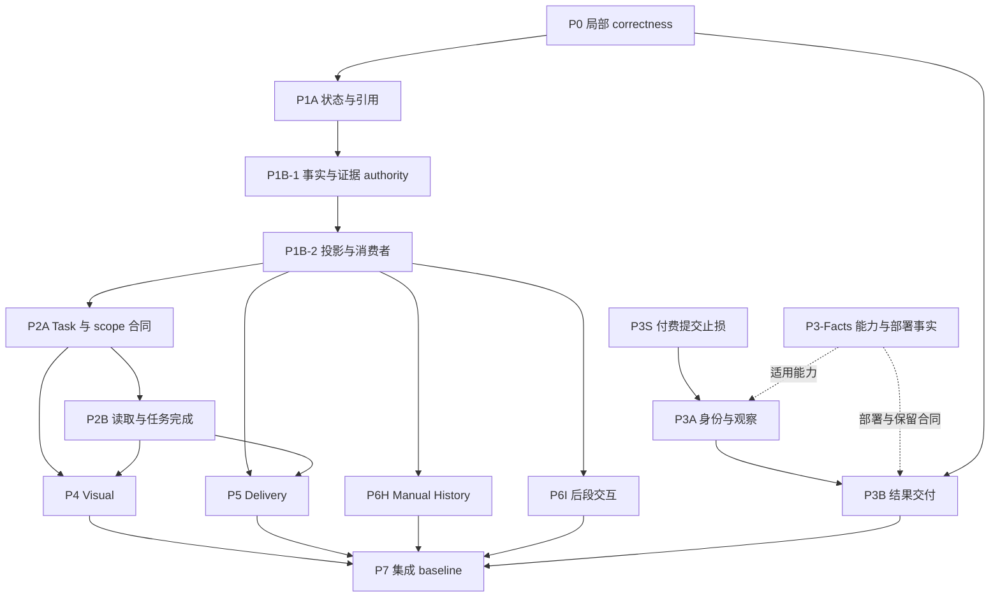

# Morpho Remediation Program Map

> 规划基线：2026-09-21，v1。范围、归属、依赖与停止规则在本文件收敛；所有 implementation package 均尚未开始。
> Program planning code baseline：`0c04ec8e4c2a88023e845b731a2ae9bebbeb31d6`（与前一审计基线 `2e801ed` 相比仅新增两份 research 文档，无源码、测试、依赖或 migration 变化，故用作规划输入；Program Map 自身在后续 commit 提交，不硬编码动荡的“当前 main”；各 package 启动时重新绑定当时最新 `main`）。
> 本文件是未来整改的执行地图，不是已实施架构，不是代码审计，也不是各 package 的完整 Implementation Plan。

## 1. 最终裁决与范围

现有材料足够冻结 remediation program，不需要新的专项审计，也不需要重新输入七份原审计。保留候选方案的主线，但作五项调整：

1. **P0 保持有界。** 合并无需新架构的底层和叶子 correctness fixes；涉及共享语义、schema、Runner 或 Provider 的问题仍归其领域 owner，不因为“代码少”塞入 P0。
2. **P1B 分为事实／证据 authority 与投影／消费者收敛两个 Plan。** 两者应由同一技术 owner 连续推进；前者在现有消费者上保留可运行适配，不交付无人使用的新模型。
3. **P2 分为 Task Contract 与读取／执行／完成闭环两个 Plan。** P2 定义逐动作目标与 scope，P4 消费并细化视觉语义；P2 消费 P1B 的事实资格，不另建 currentness。
4. **P3 独立为止损、执行身份与观察、结果交付三个 Plan。** Provider／宿主事实取证并行进行；不能让能力未知阻止安全止损，也不能把结果恢复并回整个 A+ 重写。
5. **P6 的人工历史与交互合同分开；P7 从第一包就提供验收规则，最后才建立正式 baseline。** 不把 Eval 平台建设放在开发前面。

共 **14 个可分别交付的主 Plan 单元**，另有一张 P3 事实前置清单、一项可选流程决策（O1，非阻塞）及 Deferred 清单。早期止损是所属 package 的有界里程碑，不重复登记为新缺陷或长期子系统。

Program goal：让既有产品任务在当前事实、实际输入、授权效果、本地保存、外部执行和交付之间保持一致；每个 package 能独立执行、复核和收口。

继续保留 Web / Next.js / React、browser-local Project Truth、tldraw projection、显式 domain actions、稳定对象／revision／DeliveryReference、single-Agent A+ 与现有确认边界。不上万能 Truth Service、Event Sourcing、第二 Runtime、通用 workflow engine 或新的长期任务事实库。

本地图接替 [2026-08 next-phase plan](./next-phase-implementation-plan-2026-08.md) 的后续工作排序；该文件中“下一步继续审计”等建议不作为本轮执行依据。已完成的历史工作不因此重新打开。

## 2. 证据基线与材料优先级

本轮直接核验了 `git ls-remote`、本地 Git identity、工作区、报告、canonical 索引及相关规则、关键模块位置和现有 CI 命令。`2e801ed..0c04ec8` **只新增下列两份 research 文档，共 881 行，没有源码、测试、依赖或 migration 变化**。因此现有审计可以作为当前代码的规划证据；没有逐项重新执行审计反例，也不声称重新验证了全部缺陷。

解释顺序：当前任务范围与 canonical 产品规则 → 当前实现事实 → 本地图对整改范围／依赖的裁决 → 对应审计的细节证据。发现真实冲突时只核验受影响合同，不重开全项目审计。

| Source ID | 材料与基线 | 用途 |
|---|---|---|
| CROSS | [Cross-Domain / C1–C11](../research/remediation-audits/cross-domain-coherence-remediation.md)，`2e801ed`（原产生位置：`temp/prompts/cross-domain-audit/Cross-Domain.md`） | 去重问题、authority、引用生命周期、分阶段修复与兼容边界 |
| EXT | [External Side-Effect 完整报告](../research/remediation-audits/external-side-effect-provider-reliability.md)，`2e801ed`（原产生位置：`C:/Users/hasee/.codex/automations/1/audit-2026-09-21/review.md`） | P3 的主要架构依据；优先于较早材料对外部幂等／取消的概括 |
| EVAL | [Real-World Project Eval](../research/real-world-project-eval-acceptance-architecture.md)，`2e801ed` | T1–T4、L0–L4、故障注入、归因、预算与停止条件；尚非已执行 gate |
| DESIGN | [Design Intelligence Review](../research/design-intelligence-capability-orchestration-review.md)，审查 `3e77491`，在 `0c04ec8` 入库 | F1–F7、Turn Task Contract 候选方向与正向可执行性 |
| TECH-A | [Foundational Review](../research/remediation-audits/foundational-technology-architecture-review.md)，`2e801ed`（原产生位置：`C:/Users/hasee/.codex/visualizations/.../morpho-foundational-review-2026-09-21.md`） | 事务 ACK 的实证、存储与提交边界演进、宿主限制 |
| TECH-B | [Foundational Review dr1](../research/remediation-audits/foundational-technology-architecture-review-dr1.md)，声明基线 `2e801ed`（原产生位置：`D:/Obsidian/Git/1/Morpho/dr1.md`） | 技术路线与 trigger 的第二判断；其中历史 filecite 标记不作为可独立追溯证据 |
| CANON | [Product index](../product/README_本次更新说明.md)、[Architecture index](../architecture/README.md)、[runbook](./runbook.md) | 产品 authority、现有实现与真实操作规范 |

核心调查与审计材料已归档至仓库 `docs/research/remediation-audits/`，未来仅 clone GitHub 仓库即可完整解析。原始生成位置作为历史 provenance 记录备查。精确文件指纹见文末。

两份底座报告的分歧裁决：TECH-A 建议较积极演进结构化存储，TECH-B 要求实测 trigger。共同确定的是当前事务 ACK 必须修复。近期采用“**ACK 立即修；整体迁移有优先级地暂缓**”。已知容量天花板与隔离容量实验不能等同于当前生产瓶颈；也不能把存储演进永久丢入无 owner 的 backlog。较旧性能数据不用于决定本轮迁移。

## 3. Work-package map

### 3.1 范围、修改面与独立验收

模块路径仅用于标识冲突面；文件级修改步骤在对应 Plan 冻结时依据新的 `main` 确定。

| ID / package | 包含什么；主要修改面 | 独立验收与停止点 |
|---|---|---|
| **P0 — Deterministic correctness** | IndexedDB transaction completion；重复 Gap ID；PPTX presentation 顺序；提取／二次截断元数据；多 query 来源限额分配。集中于 `indexedDbAssetStore.ts`、相关 ID builder、document parser 与 `webSearch.ts`。纯顺序／metadata 小修可同包分逻辑提交。 | request success 后 abort 不报保存成功，Assets／Recovery／restore 调用方正确收到失败；重复标签无重复 ID；顺序及覆盖元数据准确。事务语义用真实浏览器故障回归；不迁数据、不加存储依赖。 |
| **P1A — State / reference integrity** | 当前定义统一读取、空 Stage 清退、revision 不可变、事件“重复发生”和“重放”身份区分；删除／解绑／历史来源／pending dependency／stable reference 合同；现有 snapshot Undo 防覆盖。`workspace.ts`、`derivedState.ts`、validation、backup、相关领域命令与 `workspaceUndo.ts`。 | 合法动作后深校验、序列化往返及 Editable Backup 可恢复；保留历史和独立 AI／聊天编辑；隐藏当前定义不偷偷改用旧定义；Undo 危险路径显式阻止。此处不宣称完整 Undo/Redo 已完成。 |
| **P1B-1 — Truth / evidence authority** | 结构化 Decision effect、target/revision/currentness；语义声明替代／撤回／解决；来源解析及逐项 evidence qualification；Research item → conclusion 的真实证据继承；通用 Proposal 的 file/link/fragment 依赖 fingerprint 与应用检查；完整领域用例拥有引用与事件维护。`types.ts`、`decisionRecords.ts`、research／operations／source rules、schema migration。 | 对象事实、历史事件、已采用决定、候选和未知可区分；非法来源移除后不能继续 supported；Proposal 的相关来源变化不能漏判；迁移不反造历史；UI 与 Tool 路径到相同用例。提供已接入的领域查询及兼容适配。 |
| **P1B-2 — Projection / consumer convergence** | Memory、Stage、Continuity 逐项 scope／资格／review 元数据；统一当前事实读取；消除 Memory ↔ Continuity 循环；把领域投影完整性从偶然经过持久化 Hook 中移出。`projectMemory.ts`、`projectContinuity.ts`、`providerContextFrames.ts`、相关 consumers。 | 相同事实在 UI、Memory、Context、visual compiler、Delivery 读取一致；重复投影不制造等价 revision；A 方向偏好不流入 B；空投影清退；历史保留。领域各自解释后果，不收敛成通用 `isValid`。 |
| **P2A — Turn Task / scope / authority contract** | 小型内部任务合同：mixed intents、逐活动目标与来源、依赖读取、effect grants、预期产物；Strategy / Method / Context / Tool 一致；provider-visible tools 与本地 allowlist 同源；提取中立 Agent contract。`agentTaskStrategy.ts`、routing、authority、shared DTO、server provider contract。 | 至少一条真实既有 Runner 的 mixed-intent 路径接通；Compare A/B 与只用 A 生图范围分离；合法能力可执行，未授权能力不升级；简单任务无需复杂计划。不是只落 types，不新增调度器。 |
| **P2B — Input / reads / domain execution / fulfillment** | 实际输入清单和 coverage；对象／revision／document range／Delivery chapter／新图像素的有界读取；history/frame 裁剪、压缩后新请求重建；required reads；concept revise/split/merge 接线；基于真实回执的 task fulfillment。`agentTurnProductPreparationAPlus.ts`、read results、Tool executors、Runner、ProviderInputSnapshot。 | 检查最终请求及真实读取回执，不能只看准备对象；模型省略必读／生成／正确目标修订时不报完整完成；保留已有成果；已 terminal 不追加付费轮。新请求用更新后 Context，原请求恢复保持原 body。 |
| **P3S — Paid submission stop-loss** | 收紧 GrsAI、Text、Compaction 的 ambiguous POST retry、跨节点 fallback、SSE→buffered 再生成。修改 adapters 与必要的错误语义接线，覆盖共用 adapters 的 A+ 和独立入口。 | 模拟上游已接受但响应丢失／SSE 中断，不自动发第二笔生成；已有 partial effects 保留；未知与已确认失败区分。状态查询、同结果下载、同 settlement 的安全重试仍可用；不建设 escrow，不承诺 exactly-once。 |
| **P3A — Effect identity / execution observation** | logical effect + frozen request + Provider namespace；attempt 与 Provider task/response identity；先登记再观察；query/resume；未知与迟到成功；持久取消意图；可信 observation 写入；覆盖确认后非 A+ image 入口。相关 routes、Journal/RPC、adapters、recovery ports。 | 已知 task 在换实例／刷新后只观察同一执行；首次 id 丢失仍诚实未知；取消不等于退款或未执行；确认入口也具有稳定 effect identity。新旧记录／在途动作有版本兼容，不重跑历史 cleanup。 |
| **P3B — Result delivery / hosting contract** | Image/Text/Compaction 有限 escrow、redelivery、retention、访问控制、resultVersion/hash 与幂等 local ACK；Text tool claims 与结果共同形成可交付状态；Compaction 保留源基线；入口 body/duration 与部署合同一致。result store、handlers、client save/ACK 与 hosting config。 | Provider 完成、存储、Journal 绑定、传输、本地保存、ACK 各边界故障可解释；同结果重交付不重复本地效果或付费；没有持久结果不能声称可重交付。真实服务边界与宿主证据单独验收；不把 escrow 变成云端 Workspace。 |
| **P4 — Visual lineage / reference / observation** | 明确 identity parent、辅助 reference roles、exclusions、direction/branch；逐动作视觉范围；历史 Trace 因果；P2B 观察能力在视觉任务的接线。resolver、compiler、visual plan/generation metadata、relations/Trace。 | 重排辅助图不改变 parent/branch；明确排除有效；多参考仍可定位直接父版本；历史 Trace 不指向后来的图；实际像素与 provenance 一致；未观察不宣称验证。普通生图不自动批评／重生成。 |
| **P5 — Delivery / handoff** | Draft 生成时依赖基线与目标文案冲突；stable snapshots、refresh 后 copy review；Preparation／Context／Output 状态读取；引用排序、标题／隐藏／缺资产诊断与 archive 理由。`deliveryPreparation.ts`、draft 接线、delivery-output、archive。 | 原生成基线不在 Tool 返回时重采；旧 Draft 不覆盖后改文案；refresh 不偷偷改 caption；冻结素材不随源变化；输出准确呈现版本、依据、缺件及未验证内容。未证明的 provenance 标 unknown。 |
| **P6H — Manual History** | 用人工操作拥有的 before/after 变化集替代整份 Workspace 恢复；Undo/Redo 对称；导航返回独立；接入已确定的领域用例。`workspaceUndo.ts`、mutation/history controller、人工命令。 | 人工撤销不删除后来 AI 结果／消息、不重跑 Provider；相关字段后来被改时报告冲突；删除／恢复／状态／交付编辑可对称重做。默认会话内历史，不顺带新增持久历史服务。 |
| **P6I — Interaction contract** | 先修 overlay 快捷键归属、Proposal hide/discard、Delivery target 残留、Reader/Canvas selection 与 focus；后补 Cross 明确列出的 Research 推荐/保留、caption 审阅、Region 移动范围、异步注意力交接、按需关系／历史修订阅读、基础文本与整理合同。相关 UI/controller/tldraw surfaces。 | 真实组件 DOM／浏览器路径证明可见目标、选择与实际动作一致；推荐／摘录不自动确认结论；不偷改隐藏／淘汰语义；已列 canonical 场景逐项关闭。不扩展成工作台重设计。 |
| **P7 — Acceptance / baseline** | 先复用 EVAL 的独立 oracle、关键 checkpoint、故障与停止规则；每包增加最低成本切片；集成后建立 T1–T4 baseline、真实服务/模型/图像与人工接手证据。现有 tests/e2e、Eval-side artifacts。 | deterministic correctness 与设计质量分栏；失败可归因；记录全部尝试／预算／未运行项；足够证据即停止。没有真实模型／Journal／人工证据，不用 mock 冒充整体通过；不建立新产品 Runtime 或大型评估平台。 |

P0 中的“合并”指一个有界执行任务中分逻辑修改与验收，不代表不相关文件必须同一 commit。Reference ordering、archive reason、Delivery metadata 交给 P5；source qualification 交给 P1B-1，避免两包改同一解释规则。

### 3.2 复杂度、风险、模型与 Plan readiness

规模按修改面及回归面估计，不是工期承诺：S 为局部；M 为少量相关模块；L 为一个完整跨模块合同；XL 为多个独立架构决定。原 P1B/P2/P3 整包可达 XL，已拆分；不建议让一个 Agent 无中间验收连续完成整条 XL 主线。

Readiness：**A** Implementation-ready；**B** Existing plan needs repackaging；**C** Needs detailed Implementation Plan；**D** Needs additional factual prerequisite；**E** Deferred。B 仍需写清代码范围、兼容、验证和停止点，并非直接复制审计全文给 coding agent。

| ID | 规模 | 推理／架构难度 | 实施风险 | 当前准备度 | 编码模型建议 | Astra 先写详细 Plan？ | 长时间单 Agent |
|---|---|---|---|---|---|---|---|
| P0 | M | 低–中 | 中，ACK 影响保存链 | A | 普通／经济 | 不需要，普通整理执行 Prompt | 适合 |
| P1A | L | 中–高 | 高，引用与旧数据 | B | 中高能力 | 不强制；按 Cross 1A 重包装 | 适合，冻结已知状态合同 |
| P1B-1 | L | 高 | 高，authority/schema | C | 顶级 | **需要** | 适合此单包，和下一包同 owner 优先 |
| P1B-2 | L | 高 | 高，多消费者投影 | B | 中高能力 | **建议和 P1B-1 联合审定共享合同**，本包细节 JIT | 适合；不要与前包双写共享模块 |
| P2A | L | 高 | 高，合法能力与授权 | C | 顶级 | **需要** | 适合此单包 |
| P2B | L | 高 | 高，输入/续轮/完成 | C | 顶级；稳定后的 adapter 接线可中高 | **需要** | 适合，按读取到结果闭环设内部里程碑 |
| P3S | M | 中–高 | 高，付费与失败语义 | B | 中高能力 | 不强制，EXT 足够确定保守止损 | 适合 |
| P3A | L | 高 | 高，分布式状态/DB 兼容 | C；能力及生产部分受 D 限制 | 顶级 | **需要** | 适合代码工作；外部合同取证另列 |
| P3B | L | 高 | 高，结果保留/ACK/迁移 | C；部署/retention 选择受 D 限制 | 顶级 | **需要** | 适合代码工作；部署验证分界明确 |
| P4 | L | 中–高 | 高，lineage 与兼容 | B | 中高能力 | 不强制，依赖冻结后重包装 Cross 3B | 适合 |
| P5 | L | 中–高 | 高，覆盖和交付误报 | B | 中高能力 | 不强制，依赖冻结后重包装 Cross 3C | 适合 |
| P6H | L | 高 | 高，撤销误伤独立写入 | B | 中高能力 | 不强制，已有变化集方向；合同冲突才升级 | 适合，同一 history owner 连续执行 |
| P6I | L，止损段 M | 中 | 中，动作/目标语义 | B | 中高能力；局部 DOM 小修可普通 | 不需要 | 适合两个有界里程碑 |
| P7 | M，执行周期可长 | 中–高，主要在 oracle/归因 | 中，错误验收结论 | B | 中高能力；产物整理可普通 | 不需要，现有 EVAL 已完整 | 工具接线适合；人工设计验收不能由 Agent 代签 2026-10-04 用户确认 P7B-1-D1 已网页接受；C continuation clean source `80704fc1cf0d4fd9cd7e7b7cb7fc9e5a77443d10` / run `2026-10-04T07-01-53.206Z-14756`：response-loss/reload 子场景 pass，original exact request durable before POST / original Journal escrow / envelope+conversation before ACK；final Workspace save failure 子场景 fail（P7B-1-D2）：ACK=0、UI save failure、durable assistant body 空，但 Recovery Overall Local Outcome completed / persistence succeeded 未纠正。定位 Coordinator premature TURN_FINALIZED / Runner reconcileRequestResult failed-save pending branch；未修产品；D–G not_run，停止等待 bounded fix scope。Meaningful run stub=2（各 request 1），0 paid / production writes；只改 Eval scripts/docs，frozen hashes 不变，syntax/targeted lint/clean build/diff check pass。保留初始部分 C run 与 selector error invalid_run、原 D1 receipt，未扩大 gate 或 merge main。 P7B-1-D2 bounded fix `573a83b9b76a8d1e26b57970909ef1fd9cd0f0ef`：visible Text 外部终态与本地 final completion 分离，初始保存不能证明最终 conversation durable；canonical reducer preview 准备 Workspace，实际 save 成功后才 succeeded/finalized + Recovery flush + ACK；失败为 retryable recovering/failed，不丢原 envelope，storage 恢复后 same-result local recovery 可收敛。Clean C run `2026-10-04T07-34-48.607Z-34460` 两子场景 pass，失败时 ACK=0、恢复后 exact ACK=1/Recovery cleared，每 request Provider execution=1，共 stub=2，0 paid/production writes，无新 divergence。原 D2 blocker/invalid run 与 66 项历史 artifact hashes 保留；12 files/360 targeted、typecheck/lint/clean build/diff check pass，无 schema/SQL/D1 proof 或 frozen hashes 改动；D–G not_run，overall inconclusive，停止等待网页复审，未 merge main。  2026-10-04 D1/D2 均已网页接受，A/B/C accepted real receipts 保留。D continuation clean source 5fc603fe987f45af3b0a02e872415ad5fba9dc56 / run 2026-10-04T08-05-06.244Z-7940：client detach/running/late success 子场景 pass；upstream socket loss/reload 首个 P7B-1-D3：Journal external_execution_state_unknown 与 effect unknown 正确，client 丢失 bounded code，durable generic externalExecutionFailed / failedDuringProvider，Recovery 随终态清理。行政 externallyFailed 字符串本身不代表 Provider failed；D3 在 client unknown truth loss。原身份/每 request execution=1；未修产品，E/F/G not_run，P7 validating，等待网页 bounded scope。保留 setup invalid_run 与 overstrict assertion diagnostic raw verdict；本轮 stub=4、paid/production writes=0，modified harness syntax/lint、clean build/diff check pass；历史 80 项 hashes 保留，frozen files/SQL/src 无改动，无 main merge。  D3 bounded fix 3109be63edbd83a822ee692d4bffdbe71bf6faf6：Journal unknown code 进入 allowlisted canonical Lifecycle fact/reason，durable summary/text 明确 uncertainty/no automatic retry；不改行政终态、coarse taxonomy、SQL/schema/version 或 retry policy。Clean D run 2026-10-04T08-26-45.475Z-25748 两子场景 pass，unknown detail durable 后 cleanup、result/ACK=0、每 request execution=1，共 stub=2、paid/production writes=0；13 files/474 targeted、typecheck/lint/clean build/diff check pass，原 110 项 artifact hashes 和 frozen files 保留。D3 bounded fix complete/awaiting web review，E/F/G not_run，P7 validating，未 merge main。  用户确认 D1/D2/D3 与 A-D web accepted。E continuation clean source ec0b05b3e406d9b85dacfd3d9ec96145e543f4d1 / run 2026-10-04T08-51-01.446Z-6776：E1 running cancel/E2 controlled confirmed cancellation 及 wrong cancellation identity guards pass；E3 durable cancel intent 后原 execution/escrow success，client 从 cancelling 接收原 Text result 触发 illegalTransition（P7B-1-D4），Recovery stale providerRunning/cancelling，ACK=0，原 identity/execution=1。未修产品，F/G not_run，P7 validating，停止网页 bounded review。保留 cleanup-timeout diagnostic invalid_run；本轮 stub=4、paid/production writes=0，modified harness syntax/lint、clean build/diff check pass，原 125 hashes 保留；src/SQL/frozen files 不变，无 main merge。 D4 bounded fix `7c3e4c2d1a37b29b20aa38bb94b0b7c944308390`：exact late output 保持 cancelling ownership；迟到 Text 不覆盖 local cancelled，此前 committed effects 保持 partial；late Tools/confirmation/continuation 抑制；final cancelled/result Workspace durable → canonical persistence/finalization → Recovery flush → same result ACK。Save failure reload 仅重试同一 local save/envelope。Real E-only `2026-10-04T09-21-57.249Z-31764` pass，无新 divergence；两 case 各 execution/request POST 1，E3 ACK1/clear；14 files/477 targeted、typecheck/lint/strict clean build/diff check pass；158 prior artifact hashes 不变；paid/production0；F/G not_run，D4 awaiting web review、overall未PASS、未merge。 F/G continuation：用户 web accepted D1–D4 closed / A–E pass，未重跑。Real F `2026-10-04T11-13-33.951Z-27352` pass：immutable bytes/GET、durable-before-ACK、exact duplicate ACK、conflicting ACK/payload、multi-chunk staged/expired real RPC/routes，execution1。Real G `2026-10-04T11-32-20.442Z-27396` 首个 PRODUCT BLOCKER D5：同一 completed Compaction action 携 changed source/body 仍 200 返回原 Summary，existing escrow early return 绕过 actionHash/acquire conflict guard；Journal/action/effect/result 不变，execution1/ACK0，无 duplicate execution/overwrite；G1 persistence failure0POST，原intent durable与Summary hash已验证。停止，G4/G5/G7等剩余轨迹 not_run，未修产品。176 prior artifacts hashes 不变，72新index；invalid/diagnostic原始verdict保留并附calibration；meaningful clean build/syntax/lint/diff pass、0 paid/production、产品/SQL/frozen/config不变。P7 validating、P7B-1未PASS、D5待网页review、未merge。  D5 bounded fix `97dd399fa502cb5c4a461cf1cfe8e3c74739664e`：既有 result binding 保存 config-independent canonical Compaction content proof，escrow delivery/publish 前校验；changed source/body 409，无 proof 503，exact historical replay 不依赖当前 config/model、0 new execution；D1 Text/actionHash/SQL/schema/retry 不变。Clean G-only `2026-10-04T11-59-25.097Z-27012` / source `9c8734acd80a054397048eaa995b91ce2f05bc9e`：G6 pass、原 durable body 3次 exact POST/1 execution、save failure ACK0、只1个新Summary并reload复用、ACK attempts同身份且在durable Summary/Recovery后；新D6 manual recovery跌入通用driver生成Text request，400 invalid_provider_request，canonical partial/terminal且Recovery clear，无第二execution。Server ACK convergence未证明，D6未修，source/base等剩余G not_run。11 files/277 targeted/adjacent、typecheck/lint/clean build/diff pass；248 prior artifacts不变，25新index；原D5和invalid calibration raw保留，frozen hashes不变，paid/production0。P7 validating / L1b未完成 / D5-D6待网页复审，未merge。  D6 fix `ca6ea44d17a2440357df1914b83e4ddbc8feea40`：Runner manual metadata 复用 fresh finalization，不进入 Text driver；原 applied delivery / Recovery 保留到 durable Workspace+Recovery 后原 ACK contract 满足，lost ACK 只重试同ACK；automatic/preContinuation resume不变。Clean real G-only `2026-10-04T12-20-22.582Z-11124` 四case全pass、G1–G7 complete、无新divergence；Text POST0，original Compaction POST4/1 execution/1新revision/3同身份ACK/Server durable ACK后clear1；source/base变化分别compaction_source_changed/summary_revision_conflict且ACK0，各execution1；intentfailure0POST/0execution；本轮stub3/paid0/production0。10 files/386 targeted/adjacent、typecheck/lint/clean build/diff pass，273 prior artifacts及原D6/全部raw verdict保持，24新index，frozen/SQL/schema/version/retry/harness不变。A–F accepted receipts + complete G = P7B-1 L1b complete / awaiting web acceptance；G-only raw inconclusive保留，P7 validating，后续packages未开始，未merge。  2026-10-04 网页最终接受 P7B-1 L1b / A–G PASS / D1–D6 closed；reviewed implementation/evidence `2ded556fba53bacd4f951ae65717290b3cf31c8f`。仅 docs-only closeout，ff-only 保留原34 commits；全部 blocker/fix/diagnostic/limits/raw verdict 保留。P7 validating、P7B-2/3/P7C/L4 not_started；production/hosted/real Provider 未接受。 |
| P3-Facts（非编码包） | S–M | 事实核实 | 错误承诺风险高 | D | 普通／中高 + 权威来源 | 不需要新的架构审计 | 有访问资料即可完成 |
| Deferred Infrastructure | 尚不估实施规模 | 由 trigger 决定 | 迁移通常高风险 | E | 不分配 coding model | 不写详细 Plan | 不启动 |

模型建议基于推理与回归面，不基于“重要就用最贵”。Astra 的价值集中在新合同与跨系统兼容；不是每次小修、每个 review 都需要 Astra。

## 4. 早期止损与 Plan 冻结时机

不能把所有 C2/C3/C4/C6/C8/C10 问题推迟到完整架构包。下面先关闭可确定的失败，再让后续包接替其 owner；停止点必须明确，不能趁止损提前创建整套新 schema。

| 时机 | 现在可写／冻结的内容 | 后续如何接替 |
|---|---|---|
| **立即** | P0 完整执行 Prompt；P1A 完整有界 Plan；P3S 完整止损 Plan；P6I 首段动作/目标止损 Prompt | 四者有现成目标和反例。共享文件按 owner 合并，不能为追求并行改变同一 mutation 分支。 |
| **立即，作为 P2B 前置里程碑** | Delivery chapter 快照真正入请求／读取；history/context 保留与截断披露；Fragment 实际覆盖；压缩后新请求重建；已明确 required reads 缺失时诚实未完成 | 只接既有语义，不先发明 mixed-intent 合同。首轮／合法 Tool 阶段取得读取，终态后不补付费轮；最终 P2B 将这些路径接入统一 coverage/obligation 合同。 |
| **立即，作为 P4 前置里程碑** | 显式参考排除；必需参考像素不可读时阻止对应生成，避免 metadata 声称有图而实际没有 | 暂不重建 identity parent/branch。与 P2B 在 `workspaceVisualGenerationExecution.ts` 的改动串行集成。 |
| **立即，作为 P5 前置里程碑** | 使用已有 fingerprint 做 Draft stale/apply 防覆盖；旧记录缺可靠基线则可读但限制应用 | 不在结果返回时伪造生成基线。新的冻结依赖、文案 review 与迁移留到 P5。 |
| **立即，作为 P1B-1 前置里程碑** | 非法/不可用来源过滤后的 supported 资格止损；可以用现有来源身份可靠收窄的 scope 泄漏 | 不猜造逐项 evidence 关系；无法可靠收窄的内容明确不可用／需复核，完整来源模型由 P1B-1 建立。 |
| **现在只定合同方向** | P1B 的事实种类/查询输出、P2 的 task/scope ownership、P3 的不确定性及结果事实轴；P7 的证据格式/初始反例 | 可提前由 Astra 梳理架构约束，但不冻结后续文件级步骤。材料充分不等于基线不会改变。 |
| **P1A 及相关止损合并后** | Astra 冻结 P1B-1；其接口与兼容验收通过后，冻结 P1B-2 | 不在两个并行分支分别设计 Decision/source schema。 |
| **P1B 查询/投影合同落地后** | Astra 冻结 P2A；之后在新 `main` 冻结 P2B | P2A 不建立另一套 Project Truth；P2B 不继续沿用过时 resolver 行为。 |
| **P3S 合并 + 事实清单到位后** | Astra 冻结 P3A；P3A result identity/observation 合同落地后冻结 P3B | 若 Provider 无强保证，仍可按保守能力分支 Plan；不能等待一个未必存在的幂等 SLA 才做本地修复。 |
| **对应领域合同落地后** | P4/P5/P6H/P6I 后段重包装已有 Cross 方案 | 接受前置实际导出的合同，重读受影响原审计，不重新设计全系统。 |
| **集成进入收口** | P7 正式 baseline 执行 Plan、预算、fixture/rubric 版本和必跑范围 | 事先保留的失败 fixture/旧 baseline 用作对照；不能到最后才开始收集证据。 |

上述前置里程碑可用短 Prompt 执行并独立验收。它们不是 P2B/P4/P5/P1B-1 整包 accepted；在 package 记录中标记“early slice accepted + commit”，完整包只关闭剩余义务。P0 等包已经关闭的问题不被后续 Plan 再登记一次。

## 5. 依赖与推荐执行顺序

下图表达完整包验收所需的主要依赖；领域代码可在约定接口冻结后提前推进，最终接线仍要等待对应生产实现。

```mermaid
flowchart TD
  P0[P0 局部 correctness] --> P1A[P1A 状态与引用]
  P1A --> B1[P1B-1 事实与证据 authority]
  B1 --> B2[P1B-2 投影与消费者]
  B2 --> T[P2A Task 与 scope 合同]
  T --> R[P2B 读取与任务完成]
  T --> V[P4 Visual]
  R --> V
  B2 --> D[P5 Delivery]
  R --> D
  B2 --> H[P6H Manual History]
  B2 --> I[P6I 后段交互]
  S[P3S 付费提交止损] --> E[P3A 身份与观察]
  F[P3-Facts 能力与部署事实] -.适用能力.-> E
  E --> O[P3B 结果交付]
  F -.部署与保留合同.-> O
  P0 --> O
  V --> A[P7 集成 baseline]
  D --> A
  H --> A
  I --> A
  O --> A
```

P7 的场景、oracle 与证据规则从最开始使用，因此不是图中所有前置都完成后才启动 P7。P6I 的第一段 UI 止损也可从最开始执行；图中的 P6I 节点指完整交互包收口。

推荐波次：

1. **止损与证据**：P0、P1A、P3S、P6I 首段，穿插上一节的输入／参考／Draft／资格止损；并行收集 P3-Facts，为每个修复保留原失败 fixture 与验收切片。P0 的事务 ACK 先于依赖它的 durability 结论。
2. **建立共享事实合同**：P1B-1 → P1B-2。独立的 P3A 可同步推进；领域与 Journal 不共用一套 schema。
3. **建立任务合同**：P2A → P2B。P6H 可沿稳定领域用例推进；P3B 沿外部执行线推进。
4. **消费合同完成领域闭环**：P4、P5、P6I 后段。P4/P5 的领域部分可与 P2B 并行，最终实际输入／观察接线在 P2B 后验收。
5. **集成收口**：P7 的完整 trajectory、隔离真实服务边界、受预算约束的真实模型／图像、人工接手；修复本 program 的回归，达到预登记门槛即停止。

只有一个 coding agent 时，按上述波次串行，并尽早完成 P3S；不要等 P2/P4 做完才处理未知付费重试。有多个 agent 时，也不按编号机械地“全都并行”。

### 并行必须遵守的 ownership

| 重叠面 | 单一 owner / 并行方式 |
|---|---|
| `types.ts`、workspace schema、Decision/source/revision migration | P1B owner；后续 schema 修改各自独立提交并顺序分配版本，不在两分支抢同一 schema version |
| `projectMemory.ts`、`projectContinuity.ts`、持久化投影入口 | P1B-1/2 连续 owner；P2 只通过已冻结的读取接口接入 |
| Strategy、Task Contract、scope、authority、neutral DTO | P2A owner；P4 贡献视觉 role/parent 约束，不再定义另一套任务 scope |
| preparation、read tools、Runner、completion | P2B owner；P3 通过执行/交付 ports 接入。改同一 Runner/recovery 文件时串行合并 |
| visual resolver/compiler/execution metadata | P4 owner；P3 负责 paid effect/result envelope，P2 负责通用读取与任务义务；交叉文件一次一个 owner |
| Delivery draft/refresh/output | P5 owner；P2 传入生成时 input/baseline，P5 判定 domain applicability；P6I 只改可见目标与动作接线 |
| Undo history 与 domain mutation controller | P6H owner；P6I 不另建历史栈；P1A 的 guard 被新历史机制接替 |
| Journal/RPC、Provider adapters、result escrow | P3 owner；不由 P2 顺手修改 terminal/paid retry 协议 |

可并行的是不同责任面的实现，不是两个 agent 同时编辑核心文件。每次移交记录实际 accepted commit 与接口，不依赖聊天记忆。这里只规定未来协作方式，本轮没有启动子 Agent。

## 6. 六个必须冻结的跨包边界

1. **事实与读取资格归 P1B。** existence、visibility、revision、fingerprint、evidence qualification 可共享；Proposal applicability、Delivery freshness、asset availability 由各领域解释。确认采用不等于证据为真。
2. **任务和动作 scope 归 P2A。** 区分讨论集合、比较集合、修改目标、来源集合、reference roles、exclusions 和 effect grants。P4 只定义视觉 parent/role/branch 的领域含义。
3. **实际输入归 P2B 的材料化边界。** 最终 input manifest 关联实际文本覆盖与图片表示；P4 补视觉语义，P5 提供冻结 Delivery snapshot。按生成时事实记录，不从最新 Workspace 事后补写。
4. **三种完成事实分别保留。** P3：外部执行／交付；现有本地 Lifecycle：effect 与持久化 outcome；P2：用户任务义务 fulfillment。它们互相引用回执，不通过一个 success 布尔值互相推断。
5. **P3 的结果内容与 P1B 的项目事实分开。** escrow 只解决同次执行重交付；本地 apply/confirmation/currentness 仍由 domain 管理。ACK 只能在相应资产／项目保存合同满足后发出，不以 HTTP send 或 React render 代替保存。
6. **P7 只观察被测系统。** 独立 truth oracle 从场景事实和实际用户事件形成，不调用被测 projection 生成“标准答案”；完整 wire inputs 与故障证据可存于 Eval artifacts，不新增产品长期 raw payload 库。

P3B 的 bounded result retention 是本次可靠性需求的组成部分，不归 Deferred 的“通用 Blob GC”。P1B 的领域用例/投影完整性同样不等于 Deferred 的 React commit boundary 重构。

## 7. D 类事实前置项与 Deferred

### 7.1 P3-Facts：现在可取证，不是新 Audit

| 事实 | 足够的输入 | 阻止什么；不阻止什么 |
|---|---|---|
| 实际 GrsAI / AiJWS 能力 | 当前具体 endpoint/account scope 对应的文档或明确答复：执行/计费幂等、client-key lookup、task/response retrieve、保留期、跨节点 scope、cancel、relay 自身 retry | 阻止无依据的安全 resubmit/retrieve/cancel 承诺；不阻止 P3S、身份记录、已知 task 查询、结果已到 Morpho 后的 escrow。未知能力按不具备保证处理。 |
| 生产 hosting contract | 当前 deployment→commit、runtime/plan、Fluid/maxDuration/cancellation、实际请求／响应通道限制；一次有界隔离环境验证 | 阻止冻结最终部署参数及生产可靠性验收；不阻止本地模拟和宿主无关逻辑。不能由仓库 timeout 常量推断宿主能力。 |
| 当前 Journal contract | 目标环境已应用 migrations、RPC 签名/grants、writer authority 与在途记录兼容范围 | 阻止可靠 SQL rollout Plan 与生产通过声明；不阻止基于仓库 schema 设计 additive migration。沿用现有隔离环境 gate，不在生产注入故障。 |
| escrow 的容量／retention／隐私合同 | 实际存储可用性、访问/删除方式、预期结果大小与产品允许的保留窗口；缺少时由 Plan 明确选择 bounded policy | 阻止生产启用和清理承诺；不需要建设项目云存储或完整成本系统。 |

不需要现在向用户索取所有这些信息才能完成 Program Map。未来写 P3 详细 Plan 时，只对无法从已有配置、平台只读接口或 Provider 资料获得的具体事实提问。无保证可选择保守降级；必需部署事实缺失则相应项保持 blocked/not_run，不能伪造验收。

### 7.2 两类基础设施不混在一起

| 项目 | 当前裁决 | 重新进入条件 |
|---|---|---|
| whole-workspace localStorage → async document persistence | **E，有优先级地暂缓**；保留现有 DTO/backup，不先正规化 | 当前真实项目的 quota/save blocking/load growth 已影响承诺，或近期容量需求明确超出现有可支持边界；用相同源码基线测量，并同步检查 backup/restore 能力 |
| React commit boundary | **E**，保留纯 transforms/session guards | 异步保存使现有 sync ACK 合同必须演进，或当前 profile/正确性证据直接指向该边界；与存储演进共同 Plan |
| 通用 local Blob lifecycle / GC、预览资源治理、流式大备份 | **E** | 孤儿积累、内存/预览/导出规模已可测地阻碍使用；先明确 ownership，不能以未知引用为理由删除 |
| OPFS / SQLite、Desktop/PWA、CRDT/cloud sync | **E** | 对应文件 I/O、查询、原生能力、离线入口或协作成为实际需求；不能仅由“项目复杂”触发 |
| durable worker / workflow | **E** | 关页后必须持续执行／回收将过期结果，或已验证单 invocation 无法满足现有效果保障；最小 worker 可独立评估，不默认迁整个 A+ |

### 7.3 可选流程加固：CI enforcement 与 Branch Protection（O1）

TECH-B 已提出 branch protection 缺失。核验确认 GitHub API 返回 `main.protected=false`，分支适用 rules 列表为空；`.github/workflows/quality.yml` 已包含工程、浏览器、Cloudflare backup build。这是已有发现的现状核验，没有扩展安全审计。

**降级裁决：登记为 O1（可选流程决策 / optional process decision / future workflow hardening），不纳入默认执行队列，不阻塞 P0 或任何产品 remediation package。**

原因：
- 当前为个人项目，实际工作流允许 coding Agent 直接 push，由 Chat 复审真实 commit 与 diff；
- CI 已存在且正常运行；
- 强制 branch protection / PR workflow 会改变当前开发方式，而不是修复产品 correctness。

**启用 trigger**：只有未来出现多人协作、需要强制 PR、需要阻止 Agent 直接写 main、或 release governance 明确要求时再启用。本轮保持只读核验，不修改 GitHub 设置。
## 8. 覆盖账本与未来应读取的原报告

### 8.1 已知问题没有遗失，也不重复建账

| 来源 | 主要 owner | 配合／验收消费者 |
|---|---|---|
| C1 当前事实、决定、Stage | P1A 止损 → P1B-1/2 | P2B、P4、P5 读取同一 authority |
| C2 实际输入缺失 | P2B；parser 叶子项 P0 | P4 必需像素；P5 章节快照 |
| C3 scope/evidence qualification | P1B-1/2 | P4 compiler；P2B coverage；P6I 不代用户保留结论 |
| C4 Proposal/Draft baseline | Delivery Draft → P5；通用 Proposal 依赖与适用性 → P1B-1 | P2B 冻结生成时输入；P2A 目标 binding |
| C5 删除与引用 | P1A | P5 stable snapshot；P6H inverse action |
| C6 reference/identity/lineage | P4 | P2A task scope；P2B observation |
| C7 revision/Undo | P1A 保护 → P6H | P1B 用例；P6I 表面归属 |
| C8 任务完成 | P2B | P2A obligations；P3 真实执行/交付回执 |
| C9 external retry | P3S → P3A/3B | 不重复放回 P2 Runtime rewrite |
| C10 interaction/target | P6I | P2A task binding；P5 apply/read contract |
| C11 ownership | P1B-1/2、P2A/2B 在相应修改内关闭 | parser adapters 随 P0/P2B 文档工作处理；不另设目录迁移项目 |
| DESIGN F1/F2 | P2A | mixed intents、method/tool/authority 一致 |
| DESIGN F3/F4/F6/F7 | P2B | P1B evidence、P5 Delivery applicability |
| DESIGN F5 | P2A + P4，读取基础在 P2B | 每动作 reference roles、新图观察 |
| EXT 1–7 及可信 settlement | P3S、P3A、P3B | 含非 A+ image、Text、Compaction、host；保留 Search 的不同策略 |
| TECH-A/B ACK | P0 | 本地 assets、restore、Recovery 与 P3B local ACK |
| CROSS 叶子问题 | Gap/PPTX/truncation/query allocation → P0；reference order/archive reason/Delivery metadata → P5 | archive reason 在 P1B 结构化 Decision 后读取正确原因，不延续 summary 猜测 |
| EVAL T1–T4、stopping | P7，自各包开始使用 | 不用评估平台替代整改 |
| TECH-B CI enforcement | O1 | 可选流程决策（非阻塞），未来协作/治理需要时启用 |

### 8.2 原专项按需读取

七份原专项与 Cross 已归档至仓库 `docs/research/remediation-audits/`（原始生成位置在 `temp/prompts/cross-domain-audit/`），本轮只核验索引与存在性，没有重新阅读七份全文。Cross 足以做本地图；未来 Plan 对需要的细节定点回读：

| 原专项 | 真正需要回读的 Plan | 为什么 |
|---|---|---|
| [02 Project Truth](../research/remediation-audits/02-project-truth-audit.md) | P1A、P1B-1/2 | 历史记录、revision、Decision、来源及迁移的具体反例 |
| [05 Research / Evidence](../research/remediation-audits/05-research-evidence-audit.md) | P1B-1、P2B；P0 的 parser 部分按需 | item/evidence 身份、promotion、长文/fragment 与提取覆盖细节 |
| [01 Agent Harness](../research/remediation-audits/01-agent-harness-audit.md) | P2A/2B | 原 required reads、continuation、input/trace 场景；与 DESIGN 的新合同方向合看 |
| [04 Visual Intelligence](../research/remediation-audits/04-visual-intelligence-audit.md) | P4 | parent/branch/多参考/历史 Trace 的反例与兼容边界 |
| [07 Delivery / Handoff](../research/remediation-audits/07-delivery-handoff-audit.md) | P5 | 基线、冻结引用、review/freshness、输出及 archive 的完整场景 |
| [06 Workspace / Canvas](../research/remediation-audits/06-workspace-canvas-audit.md) | P6H/P6I | Undo 支持矩阵、DOM/快捷键/selection、Region/阅读返回等交互细节 |
| [03 Modularity](../research/remediation-audits/03-modularity-dependency-audit.md) | 一般无需全文重读；仅 P1B/P2 真遇到依赖提取疑点时定点查 | Cross 已明确要做的 ownership 修复，并否决完整目录树搬迁；不恢复旧拆目录建议 |

P0 普通叶子修复、P3、P7 无需把七份原审计作为日常输入。P3 以 EXT 为主；P7 以 EVAL 为主；已关闭的原审计条目保留来源链接即可。未来遇到报告与新 `main` 不一致，只核对该 package 的调用链和反例。

## 9. Program Map 的维护与验收规则

### 9.1 为什么放在 operations

本文件位于 `docs/operations/remediation-program-map.md`，因为跨任务、跨 session、跨分支的依赖与关闭记录需要随仓库版本化。`temp/` 被 `.gitignore` 排除，适合一次性的执行 Prompt、探索笔记和大体积临时证据，不适合作为唯一总地图。

本地图不写进 `architecture.md` 的“当前已实现”章节。对应代码和决定真正成立后，各 package 才更新 architecture/decisions/runbook 的相关事实。详细 Plan 可在执行时创建；需要长期复审的冻结 Plan 放在 `docs/operations/remediation/`，临时 coding prompt 留在 `temp/prompts/`。本轮不创建空的子 Plan 或目录模板。

### 9.2 只维护这些信息

- Program goal、范围、保留路线、Deferred/closed 决策与具体重开 trigger。
- 稳定 package ID、来源 finding IDs、owner、依赖及共享合同 owner。
- Readiness、状态、下一项真实 prerequisite；区分局部里程碑与完整包。
- Plan path/version、基线 SHA、contract version、允许修改范围。
- 实际 accepted commit、acceptance source（测试/轨迹/报告）、运行身份与未验证边界。
- 每个包的停止条件、兼容/回退约束、跨包移交信息。

不复制审计全文、实现代码、每次聊天记录、完整测试日志或未来未成立的架构。来源文件使用链接和指纹；执行证据只保留入口。

### 9.3 当前执行账本

全体初始状态为 `not_started`，Plan path 和 accepted commit 为 `—`；上表 A/B/C 是准备度，不是已开工、已批准生产操作或已验收。每个 ID 在实际启动时补齐下列一行即可，不预先生成 14 份空文档：

| Package / milestone | Status | Owner | Base SHA / contract | Plan path | Accepted commit | Acceptance source / limits |
|---|---|---|---|---|---|---|
| P0 | accepted | Codex | `a0abc30`（绑定远端 `main`） | `temp/prompts/p0-deterministic-correctness.md`（一次性 ignored prompt，非 canonical Plan） | `540d734` | Evidence: Delivery Gap ID 确定性回归；PPTX 真实播放顺序与提取覆盖元数据回归；parser/context/A+ 序列化截断披露回归；Web Search 多 query 确定性 round-robin 回归；真实 Chromium IndexedDB request-success → transaction-abort 产品链路回归；Chromium 持久化回归；`typecheck`、`lint`、生产 `build` 均通过且 Vercel 部署成功。Limits: 未执行 paid Provider 调用；无生产 Supabase 迁移/状态变更；均不阻断 P0 验收。 |
| P3S | accepted | Codex | `619e99b5cc5b61a7658f70c0af5846fdbbeaa6e2`（implementation base） | `temp/prompts/p3s-paid-submission-stop-loss.md`（transient execution material：一次性 ignored prompt，不是 canonical Plan；收口后删除） | `fbe8119a900f8fb6a94f14c3bb1d6a7571ee7320`（accepted implementation head） | Acceptance: 网页 Chat 最终实际 diff 复审判定 P3S accepted；Text / Compaction ambiguous network、408/429/5xx 不自动发送第二个 paid `/responses` POST；SSE disconnect / early EOF / partial semantic activity 不再 buffered regeneration，partial stream observations 保留；narrowly verified prompt-cache compatibility correction 最多一次，generic 400 不授权重发；independent Chat image→text compatibility 仅限 confirmed 400/413/415/422 + `executionStateUnknown === false` + image-specific diagnostic；GrsAI 每个逻辑 generation 只自动提交一个 `/generate`，ambiguous outcome 不重试同 host、不切 fallback host；known-task GET polling、secure same-result download、Journal replay/query、settlement retry 保留；A+ Text / Compaction / Image 使用 `external_execution_state_unknown` 诚实表达未知执行状态，公共文案不否认先前合法 compatibility correction；deterministic targeted tests（主体 15 文件 / 320 项，最终 review fix 4 文件 / 70 项）、`typecheck` / `lint` / production `build` / `git diff --check` 通过；final Vercel deployment success（网页 Chat 验收证据）。Limits: 未执行真实 paid Provider 调用；未执行生产 Supabase migration；Provider 实际执行/计费行为未验证；不承诺 exactly-once；P3A/P3B 仍负责 execution observation / result delivery。 |
| P1A | accepted | Codex | `8d376feb3a3de26922e009e111c547242c10dd75`（implementation base） | `temp/prompts/p1a-state-reference-integrity.md`（一次性 ignored execution material，不是 canonical Plan；收口后删除） | `bfdcb8a58580b94b9321ba5fe205a8344a391675`（accepted implementation head） | Acceptance: 网页 Chat 实际 GitHub diff 复审判定 P1A accepted；Project-current Design Definition 从 current-effective object → owned revision 统一解析，hidden current 不回退旧 definition；empty Stage 清除 current descriptor，保留历史 revisions；revision-producing paths 使用 copy-on-write，不修改输入 Workspace / 已持有 revision value；repeatable Continuity events 区分同 occurrence replay 与后来真实重复 occurrence；Direction / Branch / Delivery / File / Fragment / stable Delivery snapshot 按 current membership、historical identity、pending ownership、stable snapshot 分层处理引用生命周期；Direction 删除保留独立 image result、asset、generation provenance 和历史 lineage/revisions；Delivery owner 删除清理 owned references/drafts，保留 upstream sources；deleted File 的 Fragment 保留历史提取内容并报告 source missing；snapshot Undo/Redo 阻止覆盖后来独立 AI/runtime/history 内容，包括 same-ID 变化，blocked restore 不消耗 history；representative trajectories 通过 deep validation、current-schema JSON round-trip 和 Editable Backup；targeted tests（14 文件 / 228 项）、Chromium Undo stop-loss acceptance（1 项）、`typecheck` / `lint` / production `build` / `git diff --check` 均通过；final Vercel deployment success（网页 Chat 验收证据）。Limits: no Workspace schema bump；no paid Provider call；no production Supabase migration；no P1B Decision/evidence authority redesign；no P6H operation-scoped change-set history。 |
| P1B-1 | accepted | Codex | `3da52ef6940ff8be70c64a9832f215bc4df37b16`（implementation base）；Workspace schema 18；source fingerprint v2；Prompt `morpho-agent-v3.7-2026-09-30` | `temp/prompts/p1b1-truth-evidence-authority.md`（一次性 ignored execution material，已收口删除） | `f71a6b0ebb9713e6aa46512259a770f34f8c3532`（accepted implementation head） | Acceptance: 2026-10-01 网页 Chat 实际 GitHub diff 复审判定 P1B-1 ACCEPTED，用户授权以 ff-only 合入 main、保留逻辑 commits。Evidence: structured Decision effect／revision／incarnation 与 historical action 分类；semantic supersede／retract／resolve；source／evidence qualification、Research item 证据继承；Proposal source／target identity 与 stale 检查；schema 1–17 forward identity 迁移、历史 binding 不回填、JSON／Editable Backup restore；最终全量 unit 223 文件／2200 项、末次迁移轨迹 20 项、Chromium 26 项、typecheck／lint／严格 production build／storage fixture 重测／git diff --check 通过。Limits: 未执行 paid Provider 或生产 Supabase migration；缺失历史 binding 保持 unknown／review-required；P1B-2 未开始。 |
| P1B-2 | accepted | Codex | `0bcdcb4db5dd5ed315472557ab7bc2d3b585cf60`（远端 main 启动基线）；Workspace schema 18 / Memory schema 1 | `temp/prompts/p1b2-projection-convergence.md`（一次性 ignored execution material，已收口删除） | `572d5616a2798e34e920656ccfe433d4a681e956`（accepted implementation head） | Acceptance: 2026-10-01 网页 Chat 最终复审判定 P1B-2 accepted，用户授权 ff-only 合入 main、保留逻辑 commits。Evidence: 下层 Continuity qualification 与 current-definition query 消除 Memory ↔ Continuity runtime cycle；逐项 source identity / scope / eligibility / review metadata 贯穿 UI、Memory、Stage、Continuity Context、Provider frames、Memory/Stage Tool reads 与 image compiler；领域 derived-state / event / semantic 命令返回前完成投影，React setter 仅兼容防线；hidden / review / historical 分层，空 current descriptor 清退且历史保留、重复 reconcile / 等价恢复不增 revision；旧投影无 metadata 的 schema 18 normalization、schema 1–17 既有 migration 与 JSON / Editable Backup 回归；snapshot Undo 保持 authority / history / runtime 防覆盖；存储 fixtures 按现有脚本重测。Review corrections: `e989d5568bb27b3f4c45e87c37d1dde1ad6246f8` 区分 Definition 自身 current revision 与项目 current-effective Definition，object-only / revision-only A facts 退出 B 默认消费，保留 A 历史、显式回看与重新启用资格，并修正重复执行账本状态；`572d5616a2798e34e920656ccfe433d4a681e956` 在共享 semantic 写入边界要求明确且唯一的 authorized Definition / Direction owner object 或 owned current revision，incidental evidence 保留但不能替代 owner，非法 / ambiguous binding 拒绝写入，legacy 不伪造 target identity；正确 owner 下 Memory / Continuity Context / image compiler 可读取，A/B 隔离与 direction target precedence 保留。Checks: 最终全量 unit 224 文件 / 2222 项、typecheck / lint / production build / git diff --check 通过；主体实现 Chromium 13 项通过；final implementation Vercel deployment status success（GitHub commit status 已核对）。Limits: 未执行真实 paid Provider 调用或生产 Supabase migration；Provider 实际执行 / 计费行为未验证；缺失历史 owner binding 保持 review diagnostics，不回填历史 identity；无 schema bump；未开始 P2/P4/P5/P6H。 |
| P2A | accepted | Codex | `b1894a5a437ed2d7544ceadb56f39428919b5503`（开工时远端最新 main）；Workspace schema 18 | `temp/prompts/p2a-turn-task-contract-plan.md`（一次性 ignored execution Plan，accepted closeout 后清理） | `02655e829a72aea7bd555917de9fa89519818bfd`（final accepted implementation head） | Acceptance: 2026-10-01 网页复审确认 P2A 达到验收条件，用户授权 accepted closeout、ff-only 合入 main，保留原 4 个 commits。Evidence: turn-local activity / targets / sources / references / exclusions / required facts / grants / expected outputs 接入既有 A+ preparation、Strategy、Method、Context、Provider tools、本地 executor 和 confirmation；Provider-visible tools 与 executable profile 同源，模型/Method/来源不能扩权；Coordinator copy / continuation / Recovery 保留冻结合同；真实 Runner 与 visual core、Chromium UI + IndexedDB + reload 验证 A+B comparison 与仅 A 生成两张共存，B/default 不进入生成，无 Compare write / 主方向变更；simple chat / critique / read 保持轻量只读路径。Review corrections: `402f50a185504dee92aa235703c035998b43f332` activity-local visual scope ownership；`02655e829a72aea7bd555917de9fa89519818bfd` exact legacy in-flight action recovery compatibility，旧 draft/current Workspace 不重建 grants，原 action/body/hash 与 Image Operation Plan 可恢复，拒绝新 child 和新 generate/search/write，旧 Prompt 无法安全继续时明确结束。Final checks: unit 225 files / 2250 tests、Runner 50、targeted 126、Chromium 7、typecheck、lint、production build、diff check 全部通过；final implementation Vercel success（GitHub commit status 已核对）。Limits: 未执行真实 paid Provider；未验证生产 Journal / 实际计费行为，外部接口为模拟；无 Workspace/Journal schema bump；P2B required-read / input coverage / final fulfillment 等边界保持未实施，P2B / P3A 继续未开始；未进入 P4/P5/P6H。 |
| P2B | accepted | Codex | `d8b7daeea68a085459f87e4755ecb7fd2b9feca0`（开工时最新 origin/main）；schema 18 / Recovery v2 | `temp/prompts/p2b-input-reads-fulfillment-plan.md`（一次性 ignored execution material，accepted closeout 已清理） | `dbd5cd0b2b58f1fc520bd4b9d80da45f70f8e111`（final accepted implementation head，包含主体和有限 review correction） | Acceptance: 2026-10-01 网页复审确认 P2B 达到验收条件，用户授权正式 accepted、closeout 和 ff-only 合入 main，保留已有 commits。Evidence: actual serialized Provider input coverage；object / revision / document range / Delivery section / image pixels 的 bounded source reads；sequence-bound delivered receipts；required reads 接入生产 Runner；legitimate fresh continuation 与 frozen Recovery request 分离；Concept create/revise/split/merge 接通既有 domain semantics；Delivery target / stable references 实际进入 Provider-readable input；显式 generate-then-critique/compare 只读观察新生成 pixels；fulfillment 依据真实 read/effect/Workspace receipts 而非 Provider prose，0/2、1/2、2/2 分别为 notPerformed / partial / fulfilled。Review correction: `dbd5cd0b2b58f1fc520bd4b9d80da45f70f8e111` 关闭原始 scoped pixels 被删除及 payload / coverage 不一致。Final checks: targeted 102 项、Runner 69 项、全量 unit 228 files / 2284 tests、Chromium 7 条、typecheck / lint / production build / git diff --check 通过；final implementation commit Vercel status success（GitHub commit status 已核对）。Limits: 外部 Provider / Image / Journal 为模拟；未执行真实 paid Provider，未验证真实计费行为，未执行生产 Journal migration / fault injection；旧 coverage / fulfillment 保持 absent / unknown；无 schema bump；P3A / P3B / P4 / P5 属于后续 package，这些限制不阻止 P2B 当前合同 accepted。 |
| P3A | accepted | Codex | `ab25612d7af3ee091bbce194146c69b577ade972`（开工时最新 origin/main）；external effect contract v1 / Recovery v2 / Workspace schema 18 | `temp/prompts/p3a-effect-observation.md`（一次性 ignored execution Plan，accepted closeout 已清理） | `ccf4561c8c422d3b5a01c8146e63287023ab6a79`（final accepted implementation head） | Acceptance: 2026-10-01 网页复审确认 P3A 达到验收条件，用户授权正式 accepted、closeout 和 ff-only 合入 main，保留已有 commits。Evidence: stable logical effect / attempt / exact Provider namespace；frozen request 先登记再提交；known task / response identity 可继续 observation；unknown 不误判 failed、不自动 resubmit；running → late success；durable cancel intent 与 local abort / Provider cancellation 分离，cancel 后 late success 保留真实成功和 cancelRequestedAt；legacy / in-flight 不反造 Provider identity；确认后非 A+ image、A+ Image/Text/Compaction 与独立 Chat/Image 接线；P3S ambiguous paid POST stop-loss 保持。Review correction: `ccf4561c8c422d3b5a01c8146e63287023ab6a79` 使 old Turn administrative terminal 不再阻断 exact unknown/running effect 的 durable cancel intent；confirmed Provider terminal 和 legacy no-effect 只读；先 durable intent 成功再 instance-local abort，不 reopen Turn、不恢复 paid retry/fallback。Final checks: targeted cancellation / Journal / observation / Runner / Recovery 7 files / 190 tests、全量 unit 229 files / 2313 tests、Chromium cancellation slice 1、typecheck / lint / production build / git diff --check 通过；final implementation commit Vercel success（GitHub commit status 已核对）；主体阶段另有 targeted 18 files / 401 tests、本地 PostgreSQL WASM SQL 22 checks、Chromium 6 条。Limits: 未执行真实 paid Provider；未应用/验证生产 external-effect migration；未做真实多实例宿主或计费验证；Provider idempotency / lookup / reliable cancel / cross-node scope / retention 未证明能力不作保证；P3B result escrow / redelivery / retention / hosting / ACK 未开始。 |
| P3B | accepted | Codex | `6a2d220bd308783867f53628935246ff66b1935e` (execution-time main); Workspace 18 / Recovery v2 | `temp/prompts/p3b-implementation-plan.md` (transient; accepted closeout cleanup) | `3ee90f751df778fba05d8ca4e447a5ac7b20544e` (final accepted implementation head; includes both bounded Image review corrections) | 2026-10-02 网页最终复审 ACCEPTED；用户授权 docs-only closeout、ff-only 合入 main，保留原 5 个 implementation commits。Bounded service-only Image/Text/Compaction escrow、immutable identity/version/SHA-256、same-result redelivery、durable local persistence ACK/outbox、owner isolation、capacity/raw dedupe/retention/cleanup；accepted validation and production limits below。P4 未开始。 |
| P4 | accepted | Codex | `41666d2e678d78fb3d4b561e74dbca0836bb92f5`（execution-time origin/main）；Workspace 18 / P1B / P2A / P2B / P3 已 accepted | `temp/prompts/p4-implementation-plan.md`（一次性 ignored execution Plan；accepted closeout 清理） | `53a4d29b49b522c0fb31d96a432c7591c4d9a85c`（final accepted implementation head） | 2026-10-03 网页最终复审 ACCEPTED；主体及两轮 bounded auxiliary-reference authority / object-bound negation correction 均关闭。用户授权 docs-only closeout、ff-only 合入 main，保留原 4 个 P4 commits；accepted scope、final validation 和 rollout limits 见下方。 |
| P6H | accepted | Codex | `41666d2e678d78fb3d4b561e74dbca0836bb92f5`（原始 execution base；开工时 P4 未合入） | `temp/prompts/p6h-manual-history.md`（一次性 ignored execution material，accepted closeout 清理） | `6831e985b25396dae4ccd76c95d6fe4b1b8f1aa7`（final accepted implementation/review head；主体 `e51bba1658a77cd24d107c4bce9f4f5dde5fc472`）；`codex/p6h-manual-history`（独立 worktree `D:\Morpho-Worktrees\p6h-manual-history`） | Contract: session-local operation-owned field / keyed lifecycle / membership-order delta；全量 currentness/identity/revision/关系校验后原子 inverse；冲突保留 entry，Undo/Redo 对称；独立 AI/runtime/messages/assets/Provider/history stores 保留；deterministic Continuity occurrence withdrawal/reactivation、Current Focus occurrence ownership；P1B compensating Decision/lifecycle 与 current Memory/Stage reconciliation；manual import/create/delete/hide/restore、状态/Definition/reference、Research/Conclusion、Delivery section/reference/editorial 等明确人工写入接入统一历史；导航 Alt+Left 与 mutation shortcuts 分离。主体 Evidence: targeted 17 files / 273 tests（history core 26、controllers、P1A/P1B、Delivery、Canvas）；full unit 236 files / 2418 tests；Chromium 19 项（P6H 6 + adjacent Canvas / P1B / persistence / backup 13）；real Ctrl+Z / Shift+Z / Ctrl+Y、单次拖拽、独立 Agent write、retained conflict、source navigation return、Delivery editorial 与 Editable Backup/reload；current-schema validation / JSON / backup round-trip；typecheck / lint / production build / git diff --check 全部通过。Limits: schema 18 / migration / backup 不变；无 paid Provider；无 persistent history / CRDT；async parse、Agent/Proposal/external/runtime writes 不入栈，changed owned records 安全阻止；P4 lineage 合同保留；2026-10-03 网页最终复审 ACCEPTED，组合验证与集成记录见下方。 |
| P5 | accepted | Codex | `b254a951cd7a0cd0297074e88cb55b0fbcbf03ac`（开工时最新 origin/main）；schema 18 additive / generation baseline v1 | `temp/prompts/p5-delivery-handoff.md`（一次性 ignored execution material，非 canonical Plan；accepted closeout 清理） | `41c002d70aefb94c2f5a16f34f6bd969c9630fd3`（final reviewed implementation head） | 2026-10-03 网页最终复审 ACCEPTED，含 bounded Archive / P6H compensation correction；reviewed head Vercel success（用户提供的网页复审事实）。Branch `codex/p5-delivery-handoff`；主工作树；generation-time delivered dependencies、copy conflicts/review、shared inspection、single reference order、honest Output/Archive。用户授权 docs-only closeout、ff-only 合入 main，完整保留原 5 个 P5 commits；验证证据与真实 Provider / production / real-user handoff limits 见下文。 |
| P6I | accepted | Codex | `39593a560f81e35d77b47d2afe784d6d76aae99e`（fetch 后实际 origin/main）；schema 18 | 当前用户有界执行要求；无额外 worktree | `7508cd5da3cf16bac0020473710766386c32b61a`（accepted implementation head）；`codex/p6i-interaction-contract`（accepted task branch） | DOM keyboard / Escape ownership、可见 Delivery target lifecycle、Proposal visibility-only hide、Reader/selection/focus 交接、推荐/显式保留分离、显式 Region movement scope、async attention、按需关系/历史正文和最小文本编辑。Targeted 21 files / 292 tests、full unit 240 files / 2531 tests、Chromium 55 trajectories、typecheck / lint / production build / diff check 通过；详见下方。2026-10-03 网页最终复审 ACCEPTED；reviewed head `7f0c46509646d0d56b75a27dd3a930a3410b5c25` Vercel success（用户提供的网页复审事实）。Accepted closeout 与保留的 deferred / limits 见下方。 |
| P7 | validating | Codex | `ba81e6d2e126c67e825b52c5700a38c332199738`（original main/base） | 用户 P7A baseline / D1 / D2 / 网页最终复审与 closeout；EVAL T1–T4；`e2e/eval/contracts.ts` | **P7A deterministic baseline complete / web accepted**；clean D1 `8ae57a64ac97f9e16b497a53bac7f6de5c126fa6`，clean D2 `0f1c5923449f1f9df621dfb02f56a5d277d3b861`；[P7B-1 real L1b report](./p7b-1-l1b.md)；[closeout / pre-clean SHA mapping / main integration receipt](./p7a-closeout.md)；[D2 report](./p7a-d2-durability.md)；[历史 baseline](./p7a-deterministic-baseline.md) | **P7A D1/D2 closed；P7B-1 L1b web ACCEPTED / closed（A–G accepted PASS、D1–D6 accepted / closed；final reviewed implementation/evidence head `2ded556fba53bacd4f951ae65717290b3cf31c8f`；P7 overall 继续 validating）；P7B-2 = partial evidence / blocked_external_provider（D1/D2 ACCEPTED / closed；D3 confirmed external Provider protocol / compatibility blocker，Morpho绑定第一response identity后fail closed正确，不接受第二ID、不重试或补跑当前Provider；reviewed head ff57b38；Eval stop-gap fix 3be0f552541bd104d439edd9eec08c8150d625fc 在启动下一trial前durable停止，usage late settlement不恢复trial，unknown不填零；26 targeted/guard tests、原4trials+D3零付费wire replay、lint/syntax/diff pass，241旧hash不变；4 completed：L2-1 pass/pass、L2-2 fail/pass variable，L2-3 infrastructure-interrupted、L2-4–8 not_run；20 paid egress /19 settled /1 usage unknown，已知912,270 input /37,740 output /¥0.25864434 estimate，request20 unknown明确保留；正常ff integration只合入D1产品修复、Eval corrections和partial/blocked evidence，不代表P7B-2或real-text capability accepted；[L2 report](./p7b-2-l2.md)）；P7B-3 = partial evidence / blocked_eval_recovery_evidence（D1 fix `29a2b412455306f8c200998c44ed7f6cd118f5b8`：exact host + 唯一 numbered CDN family，163 targeted/adjacent + 7 guard/typecheck/lint/clean build pass；原 task 恢复 audit 发现 D2 Eval capture 未导出 IndexedDB intent blob，index/request/Journal 不足以替代原 local boundary；0 new paid/GET/download/asset/ACK，remaining7 not_run；2.5授权仅对后续新 generation，未执行或改原 task；[L3 report](./p7b-3-l3.md)：冻结 4×2，real run `2026-10-05T05-03-54.495Z-21972` 首次 submission 返回 succeeded / file4 CDN，与授权 file1 不符；P7B-3-D1 后停止，1 paid / ¥0.03 tariff estimate / Text0 / ACK0 / result0，7 not_run；未扩大 allowlist，质量与完整 L3 未验证）；P7C not_started**。D1 raw current Summary identity 与 usable content 分离；D2 initial/continuation/existing exact retry 先经 RecoveryWriter durable intent barrier，failure 零 POST，reload 先 query Journal，只恢复原 identity/body；P3S stop-loss 保持，无 schema/migration 或 generic retry 改动。Frozen contract/fixture/oracle hash 不变；T2→T4 17/17 checkpoints pass，无新 first divergence；Text reload / writer-tab 串行与默认并行各十次 clean；normal Chromium 76/76 clean；targeted/adjacent 330、full unit 2556、typecheck/lint/build/diff check pass。Paid Provider calls = 0。Task history 重建仅移除 raw archive blob / unpack script，全部 non-docs 最终内容与 reviewed head 等价；raw artifacts 保留本机诊断，不进入 main 可达 graph。原实测 build / pre-clean SHA 保留，不因 rewrite 重跑完整 gates。P7 overall 仍 validating。P7B-1 已在 isolated PostgreSQL 17.10 / real PostgREST / real Auth / Next production routes 首次执行 A/B：A pass，B fail（P7B-1-D1：completed Text escrow early return 绕过 changed body/hash conflict 校验，200 而非 409）；原失败及全部 21 项 artifact hashes 保留。Bounded D1 fix `1f410e4553d89447cfb934590e0a00979dc75ee6` 将 config-independent client content digest 绑定既有 result JSONB，Text POST 返回/publish escrow 前校验；exact replay 不加载 config/申请 execution，changed content 409 request_id_conflict，legacy missing proof fail closed，原 GET 取回保持。无 schema/migration 或 paid retry 改动。Clean executed source `cf01f4880b9767c0704e6c606e5fedfd9f186bbb` / run `2026-10-03T16-06-38.215Z-33192`：A+B pass、stub executions=1、Journal/effect/result 不变，无新产品 divergence；C–G not_run，P7B-1 overall 未 PASS、未 merge main。Focused 67、相邻 21 files/439、P3A/P3B 本地 SQL 22/53、typecheck/lint/clean build/diff check pass；0 paid / production writes；frozen hashes 不变；remote migration/schema 状态因 authentication failures 仍 unverified。T1/T3 full、L2 real model、L3 real image、L4 human handoff、production Journal fault injection 均 not_run。 |
| P3-Facts | not_started（D） | 未分配 | EXT 中明确的未知项 | — | — | 不阻止止损 |
| O1（CI enforcement / branch protection） | optional_process_decision | — | 见第 7.3 节 | — | — | 可选流程加固；不阻塞任何 remediation package |
| Deferred Infrastructure | deferred | Program owner 跟踪 trigger | 见第 7 节 | — | — | 无迁移开工条件 |

实际推进后按 ID 拆成独立行，保留 early slice 的 accepted commit。建议状态限于 `not_started / planning / ready / implementing / validating / accepted / accepted_with_limits / blocked / deferred`。`accepted_with_limits` 必须列出不影响该包承诺的剩余限制；关键证据缺失不允许伪装为有限验收。

P7A accepted integration（2026-10-03）：docs-only closeout / ff-only main integration
`753be1efa9cca2cd4436f16c8e8c5af92d191745` 已正常 push 并核实远端；main 未 rewrite。
Local/remote task branch 已删除，本轮 ignored artifacts 已清理；完整 main 可达 graph 不含
历史 archive blob / unpack script。SHA mapping、等价检查及本机诊断位置见 [closeout](./p7a-closeout.md)。
P7A complete / web accepted，P7B-1 L1b ACCEPTED / closed，P7B-2 = partial evidence / blocked_external_provider，P7 validating；P7B-3 partial evidence / blocked_eval_recovery_evidence（D1 bounded fix complete，D2 Eval recovery capture blocker，累计1 paid/¥0.03 estimate、本轮新增0）；P7C/L4 not_started。

P7B-2 于 2026-10-05 限定收口：D1/D2 ACCEPTED / closed，D3 external Provider protocol blocker 保持；Eval stop-gap correction与partial evidence正常ff合入，保留全部逻辑commits及历史receipts，不构成P7B-2/real-text capability acceptance。剩余trials不重试/补跑；本次paid0，request #20 usage/cost仍unknown。

P6H bounded review correction（2026-10-03；review base `6bc34f5a33df1f3904865bfe56c659646a0d64fe`；同一独立 worktree / `codex/p6h-manual-history`，复审前状态为 `validating`）：
人工 Undo 原先只恢复 Branch / Delivery / input 实体，遗漏该 operation 新增的 deterministic Continuity 与 Current Focus，导致已撤销动作仍进入 current projections。
现使用既有 P1B `manualState` 撤回 / 重新激活 operation-owned deterministic occurrences，保留 record identity / history；inverse Direction compensation events 也归该 entry 所有。
Current Focus 按 value / occurrence 判断 ownership，后来独立 Focus 保留且不被 Redo 重新占有；owned event 独立变更仍原子阻止 inverse。现有 Decision / semantic lifecycle authority 不变，重建 current Memory / Stage，不恢复旧 Continuity / Memory snapshot。
Evidence: 新增 12 项 deterministic regressions（Branch archive / restore、later event / Focus、同值不同 occurrence 及连续撤销 ownership、conflict、Delivery、manual input、Direction / Default Reference compensation、editorial-only）；targeted history / Continuity / P1B 9 files / 145 tests；full unit 237 files / 2430 tests；Chromium 11 条（P6H 7 + P1B 4），含真实 Delivery Ctrl+Z / Redo 后 Continuity / Focus / current Memory / Stage 一致性；typecheck / lint / production build / git diff --check 通过。Workspace schema / migration / Backup 不变，无 paid Provider，无 main / P4 merge，未扩大到 P4 / P5 / P6I / P7。

P6H 正式验收 / P4 parallel integration closeout（2026-10-03）：

- 网页最终复审确认 P6H implementation **ACCEPTED**，不再需要 source fix；accepted implementation/review head：
  `6831e985b25396dae4ccd76c95d6fe4b1b8f1aa7`。保留已审阅的主体 `e51bba1658a77cd24d107c4bce9f4f5dde5fc472`、
  validating docs `6bc34f5a33df1f3904865bfe56c659646a0d64fe` 和 review correction 原始 commit SHA，无 rebase / squash / amend。
- 原始 execution base：`41666d2e678d78fb3d4b561e74dbca0836bb92f5`；P4 integration-time 最新 `origin/main`：
  `4c438bb3368309b49d057b249bd49b61d8446b9e`（P4 accepted closeout，包含 accepted implementation `53a4d29b49b522c0fb31d96a432c7591c4d9a85c`）。
  P4 → P6H integration merge：`febcd30c534251c06403e3203e3a58fe56bca745`；随后独立 docs-only accepted closeout。
- 两包源码文件没有交集；源码 blobs 分别与各自 reviewed / accepted head 完全一致。仅 decisions / Program Map / runbook
  出现 docs conflict，保留双方 contracts / evidence 和 P4 `accepted`，architecture 自动合并；P5/P6I/P7 状态沿用最新 main。
- Combined targeted：**22 files / 423 tests**，覆盖 P6H core、Continuity/Focus、Delivery、Canvas 与 P1B authority/projections，
  P4 lineage/compiler/materialization、P2A reference authority/negation、P2B observation/Runner。额外一次性 integration fixture **1 test**
  使用真实 P4 compiler/materializer 和本地 PNG，验证后来 generated image / frozen lineage / actual inputs / relations / observation
  跨人工 Undo/Redo 完整保留；人工 image visibility inverse 仍成立，并通过 current validation、JSON 和完整 Editable Backup。
- Chromium **24 trajectories**：P6H 7、P4 3、P2A 5、P2B 5、P1B 4；真实生产 UI/Runner/IndexedDB 与 mocked Provider，
  覆盖 mutation/navigation 分离、Continuity/Focus/current projections、Delivery/backup/reload、actual references/negation、required/optional
  pixels 和 delivered observation。外部服务均为 fixtures，无真实 paid Provider 调用。
- Full unit **238 files / 2498 tests**；typecheck / lint / production build / working、integration 与 closeout `git diff --check` 通过。
  用户授权组合验证后 docs-only closeout、main ff-only integration 和 P6H branch/worktree/transient material cleanup；不扩大 source fix。
- Limits 保持 Workspace schema 18 / 原 Backup format、session-local 20-entry history；无 persistent Undo service / CRDT / event sourcing；
  async parse、Agent/Proposal/external/runtime writes 不入 manual stack；independently changed owned state 可以安全 blocked。
  P4 visual authority 与 P1B Decision/semantic lifecycle authority 保留；P5/P6I/P7 未启动。

P2B implementation 验证及正式验收记录（2026-10-01；accepted implementation head `dbd5cd0b2b58f1fc520bd4b9d80da45f70f8e111`）：
读取/领域接线 commit `32db875058c7e05f4e0e41d9b05b2bb3942249c5`；Runner/fulfillment commit
`3935e4e90ce26b562db0d876eb22c51f3d6da142`。下列路径验证现有生产 Runner、领域执行与持久化，
外部接口使用模拟，不构成真实 Provider 能力、计费或生产 Journal 验证。

| 代表路径 | 已验证结果 |
|---|---|
| Required read omitted | 合法 Tool continuation 内提醒补读；精确 keys / revision / query 匹配；零 Tool terminal 缺读报告未核实且不增加 Provider request；浏览器刷新保留 blocked fulfillment。 |
| Document bounded deep read | 实际初始 request 只含 0–2200；后续读 2200–9000，按同 identity / hash 合并 ranges；缺读、truncated extraction 与 stale receipt 不算全文；真实 IndexedDB / reload 保留 coverage。 |
| Concept operation | Runner/executor 进入已有 revise / split / merge application；原 target revision / 完整 parent set 受合同约束；无关新增方向、blocked proposal 不算完成。 |
| Generated count | 没有合法 effect 的 0/2 为 notPerformed；真实 1/2 为 partial；2/2 object + asset 保存才 fulfilled；已有成果保留。 |
| Optional image observation | 浏览器真实视觉执行保存两张 blob；从实际 Tool result 得到新 object IDs，后续 request 包含两份 native image pixels；恰好两次 image POST，无额外生图、Compare write 或 adoption。 |
| Delivery target | 从实际 Provider request 读取 section / stable reference 信息后产生对应 draft；错误 section / reference 不算 fulfillment。 |
| Recovery / fresh continuation | 已提交 body / identity 原样恢复，新请求消费最新 scoped Workspace / Tool results；compaction 后重建 Summary + uncovered tail；receipt 与 request sequence 绑定；旧 P2A Tool schema、schema 18 / Recovery v2 round-trip 保持兼容，历史缺失不回填。 |

验证命令沿用 runbook：`npm.cmd test`、Runner/targeted 文件子集、
`npm.cmd run test:e2e -- e2e/task-fulfillment.spec.ts e2e/turn-task-contract.spec.ts e2e/agent-turn.spec.ts --workers=2`、
`npm.cmd run typecheck`、`npm.cmd run lint`、`npm.cmd run build`、`git diff --check`。
Production build 是已验证实现代码的本地构建，不是最终 docs-only commit 的 clean release 或部署证明。
P3A execution observation、P3B result escrow / redelivery、P4 full visual lineage、P5 Delivery applicability / handoff 保持未开始。

P2B 有限 review correction（2026-10-01；`dbd5cd0b2b58f1fc520bd4b9d80da45f70f8e111`；已随 P2B accepted）：
修复 observation 出现后删除全部原始 input_image、而 coverage 仍声称 full pixels 的不一致。
仅对尚未提交的 fresh continuation 重新 materialize 后续 activity 所需的 scoped 原图和新图观察；
按原图 request 顺序优先、再按 observation read 顺序，整体限制 4 张 / 单图 8 MiB / 总计 24 MiB。
Coverage 显式记录当前 request sequence、materialized / omitted 与原因；omitted 投影为 unavailable metadata，
历史 delivered 不代替本次像素覆盖，缺原图的视觉 obligation 不算完成。已提交 body / identity 不重建。
Compaction 保留当前 materialized visual messages；已提交 Recovery body / identity 保持 frozen；不增加 generation authority。
两条新增真实相邻路径：A 的 initial pixels + 两张真实落盘新图，在最终 continuation 同时保留三份 pixels；
3 张原图 + 2 张观察时只发送四张，第五张如实 omitted / partial。两者仅原授权的两次 image POST；
A 路径提交第四个请求后 reload，IndexedDB 中 frozen Provider body 逐字不变，未重新 POST。
Checks: targeted 5 文件 / 102 项（含 Runner 69 项）、全量 unit 228 文件 / 2284 项、Chromium 7 项、
typecheck / lint / production build / git diff --check 通过。
Final implementation commit Vercel status success（GitHub commit status 已核对，context `Vercel` / state `success`）。
Limits: 外部 Provider / Image / Journal 为模拟；未执行真实 paid Provider，未验证真实计费行为，
未执行生产 Journal migration / fault injection。P3A / P3B / P4 / P5 保持后续 package；这些限制不阻止 P2B 当前合同 accepted。
网页复审确认 P2B 正式 accepted；本次 closeout 仅更新验收记录、清理一次性 Plan，并保留已有 commits 以 ff-only 合入 main。

P2B post-acceptance cross-package correction（2026-10-01；网页复审 accepted；implementation `7f0dd1ae6f9f507d41407ea2b829685a429bb03e`）：
fresh continuation 前依据当前 Workspace + delivered receipts + requirement currentness 双向重算 required-read completion；
same-turn authority/revision mutation 撤销 stale completion，使用既有 bounded reminder/re-read 机制，不增加 paid continuation budget。
still-current receipt 不重复要求读取；explicit historical revision / current eligibility、frozen Recovery body 和 terminal 后不追加 paid request 的语义保留。
Checks: targeted Runner/source-read/task-strategy 100 项、全量 unit 229 文件 / 2316 项、typecheck / lint / production build / diff-check、Chromium 相邻边界 2 项通过；Vercel success（网页复审核对）。
mutation → stale → reminder → re-read → fulfilled 由 Runner 集成测试覆盖；未执行真实 paid Provider 或生产数据库操作。
这是 accepted 后的 bounded integration regression correction，不重新打开 P2B、不改变其 accepted 状态，也不属于 P3B；P3B 尚未开始。

P2A 有限复审修复及正式验收（2026-10-01；从 `9336cc0` 继续；final accepted implementation head `02655e829a72aea7bd555917de9fa89519818bfd`）：
`402f50a185504dee92aa235703c035998b43f332` 修复 visual activity clause ownership；comparison 的
“只针对 A+B”以及 exclusion/default-reference 限制不再污染独立视觉 scope。
Legacy Recovery 不从旧 draft/current Workspace 重建 effect grants；已持久化 exact web/image
Action 按原 call/action identity、request body/hash 恢复，Image 使用原 Operation Plan，禁止新 child。
旧 Prompt Contract 可完成已提交结果观察/恢复，但新请求、continuation、未观察到的 Text retry
在不支持旧版本时明确结束兼容恢复，不改写 version 或伪造旧 task scope。
关闭证据：新增回归在修复前代码上 7 项失败；修复后 targeted 6 文件/126 项及最终 Runner 50 项通过；
最终全量 unit 225 文件/2250 项、typecheck、lint、production build、Chromium 7 项及 diff check 通过。
Chromium 覆盖原代表路径和“只针对 A+B 比较；只继续 A 生成两张”的 UI/Runner/视觉落盘/reload；
真实 Runner Recovery 回归覆盖 contract-less 已提交文本完成、exact Search running 观察与结果恢复、
exact Image 原计划/原请求恢复且不读取当前参考像素，以及新 generate/search/write/child 拒绝。
外部 Provider/Journal 接口继续模拟；无 paid 调用、生产 Journal 或新 execution-observation 架构验证。
Recovery 修复 commit：`02655e829a72aea7bd555917de9fa89519818bfd`；final implementation Vercel status 为 success（GitHub 已核对）。
网页复审确认 P2A 正式 accepted；用户授权当次文档 closeout 后 ff-only 合入 main。当时 P2B/P3A 未开始；当前状态以上表为准。

P1B-1 网页 Chat 复审修复（2026-10-01，`85b2636de632c609bc3eb2e13d27495221f5790b`）：
新增创建边界的 object incarnation，Source/EvidenceBasis/Decision/Proposal 修改目标及 Fragment 父文件按身份绑定；
真实 `capture → delete → 同 ID 同内容 recreate` 回归证明旧 Proposal 不自动适用、旧 evidence 不恢复 supported、旧 Decision 不恢复 current。
Schema 保持 18；旧项目/Backup/Recovery 缺身份时保持 unknown/review-required，幂等 normalization 不回填历史。
Delivery action/event Decision 按明确 kind 分类为 historical，不再污染 Decision Memory 的 review 标记或 history UI。
本轮证据：全量 unit 222 文件/2178 项通过；随后补充的 authority/fragment-parent/Recovery 回归 3 文件/54 项通过；
Chromium 全量 26 项通过，包含 Delivery 历史动作与同 ID 旧 Decision 的 UI 分类；`typecheck`、`lint`、production `build`、`git diff --check` 通过。
验收前该轮执行使用 `codex/p1b1-truth-evidence-authority`，保持 validating；当时未 merge main、未标记 accepted、未开始其它 package。

P1B-1 最后一个迁移 blocker 修复（2026-10-01，`01464113e325dd3d9028592ea6d7c0befaf80306`；
受影响的样本兼容及测量 fixture：`f9239381263bddf176ce74fa1bb85e00205642a8`）：
Schema 1–17 → 18 时只为仍存活且缺身份的 live objects 建立随机 forward incarnation，已有身份保留；
旧 Decision/EvidenceBasis/Proposal source/target/Fragment source 等 historical binding 不回填，继续 unknown/review-required。
迁移后的新 Operation/Proposal/EvidenceBasis 可得到 same/current、正常 apply/support；同 ID 同内容重建后旧 new-era baseline 变为 different/changed。
迁移 File → 新 Fragment、serialize/parse 幂等身份及真实 Editable Backup restore 保留身份均有回归。
`forwardIncarnationMigration.test.ts` 覆盖 schema 1–17 和集成轨迹；全量 unit 223 文件/2200 项通过，末次完整迁移轨迹 20 项通过；
Chromium 全量 26 项通过，包括真实 schema 17 装载、持久化及刷新后身份保持；`typecheck`、`lint`、production `build`、storage fixture 重测、`git diff --check` 通过。
验收前该轮执行保持 Workspace schema 18、同一 task branch 和 validating；当时未 merge main、未标记 accepted、未开始 P1B-2/P5 或其它 package。

### 9.4 所有包共同的 compatibility 与停止条件

1. 写 Plan 时绑定新的 `main`，明确原失败、范围、必跑相邻变体、允许结束状态与测试预算；对照前包 accepted commit，不沿用旧行号盲改。
2. 持久化变化要明确旧 schema/Backup 可读、迁移幂等、原始数据保护、fixture/recovery 同步及回退方式。历史无法还原的输入、观察、确认和 Decision 保持 unknown；旧 Draft 缺基线不补造。
3. Workspace schema、Server Journal schema、Provider capability contract 是三个版本边界。前向 additive Journal 演进保护在途 action；**不重跑已完成的 Runtime B cleanup**。代码回退不等于旧代码可以写新 schema。
4. 每包证明原失败及有意义相邻变体已关闭，执行受影响 deterministic/browser gate；涉及共享合同/schema/集成时按现有项目 gate 扩展。现有命令入口包括 `npm.cmd test -- ...`、`npm.cmd run typecheck`、`npm.cmd run lint`、`npm.cmd run build`、`npm.cmd run test:e2e`；Cloudflare backup build 按既有 CI 运行，不要求每个小修改重复全部 gate。
5. P2 的模型能力、P4 的图像保真、P5 的交接可用性，与工程 correctness 分栏。按 EVAL 选择 L2/L3/L4，并在运行前冻结预算与次数；无真实证据记 not_run/blocked，不以 mock 顶替。L1b 验证真实 routes/Journal，浏览器 API mock 不覆盖这一层。
6. 原失败修复、相邻回归通过、真实限制与 accepted commit 已记录，即关闭该包。不为增加绿勾重复测试，不自动加最后一轮审计。新发现只有确实阻断本包正确性时纳入，否则单独登记。
7. Program 完成不是“所有未来能力都实现”。近期已承诺包按其冻结验收范围收口，P7 给出分层 release 结论；Deferred 保持 deferred，不能用继续加机制代替停止。

## 10. 本轮验证记录与来源指纹

本轮已运行：`git ls-remote origin refs/heads/main`、`git rev-parse HEAD origin/main`、`git status --short --branch`、`git diff --stat/name-only 2e801ed..HEAD`、`gh api repos/Whatnamed/Morpho/branches/main`、`gh api repos/Whatnamed/Morpho/rules/branches/main`、定点 `rg`/PowerShell 读取及 SHA-256。确认远端/本地一致、基线以来只有两份 research 文档变化、关键修改面仍存在。

没有修改代码、测试、依赖、产品规则、数据库或部署；没有执行 paid Provider、重新运行审计测试、lint/typecheck/build/浏览器测试。本文新增后的检查仅覆盖文档链接、问题覆盖和 diff 格式，不算整改或产品验收。

| 文件 | SHA-256（2026-09-21 读取与归档核验） | 仓库归档位置 |
|---|---|---|
| CROSS | `87999813c9190dcfca8715afb5cdcd2e9c8d7cd729bcd059746987e326c58f3f` | [`docs/research/remediation-audits/cross-domain-coherence-remediation.md`](../research/remediation-audits/cross-domain-coherence-remediation.md) |
| EXT | `beab16efcd1f536cca8f6ea758a6ab0a7d4ec7910982a6e56fc4ee1dc1fb8bba` | [`docs/research/remediation-audits/external-side-effect-provider-reliability.md`](../research/remediation-audits/external-side-effect-provider-reliability.md) |
| TECH-A | `86a41297911999cbe4760377d3638a0af91b9ad9f1472a72f0c54788b319491d` | [`docs/research/remediation-audits/foundational-technology-architecture-review.md`](../research/remediation-audits/foundational-technology-architecture-review.md) |
| TECH-B | `27d93e6ae93e0d69a10f1fdadcea7fd4bdca20fc2aab00cbab3311dfcb6918ad` | [`docs/research/remediation-audits/foundational-technology-architecture-review-dr1.md`](../research/remediation-audits/foundational-technology-architecture-review-dr1.md) |

EVAL 与 DESIGN 位于 `docs/research/` 根目录。EXT 原始报告对应会话写入产物 `audit-2026-09-21/review.md`，已按原样完整归档入库。

P3A 主体 implementation / validation evidence（2026-10-01；验收前状态为 `validating`）：
启动基线 `ab25612d7af3ee091bbce194146c69b577ade972`，分支 `codex/p3a-effect-observation`。
执行合同 / adapters / SQL commit `ae81d01a90f80546387fe20d01958c76232af9dc`；
入口 / cancel intent / Recovery / 本地去重 commit `fb8b92b7d7b28c187c40577376d4003be6a26061`。
主体阶段 targeted 18 files / 401 tests、全量 unit 229 files / 2305 tests、本地 SQL 22 checks、
Chromium 6 条、typecheck / lint / production build / git diff --check 均通过。
已知 task 的 replacement/refresh GET-only、首次 identity 丢失 unknown/no resubmit、running → success、
cancel intent / local abort + late success、重复 observation / 本地图像去重、legacy identity absent 兼容
分别由 adapter/SQL/Route/Recovery/Runner 和真实 Chromium / IndexedDB 故障切片覆盖。
本地 SQL 使用临时 PostgreSQL WASM 引擎，不等于生产 Supabase / PostgREST / 真实并发事务验收；
浏览器和 Runner 的外部接口为模拟，不等于真实 Provider / 计费 / 宿主多实例验收。
新 migration 尚未应用生产；不创建 result escrow / redelivery store / retention / hosting / local ACK，
主体阶段未标 accepted、未 merge main；未启动 P3B/P4/P5 或重设计 P2。

P3A bounded review fix（2026-10-01；commit `ccf4561c8c422d3b5a01c8146e63287023ab6a79`，复审前状态为 `validating`）：
A+ Text cancel 保留 latest requestId + stepSequence 检查，并读取同一 exact logical effect；
即使旧 Turn 已因 external_execution_state_unknown administrative terminal，现存 unknown/running
effect 仍可持久记录 cancel intent，再尝试当前 instance-local abort。旧 Turn 不 reopen/改写；
Provider confirmed terminals 与无 P3A effect 的 legacy terminal 不产生新 intent/identity；
late success 与 cancelRequestedAt 共存，未恢复任何 paid POST/retry/fallback。
Regression 覆盖上述 running/unknown、三种 confirmed terminal、legacy、latest 双字段检查、
durable-before-abort、读写失败 fail closed；targeted cancellation / Journal / observation / Runner /
Recovery 7 files / 190 tests、全量 unit 229 files / 2313 tests、Chromium 原有取消切片 1 条、
typecheck / lint / production build / git diff --check 全部通过。
本次无需 schema/migration 变更，未执行真实 paid Provider 或生产 Journal；不扩大 P3A 范围。

P3A 正式验收 / closeout（2026-10-01）：网页最终复审判定 accepted，用户授权停止实现并
ff-only 合入 main；最终 accepted implementation head 为
`ccf4561c8c422d3b5a01c8146e63287023ab6a79`，其 Vercel commit status 已核对为 success。
最终验证采用上述 bounded review fix 的 7 files / 190 tests、229 files / 2313 tests、Chromium
cancellation slice 1 及 typecheck / lint / production build / git diff --check 通过记录。
Closeout 仅更新 Program Map 与必要 accepted 引用、清理本任务 ignored prompts；SQL 临时引擎
`temp/p3a-sql-check` 的删除被环境执行策略拒绝（blocked by policy），目录仍保留。
不修改实现、不重跑完整测试、不应用生产 migration。生产 Journal、真实 paid Provider、
多实例宿主、计费及未证明 Provider 能力的 validation limits 保留，P3B 仍未开始。

P3B accepted closeout (2026-10-02):

- 网页最终复审 **ACCEPTED**。Base: `6a2d220bd308783867f53628935246ff66b1935e`；
  final accepted implementation head: `3ee90f751df778fba05d8ca4e447a5ac7b20544e`。
  用户授权单独 Program Map closeout commit、ff-only 合入 main，保留原 5 个 implementation
  commits，不 squash/rebase/force push；一次性 ignored Plan/任务临时材料清理。
- Accepted scope: bounded service-only Image/Text/Compaction result escrow、immutable result
  identity/version/SHA-256、same-result redelivery、durable local persistence ACK + ACK outbox；
  execution / server delivery / local save 分离，owner isolation 与 server-only access；统一
  request/ingress/Recovery/Journal/result capacity、ordinary frozen-request dedupe、bounded raw/
  result retention/cleanup。P3S/P3A stop-loss、unknown、late success、cancel intent 保持。
- 两轮 bounded Image review correction 已纳入 acceptance：trusted known-task GET-only partial
  staging repair，保留 original immutable manifest / A+ binding，不 prepare/rebind/paid resubmit；
  explicit transient/permanent delivery classification 保留合法恢复中的 restored Action，
  conflict/expiry/oversize fail closed，不无限 pending。
- Accepted evidence: targeted final classification **166 tests**；full unit **235 files / 2396 tests**；
  local PostgreSQL P3B **49 checks**；P3A forward-schema **22 checks**；Chromium **7 slices**；
  typecheck/lint/production build/git diff --check 通过；网页复审记录 final implementation
  Vercel commit status **success**。Closeout 不修改实现、不重跑完整测试。
- Validation / rollout limits: 未执行 real paid Provider 或 Production migration；真实生产
  Supabase/PostgREST concurrency、多 session / hosting reliability、production cleanup scheduling
  与 Provider retrieval guarantees 未验证，mock/local SQL/browser evidence 不证明这些能力。
  这些限制不影响代码 package acceptance；不承诺 exactly-once 或 durable background completion。
  **P4 尚未开始**；不扩大到其他 package。Supabase CLI ignored cache 此前受环境删除策略限制，
  closeout 保留并如实记录，不扩大清理范围。

P4 implementation / validation evidence（2026-10-03；验收前状态为 `validating`）：

- Base: `41666d2e678d78fb3d4b561e74dbca0836bb92f5`（开工 fetch 后 main / origin/main
  一致且主工作树干净）；branch: `codex/p4-visual-lineage`；implementation commit:
  `cd89f317d26debd14504eb88cca7f8ab96d78955`。无额外 worktree，无 main merge。
- Current-code recheck confirmed parent/reference-order inference, multi-reference version loss,
  missing-pixel provenance and current-state historical Trace gaps. The fix consumes accepted
  P1B/P2A/P2B/P3 contracts; it does not recreate Truth, scope, read coverage or execution recovery.
- One parent/null identity plus auxiliary roles/requirements/exclusions; frozen Direction/Branch
  ownership; planned vs actual input manifest with positional pixel hashes and omission reasons;
  required references fail before POST. Domain and canvas Trace consume frozen history. Exact
  Recovery keeps original payload/settings; legacy insufficient evidence stays unknown.
- Matching P2B delivered pixels/contact-sheet receipts link to generated images. Image success,
  omitted/metadata-only reads and stale image identities do not count as observation; ordinary
  generate-only has no added critique/compare/regeneration. Existing source details disclose parent,
  reference roles/omissions, generation-time ownership and observation without a quality verdict.
- Final checks: **236 unit files / 2420 tests**, **17 Chromium trajectories**, typecheck, lint,
  production build and `git diff --check` passed. Deterministic coverage includes reference order,
  multiple references, cross-direction auxiliaries, count/byte limits, exclusions, missing pixels,
  payload vs provenance, Branch/Direction inheritance and deletion/archive races, historical Trace,
  P2B delivered observation, schema validation, reload/JSON and full Editable Backup. Chromium uses
  real production UI/Runner/IndexedDB and mocked services: 3 P4 trajectories, 2 P2A, 5 P2B,
  1 P3A and 6 P3B. Source details were visually inspected for normal and optional-missing results.
- No Workspace schema bump (schema 18, optional versioned contracts), paid Provider request or
  production migration. Mocked pixel delivery proves input/identity correctness, not generated-image
  quality, Provider role adherence, production Journal/hosting/cleanup/retention or billing. Existing
  P3 rollout limits remain. At this implementation stage P4 awaited web review; P5/P6H/P6I/P7 were not started by this task.

P4 bounded auxiliary-reference authority review correction（2026-10-03；复审前状态为 `validating`）：

- Review base: `ad8d2f0ca5da0beea39fda590e7a2b49242bf73c`，同一 `codex/p4-visual-lineage`
  分支。修复仅针对 `turnTaskResolver` 将视觉属性讨论误当成辅助 reference 授权的 blocker。
- 引用动词（参考 / 借用 / 沿用）必须直接绑定该对象，或明确使用该对象 / 视觉属性作为参考；
  仅描述、批评、分析或比较其结构 / 环境 / 材质 / 构图 / 风格不扩权。明确否定 / 排除优先，
  包括先借用再“不参考 B”。不新增 planner，不扩大 generation targets / identity sources。
- 新增 22 条 unit regression：7 种明确引用、11 种描述 / 比较 / 相邻对象提及、4 种否定；
  非授权 B 的 `requestedReferenceObjectIds` 和 `referenceBindings` 均由现有 authority gate
  拒绝。Chromium 新增 mixed-intent 描述句切片，验证 B 不进入 reference scope 或实际 Image 输入。
- Final checks: targeted **12 files / 261 tests**（resolver / authority、P4 lineage、P2A/P2B
  adjacent regressions），full unit **236 files / 2442 tests**，Chromium **6 trajectories**
  （P4 3 / P2A 3），typecheck / lint / production build / `git diff --check` 全部通过。
- identity parent、lineage schema、roles、planned / actual inputs、missing pixels、Direction /
  Branch、Trace、P2B observation、P3 execution / Recovery / delivery 和 UI 保持原实现。
  当时无 paid Provider / production migration，无 main merge；等待网页复审，不开始 P5。

P4 bounded auxiliary-reference negation binding correction（2026-10-03；复审前状态为 `validating`）：

- Review base: `db448c5b86e6655daf074fd6a616bec6ed317ddc`，同一 task branch。原 exclusion
  缺少无需 / 无须 / 不必 / 不是要 / 并非，并以“同 clause 存在否定 + 提到对象”宽匹配，
  会错误授权被否定的 B，或一并排除合法参考 A。
- Positive / exclusion predicates 共用对象 ID / title / letter alias 匹配和完整标点 / 换行
  clause 边界。否定 + action 直接绑定目标 object；同 object exclusion 优先，不能跨越
  其他对象 / 连词把否定绑定到后续 reference。裸“沿用 B”接入既有 visual qualifier。
- 新增 22 条 unit regression，覆盖自然否定、先引用再排除、跨句 / 同句双对象和 C source
  下的 A auxiliary；非授权 B 的 requested references / role bindings 继续由 authority gate
  拒绝。新增 2 条 Chromium negative-reference / object-bound compound trajectory。
- Final checks: targeted **5 files / 128 tests**（resolver / authority / P4 lineage / P2A
  adjacent），full unit **236 files / 2464 tests**，Chromium **8 trajectories**（P4 3 / P2A 5），
  typecheck / lint / production build / `git diff --check` 全部通过。无 paid Provider 或生产
  migration；P2 task ownership、P3、lineage/schema/Backup/compiler/input manifest/UI 未改变。
  当时不合并 main，不开始 P5/P6；P4 等待网页复审。

P4 正式验收 / accepted closeout（2026-10-03）：

- 网页最终复审 **ACCEPTED**。Final accepted implementation head:
  `53a4d29b49b522c0fb31d96a432c7591c4d9a85c`。保留主体 `cd89f317d26debd14504eb88cca7f8ab96d78955`、
  canonical docs `ad8d2f0ca5da0beea39fda590e7a2b49242bf73c` 和两轮 bounded correction
  `db448c5b86e6655daf074fd6a616bec6ed317ddc` / `53a4d29b49b522c0fb31d96a432c7591c4d9a85c`，
  不 squash / amend / rebase；用户授权独立 docs-only closeout、ff-only 合入 main 和 P4 scoped cleanup。
- Accepted scope: single identity parent 与 auxiliary references / roles 分离；冻结 Direction /
  Visual Branch ownership；planned references 与 actual sent pixels / omissions 分离；required
  pixels fail closed，optional omission 后 prompt / edit mode 与实际输入一致；historical lineage /
  Trace 不随当前 Workspace 漂移；P2B delivered pixel observation 匹配结果；legacy unknown、
  schema 18 / reload / JSON / Editable Backup compatibility 保留。
- P2A auxiliary-reference authority 两轮 correction 已关闭：只有显式引用关系授权 auxiliary，
  object-bound negation / exclusion 同对象优先且不污染其他对象；不扩大 targets / identity
  sources。无需 source fix，不继续扩展自然语言 parser，不开启新的 P4 audit/fix loop。
- Accepted final evidence: targeted **5 files / 128 tests**，full unit **236 files / 2464 tests**，
  Chromium **8 trajectories**（P4 3 / P2A 5），typecheck / lint / production build /
  `git diff --check` 全通过；主体阶段另有 **17 Chromium trajectories**，覆盖 P2A/P2B/P3 相邻回归。
  Closeout 仅校准文档状态并清理 P4 临时材料；源码不变，不重跑 unit / browser / build。
- Rollout limits: 未执行真实 paid Provider 或 production migration；真实图像质量 / role adherence、
  production hosting / Journal / concurrency / cleanup / retention / billing 未验证；mock evidence
  不证明这些能力。既有 P3 rollout limits 保留，不承诺 exactly-once 或 durable background completion。
  P5/P6I/P7 未由本 closeout 启动；并行 P6H 由网页独立复审，本 closeout 不操作其 branch/worktree。

P5 implementation / validation evidence（2026-10-03；网页最终复审 `accepted`）：

- Base 为启动时 fetch 后的 `b254a951cd7a0cd0297074e88cb55b0fbcbf03ac`；在主工作树
  `D:\Morpho` / `codex/p5-delivery-handoff` 完成；实现阶段未新建 worktree、未合并 main。
  Implementation commits 为 `6291e8f`、`7012f43`；定点 frozen-material correction 为 `5681ea3`。
- Draft generation baseline 来自现有 P2B actual chapter input / bounded read 的 delivered receipts，
  分页必须属于同一 content version；后发 partial version 不继承旧 full-read claim。
  fresh continuation 重新物化当时章节；active submitted request 和 Recovery evidence 保持冻结。
  Tool 返回后不采最新 Workspace 作假基线。目标文案、section、reference membership/order、
  snapshot/editorial/gap 变化由共享 inspection 产生 current / review-required / stale / blocked。
  known conflict 拒绝 apply；legacy 无 generation evidence 保留 unknown，显式复核才允许覆盖。
- Refresh 保留 narrative/caption/note，记录引用和章节 copy review；显式人工复核、reload 和
  P6H Undo/Redo 消费相同事实，后来独立 AI Draft/message/runtime 不丢失。Section.referenceIds
  是唯一顺序 authority；Reference.order 为派生兼容字段。历史 Draft dependencies 不再要求
  被删 section/reference 仍存活，owner 删除合同保持 P1A 既有规则，Editable Backup 深校验保留。
- Preparation / scoped Agent context / Output 使用共享 source freshness、visibility/existence、
  frozen material availability、copy review 和 provenance；只消费 P1B evidence 与 P4 frozen
  lineage/input/observation，不另建 Truth / read / task / Undo 系统。Output manifest v1、source-map、
  Markdown、diagnostics 和 UI summary 记录同一事实；缺 Asset metadata 的素材计入缺失，
  同一 asset identity 去重。live source 类型改变不重新解释旧冻结素材。Archive 淘汰原因只取
  identity-bound elimination effect 的真实 reason；legacy/无理由写“未记录明确原因”。
- Compatibility：Workspace 仍为 schema 18；generation baseline v1 与 source/provenance/copy
  metadata 为经 validation 的 additive optional fields；Recovery v2 保持可读，不补造旧基线；
  Output v1 缺新增字段时复核/依据保持 unknown。没有 database migration、paid Provider 调用。
- 验证证据：最终 implementation `5681ea3` 上 full unit **240 files / 2519 tests**、typecheck、
  lint 与 `git diff --check` 通过。`7012f43` 上 **29 Chromium trajectories** 通过，覆盖 P5（4）、
  P6H（7）、P2B fulfillment（5）、P2A task contract（5）、P4（3）、persistence/Backup（5）。
  production build 与真实 UI/Runner/IndexedDB/zip 路径已验证；主体最终 clean head `5b2b6f8`
  按 build provenance gate 重建并运行同一 Chromium 切片，**29 项全部通过**。
- 旧审计已由前置包关闭的事项：P0 repeated Gap ID allocation；P1A Delivery owner deletion 与
  stable source-deletion/Backup 合同；P1B current Truth/evidence qualification；P2B chapter actual
  input/reads/fulfillment；P4 visual identity/actual pixels/observation；P6H operation-owned history。
  原审计的 reference/section 删除后 Draft validation 缺口仍存在，本包补齐历史依赖语义。
  Pending Delivery target lifecycle、overlay/focus/Reader 等继续归 P6I，没有提前实施。
- 尚未验证：真实 paid Provider 文案/图像质量、实际计费与外部执行、生产 Journal/hosting，
  以及导师/评审/接手设计师在真实 Figma/PPT handoff 中的可用性。静态/模拟验证不代签用户
  handoff acceptance；P5 网页复审 accepted 不改变这些限制，P4/P6H accepted 状态保留，P6I/P7 不启动。
- 2026-10-03 有界网页复审修正（基于 `5b2b6f8`）：Archive 解析最近真实、identity/incarnation-bound
  elimination reason 时排除 `decision-manual-history-*` compensation；Undo/Redo 不覆盖业务理由，
  后来真实淘汰使用新理由，最近真实淘汰无可靠理由时保留“未记录明确原因”。不修改 P6H 核心模型。
  新增 6 个 regression；相关 Archive / Manual History / Direction **9 files / 152 tests**、
  full unit **240 files / 2525 tests**、typecheck、lint、`git diff --check` 通过；最终 clean reviewed
  implementation head `41c002d70aefb94c2f5a16f34f6bd969c9630fd3` 的 production build 通过。
  该 bounded correction 随 P5 于 2026-10-03 网页最终复审正式 ACCEPTED；reviewed head Vercel
  success 由用户提供的网页复审事实记录，不等同于生产 Journal / paid Provider / real-user handoff 验证。
  Accepted closeout 仅修改 canonical docs，保留原 5 个 P5 commits，用户授权 ff-only 合入 main、
  push main、删除任务分支并清理本任务一次性材料；不重跑完整 unit / Chromium / build。

P6I implementation / validation evidence（2026-10-03；验收前状态为 `validating`，现已网页最终复审 `accepted`）：

- Actual base: `39593a560f81e35d77b47d2afe784d6d76aae99e`，开工 fetch 后真实
  `origin/main` 与网页给定 baseline 相同。主工作树 `D:\Morpho`，task branch
  `codex/p6i-interaction-contract`；无额外 worktree。Implementation head:
  `7508cd5da3cf16bac0020473710766386c32b61a`。实现阶段未 merge main、未启动 P7。
- 定点旧审计 `06-workspace-canvas-audit.md` 基于 `2e801ed`，仅作问题来源。
  当前 main 已由 accepted P6H 关闭旧 finding 1 的 snapshot Undo/Redo、恢复/研究/
  Delivery 人工入口漏记及导航抢占 Ctrl+Z；保留 operation-owned inverse 与 Alt+Left。
  P5 已提供 generation-time Draft baseline、applicability/inspection 和 caption/note
  明确复核；不重新实现。P1B Truth/evidence、P2 authority/actual reads、P3 recovery/
  result delivery、P4 frozen lineage 作为现有合同消费，不把历史审计重新当需求实现。
- 旧 findings 2/3/5/6 在开工 main 仍存在交互接线缺口：真实浮层 DOM 使用 surface/
  keyboard-owner 属性，Escape 消费视觉 stacking 与 DOM order，关闭后交还焦点；
  输入旁可见且可解除 Delivery chapter target，关闭/切用途/换目标/移除目标即失效，
  Undo 不复活绑定；通用 Proposal hide/混选只隐藏并可恢复，明确 discard/reject 独立；
  Reader 保留选择，React/Canvas/输入共用原 selection controller，camera focus 不收窄
  多选；隐藏搜索项明确恢复后定位，不存在的 shape 不伪造定位。
- 旧 findings 4/7/9 与 async attention 本包关闭：推荐仅审阅候选，用户明确保留才经
  P1B 写入且不隐藏先前结论；Region 默认只移动地标，显式选中地标与所有可见成员
  才联动，包含远处成员且显示实际范围/数量；用户交互或其他浮层使旧 async UI handoff
  失效，Agent/图像/import 仍保存结果；Bottom Detail 单一受控页签驱动按需直接关系，
  历史 Definition/Direction revision 正文通过现有 detail components 阅读。
- 旧 finding 8 的最小日常阻断已补：单选普通文本可通过现有 prompt 编辑，检查 active
  identity/incarnation 与正文 baseline，接入 P6H Undo/Redo。其余 **deferred**：
  合集折叠/展开/移出成员、普通实例持久布局锁定/复制/组合、拖入 Delivery 创建稳定引用、
  完整阅读位置/浮层的 reopen continuity。这些仍是 canonical 承诺与实现间的能力缺口，
  未宣称完成；现有多选移动、隐藏/恢复、分层及面板显式加引用提供本包必要整理路径。
  完整整理需另立有界合同，不新增 collection/group/layout subsystem。大项目密度、
  Research 审阅便利性与自动聚焦体验仍需真实用户证据，不据此重设计工作台。
- UI/DOM/controller 负责 ownership、选择/视野、候选和注意力交接；tldraw 只变更
  Region native-selection/movement 与临时关系消费；domain 唯一新增普通文本编辑命令，
  其余 hide/restore、Key Conclusion、Draft、revision/lineage 继续使用现有命令/数据。
  无布局重设计、token/依赖升级、schema 18 / migration / Backup / Journal 合同变更。
- P6H integration：hide/restore、显式研究保留、文本修改和 Region/成员单次拖拽继续
  经现有 manual-history boundary；viewport/selection/reading/推荐不是 mutation history。
  async结果、Provider、Proposal authority 保留独立路径，不新增 Undo/selection/focus/
  navigation state machine。
- Final source checks：targeted **21 files / 292 tests**，full unit **240 files / 2531 tests**，
  真实 Chromium **55 trajectories**（P6I 18、P5 4、P6H 7、P1B 4、P2A 5、P2B 5、
  P4 3、Canvas 4、persistence/Backup 5），typecheck、lint、production build、
  `git diff --check` 全通过。Browser 消费 production build、真实 DOM/鼠标/键盘、
  Runner/localStorage/IndexedDB 和 mocked external services；Region 范围与 Research
  保留 UI 做了截图检查。Units 另覆盖 delayed image/import handoff、删除/恢复 target、
  stale body/incarnation。未调用 paid Provider 或生产 migration。
- 未验证：真实模型/图像质量、paid execution/计费、production Journal/hosting、
  大项目与真实用户的交互接受度。此证据不代签网页复审或人工 UX acceptance。
  实现阶段 P6I 保持 `validating`；网页最终复审后正式 `accepted`，P7 保持 `not_started`。

P6I 正式验收 / accepted closeout（2026-10-03）：

- 用户提供的网页最终复审结论为 **ACCEPTED**。Accepted implementation head:
  `7508cd5da3cf16bac0020473710766386c32b61a`；current reviewed head:
  `7f0c46509646d0d56b75a27dd3a930a3410b5c25`，其 Vercel success 来自用户网页复审事实。
  此记录不扩展为真实 paid Provider、production Journal/hosting 或 real-user UX acceptance。
- Closeout fetch 后真实 `origin/main` 仍为 `39593a560f81e35d77b47d2afe784d6d76aae99e`，
  task branch 相对 main ahead 2 / behind 0，主工作树 clean，无额外 worktree。
  保留上述两个已审阅 commits 与 implementation / validation evidence；独立 docs-only
  closeout，不 squash / amend / rebase，不修改 source/test/config，不重跑 full unit / Chromium / build。
  检查 `git diff --check` 与 Git 状态；按用户授权 ff-only 合入并 push main、核对远端后清理 P6I 分支及一次性材料。
- Deferred 保留：更完整的 Collection 整理、普通 Canvas instance lock/copy/group、
  拖入 Delivery 直接创建 stable reference、完整 Reader 阅读位置恢复。
  它们不属于本包未完成 blocker，不以本次 acceptance 宣称已实现。
- No paid Provider / production migration / real-user UX acceptance 等既有验证限制全部保留。
  P6I = `accepted`；P7 = `not_started`，本 closeout 不开始新实现。
