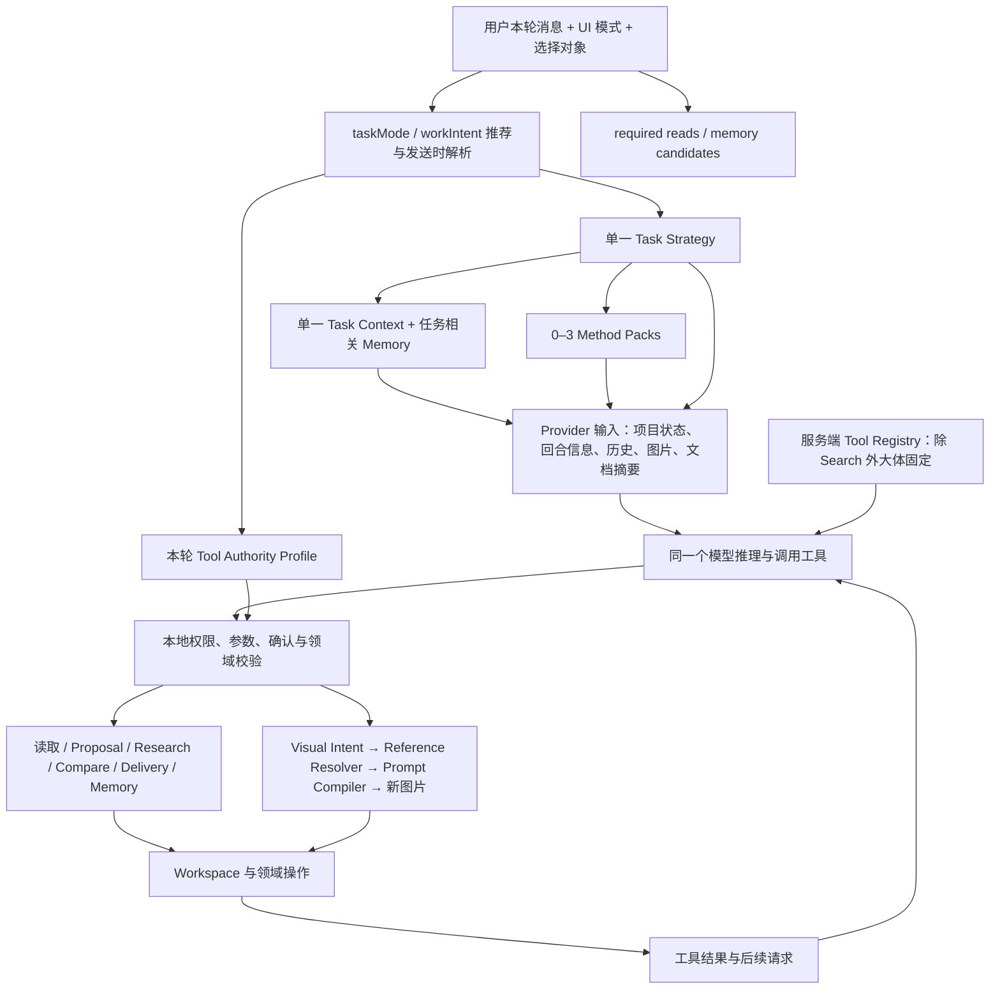

# Morpho Design Intelligence & Capability Orchestration Review

> 日期：2026-09-21（Asia/Shanghai）。
> 审计基线：远端 GitHub `main` = `3e774918c3f7baa2389fdf34d883d0414c98434d`，审计开始及中途复核一致；本地 HEAD 相同，开始时工作区干净。
> 状态：调查、架构审计与设计提案；不是已实施架构，也不是 Implementation Plan。
> 范围：真实设计任务如何进入 Strategy、Method、Context、Tool、Visual Generation 与 Project Write。不重新审计 persona、System Prompt 文案或 Method Pack 文案质量，不设计固定工业设计流程。

## 1. 判断

Morpho 已经拥有设计伙伴的共同基础：一个项目会话、结构化项目事实、来源驱动记忆、受控工具、版本与引用语义，以及完整的结构化视觉生成链。它并不是若干完全独立功能的简单拼接。

但目前的能力编排还不足以可靠承接复杂、混合、长期任务。最突出的问题是：**不同模块分别理解同一任务，却没有共同表达“这次要完成什么、针对哪些对象、哪些判断依赖哪些证据、允许发生哪些效果、何时算完成”的合同。**

具体表现为：

- 一个 Strategy 同时承担任务重点和 Context 选择，混合意图被压成单一分支。
- Method 选择、taskMode/workIntent、工具授权各有自己的分类规则，彼此只部分对齐。
- 执行器能拒绝很多越权动作，却没有同等可靠地保证合法任务被完整完成。
- 当前选择、实际参考、修改目标和比较范围没有统一的逐动作绑定。
- 读取与生成结果的再观察能力偏弱，模型难以在同一任务中完成“判断—执行—看结果—再判断”。
- 部分领域动作在底层已存在，但 Agent 的工具合同没有完整表达它们。

因此，更准确的定位是：**拥有共同项目记忆与执行底座、局部能力较完整的设计助手；尚未形成稳定的任务级协同。**这是编排合同和能力接线的问题，现有证据不支持引入 Planner、Critic、多 Agent 或 workflow graph。

本报告区分：源码直接确认的事实；使用真实本地函数/Runner 和模拟 Provider 做出的复现；基于这些证据的设计推断。没有用模拟回放证明真实模型的设计质量或线上发生率。

## 2. 当前实际编排链



这张图中的关键缺项是“任务义务”：没有一个共同结构约束全部分支必须完成什么。`requiredReadState` 被创建和记录，但其缺读补检没有接入当前 A+ 主链。运行时成功主要描述已发生的执行与持久化结果，不等于用户要求全部兑现。

Strategy 和 Method 已经作为服务端物化的 canonical System items 到达模型；此前 Capability Layer Audit 修复的投递问题本轮没有重报。[E1][E2][E3]

## 3. 当前 capability map

| 能力 | 已有真实实现 | 当前编排边界 / 缺口 |
|---|---|---|
| 理解当前项目 | Project State、四类默认 Memory、相关 Stage Record、选择对象摘要、连续历史 | 有共同背景；不能把紧凑摘要当完整对象和完整证据。缺少通用的按 ID / revision / 文档区段继续读取能力 |
| 探索与问题澄清 | discussion + 模型判断，可不走研究或定义阶段 | 保持开放是正确的；不需要强加固定探索脚本 |
| Research / Evidence | 本地文档提取、选中图片、受授权 Search、真实 citation snapshot、claim/source/confidence、候选研究对象 | 引用身份受控，但证据是否足以支持主张仍需模型判断和验证；长资料后续深读入口不足 |
| Design Definition | 定义草案、当前定义 revision、应用前审查及来源变化处理 | 基本草案/应用层级清楚；与研究、比较、方向工作的混合组合缺少共同任务表示 |
| Concept | 发散与延续方法、候选方向、方向 revision 与 lineage；domain 支持 create/revise/split/merge | Agent create 工具固定传 `createConceptDirections`，不能忠实表达全部已识别的领域意图；修订回放实证新增方向而非更新原 revision |
| Critique / Refinement | `designCritique`、`conceptRefinement`、形态/CMF/场景等方法 | 作为独立问题可工作；跨 Strategy 的批评与修订方法没有组合语义，常被主分类覆盖 |
| Comparison | 选中对象局部分析、聊天默认、显式保存记录、决定仍由用户掌控 | Compare 作为整轮 Strategy 影响 Context；与后续修改、生图的不同对象范围没有分开 |
| Visual Development | 结构化 intent、参考优先级、Prompt Compiler、逐图结果、来源/版本记录 | 没有同轮观察新生成图片像素的工具闭环；参考 ID 列表不足以表达每张图分别借用什么、排除什么 |
| Delivery | 稳定引用快照、章节草稿、独立 Apply/Discard、交付包 | Agent 主要面向已绑定章节；当前章节完整上下文留在 executor 侧，未完整送给模型；跨章节材料审查和缺口补齐的自然任务接口较弱 |
| Project Memory / Continuity | 来源驱动投影、有效性、作用域、历史 revision、聊天搜索、压缩摘要 | 底座应保留；“任务尚未完成哪部分”主要依赖聊天和摘要，没有与 effect/read 义务共同闭合 |
| 执行与用户控制 | 本轮权限冻结、工具参数校验、确认卡、stale preflight、A+ recovery | 阻止不该做的事较强；工具可见性、正向可执行性及任务完成判断仍不对称 |

不应把 CAD、制造验证、自动排版、跨项目知识库或 Agent 自主项目管理列为本轮 capability gap，它们不是当前产品承诺。[E4][E5][E6][E7][E8]

## 4. 主要结构性发现

### F1. 混合任务缺少表达方式，问题不在最多三个 Method Pack

`resolveAgentTaskStrategy` 以提前返回方式选择一个 kind，其顺序大致是 history/memory → delivery → comparison → research → definition → concept → visual。该结果随后决定一个 `contextKind` 和一组 methods。

使用真实 resolver、自动 workIntent 推荐和显式图像模式得到：

| 输入与条件 | 当前结果 | 结构性意义 |
|---|---|---|
| 选中两图；“先批评这两个方案，再比较取舍，沿用第一个继续发展，生成两张 CMF 图，不保存比较记录”；显式 imageGeneration | Strategy=`comparison`，Context=`comparison`，Method 只有 `comparisonDecision`，同时允许 `generate_visuals` | 执行能力与本轮专业判断/Context 不一致；critique、延续、CMF 没有被编排成有关系的任务 |
| “先读当前设计原则，再继续发展这张图，生成两张场景图”；显式 imageGeneration | Strategy=`historyAndMemory`，Context=`general`，Method=[]，允许生图 | 读取被升格为整轮主任务，覆盖实际设计目标 |
| “修订这个概念方向，保留原来的机制” | workIntent=`reviseConceptDirection`，Method=`conceptRefinement`，工具为 create proposal | 高层意图有名称，不代表下游具备相同动作语义 |

模型仍可能凭通用能力完成部分混合任务；上述结果不能证明每次都失败。它们证明系统没有显式保留和协调全部任务意图。

Method Pack 当前**没有直接授予工具权限**。不能把它描述成已接管 authority。真正的重叠在 resolver：例如 discussion 内用 researchSynthesis 补偿 Strategy 未识别研究综合，形成第二套局部意图判断。直接扩大 pack 数量或增加关键词不能补齐任务关系、目标和效果合同。

建议：保留一个可选的 primary focus，同时允许多个本轮活动与产出义务；Method 根据正在做的判断组合，不能成为路由或授权的第二事实源。[E1][E2][E3]

### F2. 模型看到的 Tool 与真正可执行的 Tool 不一致

服务端 `buildAPlusAgentProviderContract` 只按服务端开关及 `capabilityIntent.webSearch` 裁剪 Search。普通请求仍携带包含生图、写研究、建方案、交付草稿、Memory、confirmation 的 13 个工具。

客户端另行计算更窄的 `AgentToolAuthorityProfile`。工具调用到达本地后才按 profile 检查；未授权调用产生 `agent_tool_not_authorized` 并停止该 batch。

这保住了写入边界，却让模型面对“看见且被描述为可用，但调用就使任务失败”的能力集合。混合任务尤其容易出现 Strategy 鼓励某动作、工具存在、执行授权却不支持的组合。

应从同一个 effect grant 派生 provider-visible tools 和本地执行 allowlist。本地 gate 仍必须保留；过滤工具不是新的安全边界。不能为了避免拒绝而放宽权限，也不能让模型声明一个 capability ID 就自行获得权限。

Paid Image 仍要求发送时显式选择 imageGeneration；自动推荐不产生付费授权。Research 与联网、聊天比较与保存记录、生成候选与设主方向，都应继续分开。[E3][E9][E10]

### F3. “必读”尚未成为任务完成前置条件

当前 implementation 存在以下事实：

- preparation 计算 required reads 并保存到 runtime/recovery。
- 调用读取工具时，会校验 keys/stages/query mode 并登记完成。
- `advanceRequiredAgentReadState`、`failRequiredAgentRead`、缺读 reminder 等函数在当前 `src` 中只有自身定义和 unit tests，没有生产调用方。
- required reads 类型只覆盖 Memory、Stage Record、conversation search；没有表达“必须看 A 的当前 revision / 指定文档段落 / 新生成图像”。

在复用既有 Runner fixture 的内存隔离回放中，输入“请读项目记忆，告诉我当前设计原则”，注入一个未调用工具就终止的 Provider 响应。结果：`read_project_memory(designBrief)` 是 required，实际只有一次 Provider request，最终仍为 `status=done / agentTurnOutcome=success`，并清掉 recovery。

因此 `architecture.md:622` 的“final answer accepted 前必须完成读取”与当前实现不一致。这里已验证的是 runtime 不拦截省略读取；没有声称线上模型经常跳读。

最小修正方向是将必需事实读取接入现有 preparation / tool continuation，并记录来源身份、版本与成功状态。信息已以完整且当前的形式提供时，不应为了计数重复调用工具；读取失败、未覆盖和不存在必须区分。

尤其不要在 A+ 已 terminal 后凭空追加 continuation。优先在可合法继续的边界完成必要读取；终止时仍缺事实则应明确报告未核实，而不能标成义务已完成。[E1][E3][E10][E11]

### F4. Context 有紧凑投影，但按需深入读取能力不足

`read_selected_context` 不接受对象 ID、revision 或文本范围，只返回 preparation 时保存的 Context 摘要、proposal 内容、对象 ID、默认参考说明及标题。它不是刷新当前对象、读取全文或观察任意已授权图片的能力。

初始文档提取进入 Provider 时每份最多取 2,200 字符；Context 另有对象/文档预算。这种有界自动提供本身合理，缺口是没有配套的分段深读与完整性状态供后续判断。模型看到“资料存在”不等于能补读遗漏部分。

Memory / Stage 工具可以读取当前 revision，比纯摘要更强，应保留。历史查询也有独立能力。需要补齐的是同项目、授权范围内的对象、revision、document range 和 image observation，附带 unavailable/truncated/next-range 等明确状态，而非默认加载全项目。

对于长期工作，当前 preparation 还有 last-24 frames 和 last-96 combined messages 的裁剪。这是已有连续性实现边界，不能仅凭“使用 Token Budget”就假定全部未压缩历史都进入了请求。本轮未重新进行长历史压力实验，也不把它扩展成单独 runtime 重写议题。[E3][E6][E12]

### F5. 任务范围与参考用途没有逐动作绑定，视觉闭环没有闭合

“比较 A、B，再只沿用 A 生成 CMF”同时需要两个合法范围：比较范围 `{A,B}`，视觉来源 `{A}`。

当前 visual resolver 按顺序追加 `requestedReferenceObjectIds` 和全部 `selectedSourceObjectIds`。在隔离 reference probe 中，即使 intent 明确指定 A 且排除默认参考，传入选中 A、B 后，结果仍包含 A、B。该 probe 为 fixture 图片补了内存中的 asset ID，以满足 resolver 可用性检查，没有读取或生成真实图片。

这不是靠识别“第一张”一个词可以完整解决的问题。系统需要区分：讨论对象、比较对象、修改目标、内容来源、结构参考、CMF 参考、氛围参考、明确排除项。`requestedReferenceObjectIds` 目前是全局 ID 列表，`preserve/changeGoals` 是项目级字符串列表，无法把继承维度稳定绑定到各张参考图。

另外，`generate_visuals` 的 tool result 只返回新对象 ID、失败项等信息；continuation 复用初始 Provider 输入并追加工具结果。没有同轮读取新生成图片像素的工具，`read_selected_context` 仍读原准备快照。因此模型无法依靠这条链实际观察刚生成的结果，再据图批评或比较。用户下一轮重新选图可以带入像素，不能把它混同为本轮自动观察闭环。

建议增加可选的只读结果观察能力。仅在用户要求比较、评价或进一步发展时观察；反馈不自动授权再生一轮，不自动挑主方向，也不把图像表现当工程验证。[E6][E8][E10][E13]

### F6. 领域能力与 Agent 动作语义不完全同构

**Concept：** domain 的 proposal application 支持 create/revise/split/merge，但 Agent executor 固定使用 `workIntent: "createConceptDirections"`，create tool 也没有完整的 applicationMode、目标 revision、多个父方向等合同。

回放条件：显式 `reviseConceptDirection`，选中已有方向，模型调用获授权的 `create_concept_direction_proposal`，提供 basedOnDirectionId 和 supersedes lineage。实际结果：旧方向 currentRevisionId 不变，新增一个 `pendingPreview` 方向，turn 为 success。

这是已有能力在 Agent 接口处丢失，不需要新增“更聪明的 refinement persona”。应让受授权动作准确到达已有 domain 语义，并以原目标 revision、目标集合和实际 effect 核对完成。方法中的“延续原方案”不能替代对象身份校验。

同时，自动执行分支的 concept 工具会直接 record-and-apply 并落成候选方向；不能因为名字有 proposal，就认定所有工具都只保存待应用草案。新候选方向不是主方向决定，二者仍须区分。

**Delivery：** `deliverySectionContext` 在 preparation 后半段建立并交给 executor 校验，但未作为该目标的完整 Context 交给 Provider。pending target 又使 `selectedObjectIds=[]`，默认不加载附件。

复用既有带引用章节 fixture 回放：initial request 加 `read_selected_context` continuation 均不包含目标 section ID，以及两个稳定 reference ID；read result 的对象列表为空。`read_project_memory(outputPlan)` 可提供部分全项目摘要/来源信息，但不能替代该目标章节的完整引用快照；没有专门的章节读取工具。

已有 delivery test 把正确 referenceId 预先写进模拟 tool call，因而可以证明 executor 写入，却不能证明模型能从真实输入中获知该 ID。此处应先补齐模型实际可读的目标上下文，再讨论更丰富的交付能力。

Delivery 的自然语言计划、跨章节缺口检查和已有素材选择也不应都等同于 `prepare_delivery_section_draft`。其中大部分首先是只读判断或聊天草案，不必授权交付结构写入，更不必升级成排版编辑器。[E3][E7][E10][E14]

### F7. 执行成功与设计任务完成尚未分开

使用现有 Runner fixture，显式 imageGeneration 要求“生成两张图”，注入只说“已生成两张图”且无 tool call 的 Provider final response。实际新增对象数为 0，回合仍 `done/success`。

当前 lifecycle 对已经发生的工具、持久化、部分失败有细致表达；缺少的是对**本来应该发生但被模型省略的效果**进行核对。F3、F6 是同一缺口在读取和动作语义上的体现。

应单独表达本轮 obligation 的 `fulfilled / partial / blocked / awaitingUser / notPerformed` 等事实，不混同 Provider/Turn 的执行状态。生图成功要有落地的新对象；修订完成要对应正确对象和 revision；章节草稿完成要有正确目标的 draft。设计质量仍需模型与用户判断，不能由这些结构性检查宣称“设计合格”。

不需要一个 Critic Agent。已有 Runner 的结果提交点就可以核对可确定的产出，再诚实说明仍未完成的部分。[E10][E11]

## 5. Strategy / Method / Context / Tool / Write Authority 应各自负责什么

| 层 | 应负责 | 不应负责 |
|---|---|---|
| Strategy | 当前问题的主要目标、成熟度、重点；允许同一任务含多种活动 | 用一个排他标签锁死全部读取与动作；强迫走完整流程 |
| Method | 当前判断需要的专业视角、权衡维度、证据纪律；按需组合 | 创建授权、改项目状态、补偿所有路由问题；变成方法论长文 |
| Context | 为具体判断与动作提供当前且可追溯的事实，标记覆盖/缺失，按需深读 | 把有摘要当成已看完整资料；把旧历史或模型推断当有效决定 |
| Tool | 表达一个明确可观察的读或 effect，目标与产物契约稳定 | 用一个 create 动作冒充 revise/split/merge；只依靠工具名称暗示行为 |
| Write Authority | 确定本轮允许的动作、对象范围、外部费用、确认条件与不可升级边界 | 判断哪个设计最好；让 method、来源文字或模型信心扩大权限 |
| Completion | 核对授权任务的实际读取与产物，并区分完成、缺失、待用户 | 把模型结束回答、Provider 成功、图片好看等同于用户任务完成 |

“理解、分析、提方案、生成视觉、写入 Project Truth”不应成为强制顺序，但必须是不同 effect 层级：

1. 获取当前事实 / 读取证据：只读。
2. 分析、critique、comparison、推荐：可只留聊天。
3. 保存候选研究、方向或草稿：属于项目数据写入，但不代表用户已采纳。
4. 发起视觉生成：有独立外部费用和来源范围；生成新对象。
5. 应用定义、设主方向/默认参考、确认结论或重要交付结构：必须有用户决定，使用现有领域授权与 preflight。

不能把“写进 Workspace”与“成为已确认项目事实”合成一个布尔值。已经明确授权的低影响工作也不应反复确认。[E4][E5][E9]

## 6. mixed-intent task 的最小表达

建议增加一个小型、内部的 **Turn Task Contract**。这是统一既有 resolver 输出的建议名称，不要求新增服务、计划执行器、图或第二个长期事实库。

它只需表达：

- 用户当前目标与必要的完成条件；可选 primary focus。
- 本轮活动，例如 critique、compare、refine、visualize；保留用户明确提出的先后或条件关系。
- 每项活动的目标/来源/参考用途，以及允许的变化和明确排除项。
- 所需事实及读取覆盖状态。
- 来自当前用户/UI 的确定性 effect grants；不得由模型填写后直接生效。
- 预期输出及实际执行回执。

例如“比较 A/B，然后只在 A 上做两张 CMF；不保存比较、不改主方向”：

| 活动 | 输入范围 | 输出 | 权限 |
|---|---|---|---|
| critique / compare | A、B 的实际内容；当前有效设计约束 | 聊天中的问题、权衡与建议 | 只读与分析 |
| refine CMF | A；明确保留的结构和身份 | 两项 visual intent | 模型可拟定；不能扩大对象范围 |
| generate | A 为参考，B 不自动继承 | 两个可追溯的新图 | 仅在本轮已有明确 Paid Image grant 时执行 |
| 可选结果观察 | 本次生成的两图 | 基于实际像素的差异和限制 | 可读，不自行再生成或采用 |
| 完成核对 | 读取回执、生成对象与授权范围 | 哪些已完成，哪些仍需用户判断 | 不保存 Compare、不设主方向、不写长期偏好 |

不是所有混合请求都要拆成可见步骤。简单的批评加建议可以直接回答；仅当任务包含不同来源范围、效果、前置事实或用户条件时，才需要内部显式区分。

“比较后替我选更好的作为主方向”包含用户决定边界：可以给推荐，正式状态变更仍须有清楚的对象与授权；不能把“更好的”由模型自行具体化后悄悄实施。反之，“只继续 A，生成两张”已经确定方向，不应再次要求用户选 A。

## 7. deterministic routing 与 model judgment 的边界

**系统确定性负责：**

- 项目、对象、revision、选择与来源身份；可读范围与隐藏/删除状态。
- 费用、联网、写入、确认、拒绝条件和实际允许的工具。
- 明确用户命令/UI provenance；模糊或模型推断不能自动增加高影响/付费 grant。
- Context 来源有效性、预算及缺失/截断状态。
- 必读来源的实际覆盖；工具参数和引用合法性。
- 动作对应的目标和结果、stale revision preflight、幂等与持久化事实。

**模型负责：**

- 从真实设计任务中识别复合活动、隐含设计问题与合适判断深度。
- 在已经开放的读取范围内选择进一步读取什么，判断证据是否足够。
- 选择适合的 method 视角；提出批评、对比维度、权衡、改进和 visual intent。
- 区分证据、推断、假设和未知；解释设计建议，但不代用户采纳。
- 在目标不明确且不同解释会显著改变产出时提出简短澄清。

模型解析可以参与“把用户的话理解成任务”，但它的解析结果不是 grant。系统应让模型在已授权动作/对象集合内组合和缩小范围；超出范围时，先给具体可审查的提议，不能借“为完成任务所必需”自动升级。

不建议用 deterministic resolver 推导全部设计逻辑，也不建议让它凭词汇“研究”“方向”“原则”决定整轮只能做什么。确定性适合管理不变量和效果，模型适合理解设计语义。

## 8. Context 何时自动提供，何时按需读取

| 自动提供 | 按需读取 | 执行前必须覆盖 |
|---|---|---|
| 当前有效 Brief、稳定约束/偏好、相关未解问题、用户明确目标、对象 ID / revision、轻量任务状态 | 长文档区段、完整方向 revision、历史决定及理由、源图细节、相关比较依据 | 写入目标的最新身份和 revision、明确指定参考、目标章节的稳定引用快照 |
| 对本轮必需且已授权的选中图像/文档片段 | 模型发现的证据冲突、具体假设所需补充资料 | 用户明确询问的历史/记忆来源；确认卡绑定范围和来源变化 |
| 可追溯的摘要与资料目录 | 本次产出的图像像素；授权对象的更深细节 | 输出所声称已完成的工具和持久化回执 |

自动提供和 tool read 可共同满足资料需要；不应强迫模型重复读取已具备的完整当前事实。当前 canonical 特定必读工具要求若要改为“来源覆盖即满足”，应显式更新合同和测试，不能在本轮审计中假定已被替换。

“自动提供”也不能意味着全画布扫入：Compare 的对象范围、默认参考的可选性、隐藏对象排除和文档的来源边界继续保留。

## 9. 长期项目、成熟项目与中途改意图

长期伙伴能力需要同时保留两类东西：已确认项目事实，以及本次工作尚未完成的意图。后者不能为了连续性直接写进稳定 Memory。

可复用现有 conversation summary 的 `activeWork` / `nextTurnAnchor` 和 turn/recovery facts，保存有限的任务延续提示：目标对象、已完成产物、未完成义务、等待用户的决定。它是可失效的工作上下文，不是新的项目事实源，也不自动续费或继续生成。

成熟项目应默认先理解当前 revision、来源图身份和用户允许变化的维度。是否需要补研究由真实证据缺口决定，不能因为任务提到“研究 CMF”就退回研究阶段，更不能为了建立 Brief 而阻断继续已有草图。

当前 send handler 在 streaming 时直接返回；一个运行中回合的输入、authority 和 continuation 被固定。用户改意图目前主要需要停止/结束旧回合后另发新消息，不能假定存在实时 steering。

最小演进先明确 stop-and-resubmit：保留已完成效果，核对未决外部动作，按新指令重新计算本轮目标和授权；旧确认卡不能换目标。只有真实交互证据证明中断成本显著，才考虑在尚未执行 effect 的边界接收 steering。停止并不自动证明外部动作未执行或可以免费重试，本轮不重开 Provider reliability 审计。[E15]

## 10. 能力增删与最小 architecture evolution

**保留：** single-Agent、同一项目会话、A+ 执行权威边界、来源驱动 Memory、真实 domain operations、Method Packs 的轻量形式、Structured Visual Intent → deterministic resolver/compiler、聊天比较默认、稳定交付引用、用户应用/决定与 stale preflight。

**重新定位：**

- Strategy 成为重点提示，避免承担整轮排他编排。
- Method Pack 保持专业判断模块，去掉“靠 pack 弥补路由”的职责；本轮没有证据支持扩大 11 个 packs 或提高 3 个的上限作为首要修复。
- history/memory 从排他任务类别转为可组合的读取活动，同时保留独立历史问答。
- Comparison 成为可组合局部判断；Delivery planning/review 与 chapter draft write 分开表达。
- taskMode/workIntent、Tool availability 与 effect authority 共享同一个合同，保留既有 UI 入口和费用边界。

**补齐：**

1. 小型 Task Contract，将混合意图、范围、读取和产出义务汇合；直接复用现有 runner，不新增调度系统。
2. 同项目、受范围约束的深读与结果观察能力；先覆盖 revision、文档区段、交付章节和新图。
3. 将既有 concept domain 的 revise/split/merge 正确接到 Agent；补齐 delivery 目标资料的实际投递。
4. 将必要读取和可验证的结果义务接到现有执行边界，单独报告 task fulfillment。
5. 每动作独立目标/来源绑定；在有真实多参考需求时增加参考用途与继承维度，保留 deterministic 优先级和省略记录。

优先级是闭合已有承诺和正向路径，再增强混合表达；不是先增添一批新“智能能力”。以上是设计边界，不是文件级工期、迁移步骤或大规模实施计划。

仅当实际需求必须在浏览器消失后持续推进，才单独评估 durable execution；仅当独立专业工具、可隔离上下文或可并行任务实证需要不同执行主体时，才讨论多 Agent。目前发现的缺口均可由 single-Agent + deterministic authority 表达。

## 11. Eval 应怎样验证本次判断

保留现有 A–L / H2 capability corpus，它对局部行为和禁行边界有用。但它不能单独证明任务编排连贯：不少 case 只列 expected strategy/method，未完整固定 UI mode、目标绑定、已有 revision 和后续效应。

例如 corpus E 的“只研究 CMF，结构别动”，在默认聊天模式、选中图像的 resolver probe 中实际进入 researchOperation/researchSynthesis；显式图像模式下才是另一种结果。这不是只补该句 regex 的理由，而是需要区分语义识别、用户授权和实际执行入口。corpus I 的展板请求也不能证明已授权章节 draft。

`main` 最新新增的 real-world-project-eval 文档已经提出项目轨迹、状态 oracle、真实 Provider 与人工设计评审，但明确是尚未实施/执行的方案。本轮应沿用其框架，补充以下编排观察点，避免再建一套 benchmark：

| 任务切片 | 应观察的结果 |
|---|---|
| critique + compare + refine + visual | 次要意图不丢；Compare 和生图各用正确对象范围；无意外记录/状态变化 |
| 先读原则再改图 | 真实当前原则进入依据；读取不覆盖视觉目标；图片效果有实际回执 |
| 保留身份、只改 CMF | 当前图像和允许变化被保留；自动路由不产生付费授权；视觉保真另由真实图像评审 |
| 已有方向 revise/split/merge | 对象身份、revision、父方向及 lineage 与用户命令一致 |
| 交付缺口 → 某章节说明 → 用户决定补图 | 模型实际看到了正确快照；缺口分析不自动付费；应用仍独立 |
| 模型省略必读或工具，仅声称完成 | runtime 能显示未核实/未执行，不能因 final response 正常就算完成 |
| 新图生成后比较，再跨 session 继续 | 新图像素确实到达模型；延续当前 revision；未确认建议不变成事实 |
| 用户途中取消、缩小范围或改方向 | 新任务采用新授权；旧效果与未决执行诚实保留；旧卡不能改目标 |

程序检查真实输入、读取回执、authority、Tool 调用和 Workspace diff；设计师评审具体判断是否有用、改图是否保住身份、结果是否值得继续。不要把 Tool 次数、methods 数量或单一综合分当“设计伙伴”的证据。[E16][E17]

## 12. 证据、命令与验证边界

### 本轮实际执行

- `gh api repos/Whatnamed/Morpho/commits/main`、`git ls-remote origin refs/heads/main`、`git rev-parse HEAD`、`git status --short`：核验远端与本地身份及工作区。
- GitHub Contents API 与本地 Git blob hash 对照 `agentTaskStrategy.ts`；远端普通网页访问返回 404，因此使用已认证的 `gh` 读取远端元数据，并审查同一提交的本地源文件。
- `rg` 与 PowerShell 文件读取：核对 canonical 产品/架构/decisions 文档及当前调用方，未把历史审计评级当当前结果。
- `npm.cmd test --` 定向运行下列 15 个测试文件：全部通过，197 tests；没有运行无关全量构建。
- 使用 Vite SSR 在内存中加载真实 resolver / reference resolver / Runner。Runner probe 复用现有 test fixtures，仅在加载时屏蔽 test suite 注册并导出 fixture helpers；生产源码未替换、仓库测试文件未编辑。Provider/Host 为既有 fake，没有付费调用、真实用户项目写入或生产数据库操作。
- 参考及交付 probe 最初遇到 fixture 图片无 asset ID、首章节无引用；按 fixture 条件补齐内存 asset ID / 选择带引用章节后复跑。初始化失败未作为产品缺陷或通过证据。

定向测试文件：

```text
src/features/workspace/agentTaskStrategy.test.ts
src/shared/designMethodPack.test.ts
src/features/workspace/aiTaskRouting.test.ts
src/features/workspace/agentToolAuthority.test.ts
src/features/workspace/taskContext.test.ts
src/features/workspace/agentReadContextResult.test.ts
src/features/workspace/agentToolBatchAPlus.test.ts
src/features/workspace/agentToolExecutors.test.ts
src/features/workspace/agentTurnRunner.test.ts
src/server/ai/agentTurnProviderRequest.test.ts
src/domain/operations/imagePromptCompiler.test.ts
src/domain/operations/visualGenerationPlan.test.ts
src/domain/morpho/projectMemory.test.ts
src/domain/morpho/projectContinuity.test.ts
src/features/workspace/agentConfirmation.test.ts
```

### 源码索引

以下链接固定到本轮远端 `main` SHA，后续不能无核验地视为新版本事实。

- E1：[Task Strategy 与 required reads](https://github.com/Whatnamed/Morpho/blob/3e774918c3f7baa2389fdf34d883d0414c98434d/src/features/workspace/agentTaskStrategy.ts#L155)。
- E2：[Method registry / resolver](https://github.com/Whatnamed/Morpho/blob/3e774918c3f7baa2389fdf34d883d0414c98434d/src/shared/designMethodPack.ts#L147)。
- E3：[A+ product preparation](https://github.com/Whatnamed/Morpho/blob/3e774918c3f7baa2389fdf34d883d0414c98434d/src/features/workspace/agentTurnProductPreparationAPlus.ts#L193)。
- E4：[AI 与 Context 产品规则](https://github.com/Whatnamed/Morpho/blob/3e774918c3f7baa2389fdf34d883d0414c98434d/docs/product/03_Morpho_AI工作流程、阶段Context与连续性机制.md#L158)。
- E5：[状态与记忆产品规则](https://github.com/Whatnamed/Morpho/blob/3e774918c3f7baa2389fdf34d883d0414c98434d/docs/product/04_Morpho_状态、版本、项目记录与记忆.md#L418)。
- E6：[Task Context](https://github.com/Whatnamed/Morpho/blob/3e774918c3f7baa2389fdf34d883d0414c98434d/src/features/workspace/taskContext.ts#L186)、[read result](https://github.com/Whatnamed/Morpho/blob/3e774918c3f7baa2389fdf34d883d0414c98434d/src/features/workspace/agentReadContextResult.ts#L4)。
- E7：[Concept domain application](https://github.com/Whatnamed/Morpho/blob/3e774918c3f7baa2389fdf34d883d0414c98434d/src/domain/operations/operations.ts#L1520)、[mode inference](https://github.com/Whatnamed/Morpho/blob/3e774918c3f7baa2389fdf34d883d0414c98434d/src/domain/operations/operations.ts#L2707)。
- E8：[Visual Intent / Research Evidence types](https://github.com/Whatnamed/Morpho/blob/3e774918c3f7baa2389fdf34d883d0414c98434d/src/domain/operations/types.ts#L71)、[Image Prompt Compiler](https://github.com/Whatnamed/Morpho/blob/3e774918c3f7baa2389fdf34d883d0414c98434d/src/domain/operations/imagePromptCompiler.ts#L21)。
- E9：[Tool Authority](https://github.com/Whatnamed/Morpho/blob/3e774918c3f7baa2389fdf34d883d0414c98434d/src/features/workspace/agentToolAuthority.ts#L63)、[server Tool Registry composition](https://github.com/Whatnamed/Morpho/blob/3e774918c3f7baa2389fdf34d883d0414c98434d/src/server/ai/agentTurnProviderRequest.ts#L188)。
- E10：[Tool executors](https://github.com/Whatnamed/Morpho/blob/3e774918c3f7baa2389fdf34d883d0414c98434d/src/features/workspace/agentToolExecutors.ts#L180)、[batch authority / confirmation](https://github.com/Whatnamed/Morpho/blob/3e774918c3f7baa2389fdf34d883d0414c98434d/src/features/workspace/agentToolBatchAPlus.ts#L210)。
- E11：[Runner completion and continuation](https://github.com/Whatnamed/Morpho/blob/3e774918c3f7baa2389fdf34d883d0414c98434d/src/features/workspace/agentTurnRunner.ts#L555)、[fixture helpers](https://github.com/Whatnamed/Morpho/blob/3e774918c3f7baa2389fdf34d883d0414c98434d/src/features/workspace/agentTurnRunner.test.ts#L1203)。
- E12：[Default Memory selection](https://github.com/Whatnamed/Morpho/blob/3e774918c3f7baa2389fdf34d883d0414c98434d/src/domain/morpho/projectMemory.ts#L328)、[scoped continuity](https://github.com/Whatnamed/Morpho/blob/3e774918c3f7baa2389fdf34d883d0414c98434d/src/domain/morpho/projectContinuity.ts#L526)、[Provider frames](https://github.com/Whatnamed/Morpho/blob/3e774918c3f7baa2389fdf34d883d0414c98434d/src/features/workspace/providerContextFrames.ts#L342)。
- E13：[Visual Reference Resolver](https://github.com/Whatnamed/Morpho/blob/3e774918c3f7baa2389fdf34d883d0414c98434d/src/domain/operations/visualReferenceResolver.ts#L15)。
- E14：[Delivery section Context](https://github.com/Whatnamed/Morpho/blob/3e774918c3f7baa2389fdf34d883d0414c98434d/src/features/workspace/deliveryPreparationUi.ts#L108)、[existing delivery Runner test](https://github.com/Whatnamed/Morpho/blob/3e774918c3f7baa2389fdf34d883d0414c98434d/src/features/workspace/agentTurnRunner.test.ts#L982)。
- E15：[Send / running-turn boundary](https://github.com/Whatnamed/Morpho/blob/3e774918c3f7baa2389fdf34d883d0414c98434d/src/features/workspace/useWorkspaceAgentRuntimeController.ts#L395)。
- E16：[Capability eval corpus](https://github.com/Whatnamed/Morpho/blob/3e774918c3f7baa2389fdf34d883d0414c98434d/docs/architecture/ai-capability-eval-corpus.md)。
- E17：[Real-world project eval proposal](https://github.com/Whatnamed/Morpho/blob/3e774918c3f7baa2389fdf34d883d0414c98434d/docs/research/real-world-project-eval-acceptance-architecture.md)。

### 未验证与变更范围

没有执行真实文字/多模态模型、图片 Provider、浏览器端完整设计项目、人工设计质量评分或生产集成验证。报告不声称线上发生率、实际设计质量提升或用户体验验收通过。

本轮只新增本研究报告，没有修改源码、测试、依赖、canonical 文档或已有 eval corpus；没有 commit、push、部署、migration、外部消息发送或长期记忆更新。
