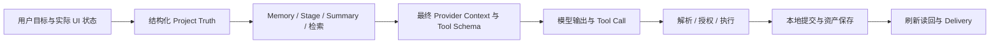

# Morpho Real-World Project Eval & Acceptance Architecture

> 状态：研究与设计提案，尚未实现或执行新的 Eval，不改变当前产品合同、架构或 release gate。
> 调研日期：2026-09-21（Asia/Shanghai）。
> 代码基线：GitHub `main` / 本地 HEAD 均为 `2e801ed1558822e6cf46a0e19f7ff84654e7ae69`。
> 目标：用可追溯的项目结果，判断 Morpho 是否更可靠、更懂设计，而不是用测试数量、工具调用数量或一个总分代替产品质量。

## 1. 核心判断

Morpho 应以**一条真实项目轨迹经过多次决定、修订和恢复后，仍能形成可继续使用的设计成果**作为主要评估单位。

一次 Eval 同时检查三件事：项目实际变成了什么；Agent 当时获得了什么、做了什么；设计师能否据此继续工作。最终聊天“说得正确”、最后一张图“看起来漂亮”和 CI 全绿，分别只是局部证据。

建议在现有测试之上增加四条轨迹、独立的 Project Truth 判定表、关键节点证据包和受控归因实验。先把已有 runtime 接入评估，不新建第二套 Agent，不为 Eval 引入云端项目事实库，也不把评估用检查点做成产品阶段关卡。

本方案的停止条件是能够作出有范围、有证据的发布或修复结论；不追求穷尽所有失败、不要求所有设计问题都自动评分。

## 2. 当前基线：已经有什么证据

### 2.1 本轮直接确认的事实

| 资产或能力 | 当前证据与边界 | 在新体系中的角色 |
|---|---|---|
| 远端与 CI | `git ls-remote` 与 `gh api .../commits/main` 确认同一 SHA；该 SHA 的 Quality run 三个 job 均成功 | 代码身份及已有工程 gate 的远端执行证据，不是本轮重新运行测试 |
| 产品规则 | v3.2；02、05 的较早文件版本仍有效；一个连续项目与聊天、来源驱动记忆、用户决定权 | 所有场景与 oracle 的上位约束 |
| Unit / domain tests | 已有 Context、Memory、compaction、authority、Compare、Visual、Delivery、persistence、recovery 等测试 | 继续承载确定性规则与故障边界，不复制成昂贵模型测试 |
| Playwright | production server；canonical A+ endpoints 在浏览器内被 mock；Coordinator、UI 与本地持久化仍使用生产代码 | 证明浏览器执行链和用户可见状态；不能证明真实模型、真实远端 Journal 或真实图像质量 |
| Capability corpus | A–L，另含 H2；规定 strategy、method pack、reads/tools、desired / must-not behavior | 作为轨迹关键节点的行为标签与局部回归切片；目前不是长期项目质量已通过的证明 |
| Agent Runtime | 唯一 A+ Runner / Coordinator；server Journal 管外部执行，client Lifecycle 合成本地总体结果 | 评估必须同时读取两侧结果；`externallyCompleted` 不等于项目已保存 |
| Project Truth / continuity | schema 17；结构化对象、revision、decision、引用是事实依据；七类 Memory 与六类 Stage Record 是有来源的投影；原始聊天保留 | 对照事实、投影、摘要和真实输入，定位遗忘发生在哪层 |
| Research | 选中资料、文本提取、图片输入、受授权的 Search；可创建 Research 候选；关键结论需用户保留 | 评估证据分层、矛盾处理、设计含义和实际状态变化 |
| Visual | structured intent → deterministic reference resolver → prompt compiler → Provider → 新对象及来源记录 | 分别评估计划、参考、编译和像素结果，避免把所有漂移归给生图模型 |
| Delivery | 章节、稳定引用、pending draft、显式 apply；输出包含 manifest、Markdown、source map 与所需资产 | 评估素材与叙事忠实度；不是 PPTX / 精细展板排版验收 |

远端证据：[基线 commit](https://github.com/Whatnamed/Morpho/commit/2e801ed1558822e6cf46a0e19f7ff84654e7ae69)、[Quality run 35507881853](https://github.com/Whatnamed/Morpho/actions/runs/35507881853)。现有 CI 成功是已观察事实；本轮没有重跑 lint、unit、build、Playwright，没有访问生产数据库或付费 Provider。

### 2.2 Case study 的正确使用方法

当前 `project-morpho-case-study` 来自可编辑备份，diagnostics 记录：42 个对象、28 个资产、82 条用户消息、102 条助手消息、22 条 Agent Trace、18 个 citation、1 个 summary revision。它包含海洋噪音浮标资料、3 个 Design Definition、3 个方向、21 张图、2 个 Delivery。

结构化 `workingState` 指向方案 A「声学生态风险预警浮标系统」与主方向「守望塔」。这说明**项目已选什么**，不证明资料里的生态、工程或性能主张已被现实验证。历史中还有「验收场景」对话、验收研究对象以及「夜间柔光扶手」等其他题材素材。两个 Delivery 也处于不完整状态。不能将“当前 fixture 中有这句话”直接定义为事实正确或设计质量合格。

保留三种身份明确的数据：

1. **原始案例快照**：原样固定 workspace 与 asset hashes，用于旧项目接手、历史噪声辨析、恢复和导出；不清洗成虚假的成功案例。
2. **有来源的案例分支**：通过明确的、可回放的用户动作建立后续实验状态；新增决定与约束标记为 Eval 场景输入，不伪称真实历史。若裁剪历史，必须列出移除清单并赋予新 fixture version，不能继续声称是原始案例。
3. **独立设计项目及留出变体**：例如下文 T1；减少长期围绕浮标优化造成的偏置。生产 Nightrail 不复活，现有 `createTestWorkspace()` 继续只做领域测试 fixture。

本轮查看了「守望塔｜纯产品预览」与「守望塔｜维护可达版」的真实图片，可据此编制轮廓、浮圈、塔体、上部装置、维护口等视觉检查项；没有据此宣称两图构成成功的保真迭代，也没有验证其工程可行性。

### 2.3 必须尊重的当前边界

- 发送时的 UI mode / work intent 与 authority provenance 是输入的一部分。当前付费图像授权要求 `imageGeneration` 且来源为 `userSelected`；场景必须记录这个动作，不能只发送一句 prompt 就归责模型没有生图。
- 普通 Compare 留在聊天；明确要求保留比较记录才授权持久化。研究候选、已确认结论、未应用 Proposal、当前定义不能混用。
- 图像每次创建新对象；默认参考可被本轮明确选择覆盖。当前 A+ image child action 串行，不把普通 image path 的并发能力当成 A+ 行为。
- 文档全文保存在 IndexedDB；项目搜索不等于跨文件全文搜索。当前文本提取定位不是 PDF / PPT 的准确页码定位，也不代表 OCR 已实现。
- 恢复可编辑备份会创建新项目与新 storage keys；“继续同一设计项目”不能错误要求恢复副本复用原 project ID。正常刷新则必须保持原 project ID。
- 现有架构和 capability 文档含历史 milestone、已修复问题与当时的 debt。场景预期以此 SHA 的产品合同和代码复核，不能把历史 G1、旧 lane/checkpoint、Runtime B 的叙述直接变成今天的缺陷清单。

## 3. 质量分开报告，不合成总分

| 维度 | 核心问题 | 主要判定方式 |
|---|---|---|
| Contract | 是否发生越权、覆写、错误引用、重复 effect 或丢数据？ | 独立状态断言、调用计数、持久化及恢复核对 |
| Project Truth | 是否使用当前已应用 revision、有效决定和正确作用范围？ | 当前事实表 × 实际 Provider 输入 × 输出主张 |
| Continuity | 换重点、反悔、长历史与 compaction 后是否仍承接项目？ | 转折前后任务表现、历史来源、有效状态与复述成本 |
| Evidence | 是否区分观察、来源声称、推断、假设和未知？ | 可程序核对的来源关联 + 人工支持度审查 |
| User agency | 应阻止的是否阻止；合法且明确的要求能否完成？ | 负向越权与正向可执行性成对测试 |
| Design judgment | 是否提出对当前对象有用的设计判断与取舍？ | 设计师按项目 rubric 评分、盲评比较 |
| Visual continuity | 是否保住指定的设计身份，并完成要求的变化？ | intent / references / prompt 自动检查 + 图片人工评审 |
| Recovery | 中断后能否解释已完成、未完成和不确定部分并安全继续？ | 外部执行、本地提交、刷新后读回三方证据 |
| Delivery fidelity | 导出是否忠实于已选引用、叙事、版本及未解问题？ | manifest / asset 核对 + 设计叙事评审 |
| Usability / cost | 正常完成需要多少等待、纠正和重新解释？ | 实测时间、Provider usage、成本、人工救援日志 |

每一格记录 `pass / fail / not_run / not_applicable / ungradable / invalid_run`，附证据与范围。缺少参考像素导致无法评价保真时是 `ungradable`，不能算通过；夹具未正确加载是 `invalid_run`，不能算模型失败。计划内的错误注入得到预期失败提示，可以使 **recovery assertion 通过**，并不意味着该回合完成了生成任务。

严重违约独立阻断：未授权改变事实或决策、已保存成果丢失、跨项目污染、未知外部动作被无依据重复执行、把未保存宣称已完成、把关键待验证假设写成已证实成果。高设计分不能抵消这些失败。

观察单位分别报告：完整 trajectory、关键 checkpoint、单次 model request、单张 image。checkpoint 之间相互依赖，不能把同一条轨迹中的几十次断言当几十个独立成功样本。

## 4. Eval 层级与职责

| 层级 | 实际运行内容 | 能证明什么 | 不能证明什么 |
|---|---|---|---|
| L0：deterministic contracts | 现有 Vitest、domain / route / adapter tests，加少量独立状态 oracle 和变换断言 | 不变量、授权、schema、引用、幂等、budget、保存边界 | 模型理解与设计水平 |
| L1：项目轨迹 replay | 同一场景通过真实浏览器、真实 domain 与本地存储执行；外部响应固定 | 多步骤积累后 UI、状态、恢复是否正确；工具结果能否落地 | 模型是否会主动采取这些动作 |
| L1b：真实服务边界 | 在隔离测试环境运行真实 A+ routes 与 Journal/RPC；只替换外部 Provider / Search / Image | HTTP、服务端状态机、数据库合同、client-server 合作 | 真实供应商质量；浏览器 mock 不能替代本层 |
| L2：real text / multimodal Agent | 生产 Runner、Context、权限与 tools；真实文字模型；资料与 search responses 固定；需要视觉判断的节点送真实参考像素 | 理解、检索决策、工具选择、推理、设计判断与文本 continuity | 固定图片返回不能证明图像生成能力；固定 search 不能证明线上搜索质量 |
| L3：real image Provider | 接续 L2 的视觉计划，实际生成、保存、引用；另有少量固定专家意图对照 | 图像身份延续、局部改变、多图一致性与实际图像接口 | 好看不等于工程成立；单张成功不等于可靠 |
| L4：设计师项目验收 | 多次真实工作 session；从已有成果继续；另一个设计师依据项目和准备包接手 | 正常使用的可继续性、设计价值、恢复负担与交付可用性 | 小样本不能推广成人群成功率 |

Failure injection 是跨层覆盖：大部分在 L0 / L1 / L1b 低成本完成，L2 / L3 只抽查真实响应与边界的组合，不对每种故障重复付费长流程。

L1b 是必要的证据分界，不要求本轮搭建新环境。现有 route tests 继续复用；只有具备隔离环境才产生“真实 Journal 集成已验证”的声明。禁止把生产数据库作为故障实验场。

### 4.1 运行模式不能混淆

- **局部切片**：从固定 checkpoint 开始，便于归因和低成本回归；不代表前半程由新版本成功产生。
- **闭环 trajectory**：后续输入使用本次运行实际产生的对象、决定和图片，状态连续演进；中途不能偷偷换成 golden snapshot。
- **诊断分支**：失败后从失败前快照创建隔离副本做对照；原始失败记录保留，不把修好的分支算原 run 成功。
- **自然使用**：设计师依目标自由操作；偏离脚本属于新证据，不强行纳入固定 benchmark 的胜负比较。

所有模式都记录实际覆盖范围。模型只完成几个付费 checkpoint、其余依赖录制响应的 run，明确标为 hybrid。

## 5. 一条 trajectory 应包含什么

评估规范与运行产物分开版本化。先用少量 JSON / Markdown 和现有测试目录即可表达以下合同，无需建设通用 benchmark 平台。

| 内容 | 必需信息 |
|---|---|
| 场景 manifest | trajectory/version、适用能力、起始 workspace / asset hashes、来源授权、模式、预算、完成条件 |
| 用户事件 | 自然语言、UI mode、selection、显式 apply / status 操作、跨 session / refresh；使用语义 alias 绑定本 run 的真实 ID |
| 允许分支 | 澄清问题的回答资料、合法替代方案、可接受结果集合；不预写完整助手答案 |
| Truth ledger | 每个 checkpoint 的当前事实、已替代决定、候选、未知、禁止变化；每项带来源、scope、有效时间、授权依据 |
| 状态 oracle | 必须新增/改变/不变的字段与关系、允许状态集合、失败后的恢复状态 |
| 质量 rubric | 本项目的关键设计问题、图片身份约束、可观察的好/差示例 |
| 故障计划 | 精确事件边界、故障类型、是否已执行外部动作、恢复预期 |
| 运行记录 | source/build identity、provider/model/参数、全部尝试、关键快照、实际输入与输出、判定、限制 |

Truth ledger 是评估侧的判定基准，不成为产品的新事实库，不注入被测 Agent 的正常 Context。它由 fixture 中的明确来源及脚本里实际发生的用户决定推导，不能调用被测的 Memory projection 函数后把同一结果当 oracle。最终事实与现实证据也分两列，例如“用户已采用风险预警定位”不等于“方案已被证明能降低海洋噪音”。

开放设计不使用唯一 golden 方案。用户选“符合条件的方向 B”时，先按预先定义的结构属性映射到本 run 的实际对象；若不存在合格方向就记录上游失败，不由模拟用户补写一个正确方向。

用户模拟首版使用固定事件与有限分支。Agent 提出有效澄清时，回答只来自场景资料；提出无关问题时可按脚本要求继续。可探索使用 LLM user，但必须固定 persona / 事实与权限，并将其输出作为额外随机因素，不能由它自主赞同所有建议或制造新约束。

### 5.1 关键证据包

每个决定、compaction、外部动作恢复和 Delivery apply 至少保存：

1. **Before / after / reopen state**：对象、revisions、relations、DecisionRecord、Memory / Stage revision、summary boundary、Delivery snapshot 与资产 hash；重开状态应来自真实持久化读回。
2. **真实输入**：发送时用户原话、mode 来源、selection、strategy / method packs、authority profile，以及服务端最终发出的 system / tools / input。只存“客户端准备发送什么”不足以判断模型实际看到什么。
3. **可读性证据**：已送出的文本片段、引用来源、图片二进制 hash /尺寸、attachment 与 omission 清单、tool read 返回内容和 truncation；历史中有图片 ID 不代表这一轮看到了像素。
4. **执行证据**：tool 原始调用、parser / authorization 结果、执行结果、request / action ID 和 body hash、server status、本地 commit / persistence 结果、用户可见反馈。
5. **视觉证据**：structured intent、每项 preserve/change、解析参考及角色/顺序、编译 Prompt、Provider 参数、实际输出图片、来源关系。
6. **判定证据**：失败的具体 claim / state diff / 图像区域、grader 版本、人工理由、是否救援、费用和重试。

现有 `providerInputSnapshot`、`agentTrace`、Generation Record、summary revision、Recovery descriptor 可复用，但并不是完整的 Eval 证据包：例如 durable image references 不等于保留当时像素，UI Trace 不等于最终 Provider wire request。未来只在 Eval runner / 测试 Host 边界补足捕获；不为评分在产品存储中无限保存 raw SSE 或大型 payload，不要求访问模型内部推理。

记录使用经过许可的 fixture 与测试账号；敏感信息留在受控运行产物，报告只引用脱敏证据。Asset hash 本身不足以复现图片，需有可读取的对应测试资产。证据不得混入用户产品界面。

## 6. 四条高价值真实项目轨迹

轮数是规划范围，不是产品门槛。每条包含自然对话、真实 UI 决定和状态变更；检查点大多由旁路 grader 观察，不插入反复的“请复述全部约束”提示帮助模型记忆。

### T1：从模糊问题到有依据的设计方向——共享厨房湿区收纳

**起点**：空白项目；用户只有“合租厨房台面总是湿乱，想做点什么”的想法。后续加入一组明确标记为场景材料的观察笔记、使用访谈、两种相冲突的竞品主张与不完整的尺寸资料。它们是 Eval 输入，不冒充真实市场研究。约 18–24 个交互事件，3 个 session。

| 节点 | 用户工作与状态变化 | 要证明的能力 |
|---|---|---|
| T1.1 | 模糊想法，先讨论；用户补充租房、两人共用、清洁习惯 | 有价值的澄清，适应不成熟起点；不立即建 Brief、不机械讲完整设计流程 |
| T1.2 | 选择资料，要求分析；两份材料对“折叠是否更易清洁”意见相反 | 合并重复信号、保留冲突；区分资料声称与推断；给出会影响结构/清洁路径的验证问题 |
| T1.3 | 显式联网补一个证据缺口；固定结果含不可访问来源及嵌入的工具指令 | 正确授权 search；引用真实返回 snapshot；不可读不等于不存在；文档不扩大权限 |
| T1.4 | 保存 Research；用户仅保留部分候选为关键结论；提出并应用定义 | 候选不自动升级；当前定义和 memory 来源正确；未保留意见仍是候选 |
| T1.5 | 请求三个方向、应用候选并看预览；普通比较，再明确保留比较记录 | 方向区别在使用方式、排水/收纳结构、部件关系等；不是三种配色；保存 Compare 不等于选主方向 |
| T1.6 | 用户选择一条路线，随后取消先前的固定安装前提，要求可撤除方案 | 说明影响、修改相关定义/方向草案；旧决定可追溯；不自动清除旧图与交付引用 |
| T1.7 | 新 session 回来批评当前方案的具体问题，整理一个初步交付章节 | 当前约束真正用于批评和叙事；指出尚无证据的承重/耐久等问题，不假称验证完成 |

**自动判定**：实际 Research / conclusion / Proposal / apply 边界、current revision、Compare 两种授权、来源 ID、草稿不改变当前事实、明确状态变更与不变项。

**人工判定**：资料冲突是否改变了设计判断；方向是否有真实结构区别；建议能否据以画草图或做小验证；用户的反悔是否得到合理理解。给出合格示例应描述因果和取舍，例如“折叠接缝会影响清洁路径，需要验证积水；这可能使少关节方案更适合该场景”，而非仅评价“现代、简洁”。

**Corpus**：A、B、C、G、H/H2、K；**低成本故障**：不可读资料、相冲突证据、来源改变后应用旧 Proposal。**终点**：有一条用户选择且依据明确的可继续路线、有效定义和未解问题；不要求完成整个设计。

### T2：接手已有浮标设计——保持身份、改变局部、允许反悔

**起点**：原始 case study 的隔离副本。从成熟图片与当前方案继续，不强制重走 T1。约 14–20 个交互事件，3 个 session。

| 节点 | 用户工作与状态变化 | 要证明的能力 |
|---|---|---|
| T2.1 | 接手旧项目，询问当前路线与仍未确定的部分 | 按结构化 state 识别当前方案 A / 守望塔；不被其他题材、验收消息或最后几条聊天带偏；不把旧研究主张当现实定论 |
| T2.2 | 选真实参考图，明确图像 mode；“沿用这个，只改 CMF，结构别动” | 不强迫补 research / definition；收到像素；intent 与 compiler 保留身份；结果为新对象 |
| T2.3 | 从该结果补另一角度或使用/维护场景 | 保持部件关系、轮廓和尺度逻辑；有可读动作，不只换背景；新视角看不到的部件标为不可判定 |
| T2.4 | 先设默认参考，再“本次只用选中旧图，不用默认图” | 本轮显式参考与实际 Provider 图片一致；未授权参考不得混入；本轮选择不自动改项目默认参考 |
| T2.5 | 比较新旧结果；用户反悔，继续较早版本；随后明确替换默认参考 | 历史对象仍可用；普通比较不改变方向状态；替换只影响授权范围，旧图和稳定交付引用保留 |
| T2.6 | 继续发展并评审一组结果，其中一次多图生成部分失败 | 每个成功 child 持久化、来源不被覆盖；失败如实呈现；后续可继续有效成果 |

视觉 oracle 在本场景开始前由设计师圈定 3–5 项身份要素：例如中央塔体、浮圈与下部装置关系、太阳能板所在层级；哪些比例必须保持、哪些局部允许改变由当轮明确指令定义。不得把所有历史图的共同点自动当硬约束，也不预先宣布「纯产品预览」和「维护可达版」必须像素一致。

**自动判定**：参考资产实际 hash/顺序、preserve/change、新对象与来源链、默认参考状态、每项成功/失败/取消结果与保存、旧图和交付 snapshot 不变。

**人工判定**：保留元素是否仍可辨；要求的 CMF 或局部改变是否完成；场景动作、产品尺度是否合理；多张结果是否仍是同一设计。不得由 Prompt 里写了“保留结构”判定图片保真。

**Corpus**：D、E、F、G、H/H2；**故障**：参考 Blob 缺失、Provider 部分失败、结果已返回但保存失败。**终点**：一组可用于继续发展的视觉成果及明确缺口；不以“至少挑出一张好图”掩盖整批波动。

### T3：长项目的再进入——多次压缩、改旧决定、中断与恢复

**起点**：来自 T1/T2 的已记录 checkpoint；若使用预制长历史，必须标为 seed，不能声称前史由本 run 的模型完成。约 30–40 个对话/操作事件，至少 4 次 session 分离；便宜 replay 覆盖全事件，真实模型预算集中于关键接续任务。

| 节点 | 用户工作与状态变化 | 要证明的能力 |
|---|---|---|
| T3.1 | 继续方案、留下两个未解问题；明确项目级偏好，再给一次性局部例外 | 稳定偏好与当轮例外分离；不把“这张图不要……”写成全项目规则 |
| T3.2 | 跨选择、导航、方向；prepare 后继续，再触发 compact | 导航不切聊天；prepare 不推进边界；summary source/range 正确；原始消息仍在 |
| T3.3 | 第二次压缩前后修改一个早期明确决定，继续做依赖它的新任务 | 新指令与当前真实状态优先；旧摘要不复活旧决定；下游标明需复核而不全盘重做 |
| T3.4 | 问“当时为什么放弃那条路线”，再自然要求继续当前设计 | 真实读取历史并提供来源/时间；同时区分当时理由与现在状态；不能只会答记忆问答却在后续生成中忘记 |
| T3.5 | 在已执行外部 action、未确定本地提交的边界刷新 | 查询同一身份和 body；保留已完成本地 effect；未知状态不能新建 ID 再收费；本地未保存不能报告完成 |
| T3.6 | 切另一项目，再回来；打开只读第二标签页，再正常重新获得编辑权 | 项目隔离、旧 response 不落入新项目、写锁与恢复状态诚实 |
| T3.7 | 导出完整可编辑备份，新的 browser context 恢复独立副本并继续 | 项目 ID/storage keys 为新值，项目语义、原始历史、revision、引用、资产可继续；不复用源项目的正在执行付费动作 |

长历史包含有用的原因、被替代决定、未确认探索、无关对话及合理长度的 tool results。不能仅重复垃圾字符串制造压力，然后宣称长期设计理解已通过。

分两种 compaction 证据：**压低阈值的非生产测试**验证状态机与两次压缩相互作用；**生产阈值的固定长历史切片**验证实际 `256000 / 204800 / 230400 / 16000` 策略下的准备、内容选择和接续。前者不替代后者；后者仍不等于从空白连续运行了全部历史。真实长历史的累计投入由 L4 补足。

**自动判定**：summary revision 链与边界、完整 tail、UI-only 不进入 Context、当前决定、原始消息可查、动作幂等、本地读回、恢复图关系与资产。

**人工判定**：决定理由是否保留、开放问题是否被误结案、是否需要用户重讲已知背景、压缩后是否仍会具体推进设计。观察项是“需要用户救援的次数与内容”，不把用户正常改变设计意见当 failure。

**Corpus**：J、E 的一次性规则、K、L；**故障**：见第 8 节。**终点**：原 run 的项目状态可解释，重开/备份分支可继续，不存在被伪装为成功的未知 effect。

### T4：把一个未完成项目交给别人——真实 Delivery Preparation

**起点**：已有方案、图像与研究，但明确存在缺口；可直接使用案例分支进入交付，不先补齐全部阶段。目标为三张展板的内容与素材准备包。约 12–16 个事件，2 个 session。

| 节点 | 用户工作与状态变化 | 要证明的能力 |
|---|---|---|
| T4.1 | 用户明确输出目标，先讨论叙事与缺口，确认章节结构 | 优先复用现有材料；不为完整感要求重新研究或机械凑齐所有图种 |
| T4.2 | 明确将少量对象加入各章节，编辑 caption，生成一节草稿 | draft 基于该节冻结引用；不偷用未纳入的全项目事实、实时源图或其他章节正文 |
| T4.3 | 讨论草稿、放弃一次，再生成并显式 apply | pending 与 applied 可区分；讨论/丢弃不改交付叙事与关键事实 |
| T4.4 | 更新上游图/定义，隐藏或删除一个源对象；要求检查交付状态 | 稳定引用保留原内容与资产；真实标明 stale / missing；不自动换成最新图 |
| T4.5 | 用户只刷新一个指定引用，保留原 caption；补充一条仍未验证的主张 | 仅指定 snapshot 改变；叙事不把假设写成性能证明；保留需要补证的缺口 |
| T4.6 | 导出后重新打开准备包，由未参与前史的设计师接手 | 包内文本、source map、图片及状态一致；对方能知道方案是什么、依据是什么、还缺什么 |

**自动判定**：DeliveryReference ID 与 snapshots、实际输入范围、apply 边界、caption 保留、export manifest/source map/资产 hash、导出无项目写入、pending drafts 不伪装已应用。

**人工判定**：叙事是否具体、图文相符、证据与设计主张一致；缺口是否影响理解；接手者是否能用准备包开始外部排版。不能因源对象后来被删，就要求稳定引用从包里消失；也不能因为已导出 zip，就认定交付可用。

**Corpus**：I、J、G；**故障**：草稿目标过期、Blob 丢失、导出前 source 更新、备份校验失败。**终点**：准确、可接手的准备包，明确未完成部分；不要求导出 PPTX、PDF 或最终版式。

### 6.1 覆盖关系

| 轨迹 | Contract / Truth | Continuity / recovery | Evidence / agency | Design / visual | Delivery |
|---|---|---|---|---|---|
| T1 | 主覆盖 | 一次真实跨 session 与反悔 | 主覆盖 | 问题界定、方向差异与批评 | 初步章节 |
| T2 | 参考与版本 | 旧图继续、部分成功 | 参考权威与选择权 | 主覆盖 | 引用不变 |
| T3 | 全链状态身份 | 主覆盖 | 历史证据、偏好范围 | 通过实际继续任务检验记忆 | 恢复后可用 |
| T4 | 稳定引用与 apply | 更新/重开/导出 | 主张边界与显式决定 | 叙事、图文一致、接手 | 主覆盖 |

独立增加少量 metamorphic 分支：只移动对象/改变画布位置，语义不变；变更无关项目内容，本项目不变；同一明确要求换一种自然说法，合法能力不应系统性消失；同一句话只切换已声明的 UI mode 时，授权结果按合同变化。这些分支帮助检测架构偏差，不扩展成新的产品流程。

## 7. 怎样归因：模型弱，还是 Morpho 给错了条件

### 7.1 先找第一个可观察的分歧

正常过程允许多个合法路径；只在合同要求时强制先读某类来源，不要求模型逐字命中 golden 回答或固定 tool 顺序。评估从第一个违反任务义务的节点开始，记录后续影响，不把一次原因引起的十个下游症状计成十个独立模型失败。

先检查夹具、UI mode、资料可读性、真实请求以及预期是否有效。缺少这些证据，结果只能是 `unattributed` 或 `invalid_run`，不能根据一张失败截图指定责任方。

### 7.2 每类失败的证据与最小对照

| 候选归因 | 需要观察到什么 | 最小受控实验 | 可得出的结论 |
|---|---|---|---|
| 场景或 grader 错误 | 目标依赖未提供资料、不受支持能力，或合法替代结果被判错 | 人工复核来源与允许结果；不更改原 run | 修订 Eval，不开产品修复任务；旧报告保留版本差异 |
| Project Truth / projection | 原始结构化状态正确，但当前 Memory/Stage/revision 选择错误 | 固定原始 state 重建投影，并与独立 truth ledger 对照 | 首个分歧在投影/状态选择；不要先调模型 prompt |
| Context / retrieval | 必需且有权读取的信息缺失、旧事实优先、图片未送出或读取结果被截断 | 同模型、同工具及参数，仅补回一项缺失证据或纠正一项优先级；不加入未来决定 | 改善支持 Context 归因；单次改善不是因果定论，仍须配对复验 |
| Strategy / Tool exposure / 过度限制 | 合法任务缺 tool、被错误 mode/profile 禁止，或所需 strategy/method 未到最终请求 | 固定 task/state；比对产品允许操作与实际 profile/schema；隔离环境仅修正已确认错误的那一项 | 区分正确拒绝与 false block；不能把关闭全部 guard 后成功当产品修复 |
| 模型选择或理解 | 正确信息已在 wire input，tool 可用，仍读错/选错/编造/不执行 | 相同请求重复；再做最小充分 Context 和同条件模型对照 | 在该任务、该配置下的模型能力证据；不外推为“模型本质不行” |
| 协议/adapter/parser | Provider 已给可用结果，客户端却漏掉、曲解或丢失 tool/citation | 固定原始响应，重放同一 parser/adapter；核对 Provider 协议 | 兼容或解析问题，可低成本确定性修复；不需要重跑整条 paid 轨迹 |
| Executor / domain | 已解析且获得授权的 action 正确，执行后的状态错 | 同一快照注入人工验证的合法 action，经过同一 authority 与 executor | 不需模型即可复现则优先归给执行路径；若 golden action 本身被合法拒绝，先修 oracle |
| Persistence / recovery | 内存中正确，localStorage/IndexedDB/恢复读回错误，或 server completed 与 local failed 不一致 | 在 commit 前后定点注入故障，重开并检查状态、资产与 Journal | 明确哪个 effect 持久化，哪些未知；不要把 SSE 结束当完成证据 |
| Provider 可用性 | 超时、限流、返回损坏字节、输入协议不兼容 | 同请求的协议探针或录制响应验证；记录可用性结果 | 与设计能力分开，同时保留用户端任务失败事实，不能从总结果中删除 |
| 混合原因 | 缺上下文与工具限制等同时存在 | 一次只改变一个因素，必要时再检验组合 | 标主因、促成因素和未决项；不强行唯一归因 |

不把“模型没有读到所有项目内容”默认当 Context 错误。只检查本任务必要、授权、当前有效的信息是否已送达，或可通过已暴露的读取工具获得。相关证据可读而模型没有按需读取，与工具根本不可用是不同问题。

### 7.3 固定输入的对照梯子

先保留失败的生产路径运行 **F**。之后按证据需要选择以下分支，不全部例行执行：

1. **R：录制重放**。同一响应经过 parser、executor、storage；先排除确定性故障。
2. **C：最小充分 Context**。同模型、同合法工具、同来源材料，仅消除已定位的漏项/过期项，比较 F 与 C。
3. **T：修正工具条件**。Context 不变，只修正经过产品规则确认的错误 tool exposure / schema / description。维持权限边界。
4. **E：已验证 action**。在相同 state 和 authority 下执行 oracle action，证明执行及保存链是否能完成。
5. **M：模型对照**。固定 Context、tools、预算与输入媒体，比较当前模型及一个候选模型。Provider endpoint/adapter 无法相同时，必须把差异列为混杂因素。

F 失败、C 稳定改善、E 成功，可支持优先修 Context；F/C 都失败、E 成功，且另一个模型在相同条件下稳定成功，才有更强的模型相对不足证据。两模型都失败可能是问题不充分、输入视觉不可读或共同能力局限，仍不能直接给 architecture 无责结论。

先做 2 次预登记的重复用于筛查；关键归因用固定的 3 次配对窗口。不同结论冲突时停止自动归因，交人工分析；不持续增加重试直到得到偏好的解释。3 次也不构成统计上的高可靠证明。

### 7.4 视觉归因单独拆链

视觉发生漂移时依次核对：

1. Agent 是否把“CMF only”错误改成了结构优化？若是，先归到意图理解。
2. resolver 是否提供了正确对象的真实像素、正确顺序、明确 exclusion 与 omission？名称和 ID 对不代表图片字节对。
3. compiler 是否引入了与 preserve 冲突的结构、风格或装饰要求？
4. image request 是否按 Provider 支持方式传入这些参考及参数？
5. 在上述条件正确时，图片是否仍系统性违背保留/改变边界？这才主要考察 image Provider 能力。

用同一图片任务做三个按需对照：原 Agent intent + 当前 compiler；专家修正 intent + 同一 compiler；必要时专家最小修改的 compiled prompt + 同一 Provider/参考。每次只改一个边界。专家 prompt 只作诊断，不能代替产品路径计为通过。

另将同一组实际图片交给盲评者，避免被 Agent 的解释诱导。没有 mask 的生成能力不要求像素级锁定；新角度的不可见细节不作已保真认定。方案的工程真实性需外部验证，不由 image score 推导。

## 8. Failure injection：围绕 effect 边界，而非随机断网

每个故障记录 `trigger event + 已发生 effect + 故障 + 预期可见状态 + 恢复动作 + 禁止副作用`。先做单故障；复合故障只选高价值组合，避免全笛卡尔积。

| 场景 | 精确注入位置 | 必须保住的结果 | 主层级 / 轨迹 |
|---|---|---|---|
| 输入不可读 | extract / image Blob 读取失败；文档已变但旧引用仍在 | 明示未读取；不生成伪 citation / 图像观察；保留来源与输入 | L0/L1；T1/T2 |
| 恶意或冲突资料 | source/tool result 中夹带指令；真假主张冲突 | source 不能升级 tool authority；冲突被标出而非当稳定事实 | L0 + L2 少量；T1 |
| Provider 失败 | 请求前限流/503；stream 中断；已获 commentary 但无 terminal | 可见失败/未知与已有成果一致，不把半段文本当最终成功 | L0/L1/L1b；T3 |
| ambiguous external action | Search/Image/Compaction 已受理或完成，response 丢失 | 查询原 action；同 ID/body hash；不建立替代 action 重复外部 effect | L1b；T2/T3 |
| 重复/延迟消息 | 完成后重复回包、context retry 的旧 attempt 迟到 | 本地 effect 不重复；旧 attempt 不污染新消息与 usage | L0/L1；T3 |
| 本地 Tool 后失败 | Research/Proposal/图片已落地，continuation 失败 | 已落地结果保留，整体可为 partiallyCompleted；后续不重做已完成写入 | L0/L1；T1/T3 |
| 资产/状态分步保存失败 | Blob 写入失败；Blob 成功而 workspace commit 失败；workspace 成功而 catalog 失败 | 不出现假成功或悬空可用图；正确区分失败阶段，已成功 workspace 不被回退 | L0/L1；T2/T3 |
| 页面生命周期 | pagehide/refresh/project switch，保存 debounce 未到；旧 session response 到达 | 已确认持久化事实重开可见；未持久化不谎称完成；旧项目结果不写新项目 | L1；T3 |
| Recovery payload 不可用 | descriptor 缺失、body hash 不符、来源已改、session 过期 | 显式无法恢复或需重新授权；不能按当前 state 猜造旧请求 | L0/L1b；T3 |
| 压缩失败 | invalid summary、过期 previous revision、范围/hash 不符、overflow/item pressure | 不推进无效 boundary、不删 raw history、不重放已完成 tool；有限重试后保留结果与未完状态 | L0/L1，少量 L2；T3 |
| 过期决定目标 | 确认卡出现后切 selection/更改目标 revision；sourceChanged/baseSuperseded | 仍绑定原目标；应复核时复核，应禁止时禁止；不替用户选当前新对象 | L0/L1；T1/T2 |
| 多图部分成功/取消 | 第 1 张落地、第 2 张执行中失败或取消 | 保住第 1 张；每个 child 状态可解释；取消不等于证明外部未执行 | L0/L1b + L3 一次；T2 |
| 跨标签/跨项目 | 写锁冲突、只读接手、来回切项目 | 不丢用户编辑、不串历史/引用/恢复身份；获得写权限前不做持久化修改 | L1；T3 |
| Delivery / bundle | 引用源变更/删除、资产缺失、备份损坏、restore 中途失败 | snapshot 稳定；输出准确诊断缺件；非法备份不覆盖源项目，恢复失败不留下伪完整副本 | L0/L1；T4/T3 |

优先的三个复合故障：外部 image 完成 + response 丢失 + refresh；compaction 响应过期 + 用户修改早期决定；Delivery 源已改 + asset 读取失败。每次都在隔离副本执行。

有价值的成功不是“从来没有错误提示”，而是项目成果没有被损坏、状态诚实、用户能理解如何继续。无法证明外部动作未发生时，显示不确定并禁止自动重复是正确恢复行为。

## 9. 控制 real Provider 成本与随机性

### 9.1 预算与分层运行

以下是**首版建议预算包络**，需要首次 baseline 后校准，不是现有配置、产品能力限制或本轮付费授权：

| 配置 | 覆盖 | 建议上限与停止方式 |
|---|---|---|
| 免费回归 | L0 + 受影响 L1 + 固定故障分支 | 零付费调用；需要已有 L1b 环境时复用隔离服务 |
| 小型能力 smoke | 8 个高价值 L2 切片，每个 2 次；固定资料 | 最多 16 个被测 Agent 交互、64 个 Provider requests、60 万 input / 5 万 output tokens；默认 0 张 real image |
| 图像变化 smoke | CMF、角度、场景、明确排除默认参考四类 | 每类 2 张，共 8 张；保留所有输出；故障和重试也计入预算 |
| 首次/重要 release baseline | 四条闭环轨迹；约 40–60 个真实 Agent 交互；关键节点另做预登记重复 | 最多 200 个 text requests、600 万 input / 30 万 output tokens、12 张 real images；必要的诊断从同一预算扣减 |
| 架构级验证 | 上述 baseline + 生产阈值长 Context + L1b + 关键对照 | 单独确定更大的费用/时间上限；不能在普通 smoke 失败后自动升级成无限实验 |

一个 Agent 交互可能包含多个 Provider requests、Search、Compaction。所有外部调用、重试、judge 调用和失败都进入账本；上表 text token 包含模型 judge 和 compaction，如使用它们。Search 另设明确调用上限，首次方案建议 smoke 最多 4 次 live search、baseline 最多 8 次，其余固定 evidence replay。

执行前按目标 Provider 当时价格、图像档位与工具收费，计算独立货币上限；使用本轮约定的金额和数量上限中更严格者。没有价格/usage 数据时记为 unknown，不报虚假的精确成本。达到预算停止发起新动作，结算或查询已在途动作；未完成项记 `not_run`，不能算失败也不能算通过。

预算约束的是实验。不能为了降低 Eval 费用修改 Morpho 的产品数量规则；3/5/9/12 张等数量执行合同用 mock 验证。真实图像预算不足，就不声称真实 12 张批次已验证。

### 9.2 哪些东西固定，哪些必须真实

- 固定 source/build hash、fixture/trajectory/oracle/rubric 版本、system/prompt/tool schema hashes、Provider endpoint/adapter、model ID/version、reasoning/temperature/seed（支持时）、图片参数、并发与 timeout。
- 固定 research corpus 与抓取时间用于前后比较；live search 作为独立 freshness/citation 集成切片，不能把今天搜到不同网页误判成产品回归。
- 固定原始参考图片及 hash；只比较相同任务、参考和允许变更下的图像。Provider 不支持 seed/version pin 时显式记录随机性与 alias 漂移。
- 不以 `temperature=0`、相同 seed 或同名 model 承诺确定性。模型别名变化时，在相邻时间交错运行 baseline/candidate，或重建 baseline。
- 记录缓存状态与 usage；真实质量应独立于 cache hit。成本/延迟比较区分冷缓存与热缓存，不能只选热缓存候选版对冷缓存旧版。
- 普通集成先使用固定 Tool/Provider responses；需要评价 Agent 判断时才换真实文字模型；需要评价视觉结果时才换真实 image Provider。

### 9.3 重复、留出与报告

预先指定重复哪些 checkpoint，而非看到失败才决定“再试一次”。建议五个哨点：Research 冲突、普通/保存 Compare、反悔后继续、跨 compaction 历史回读、排除默认参考。重要 release 对每个哨点固定 3 个独立 trial；如涉及图片，独立计入 image budget，预算不足则标未覆盖。

报告 first-attempt 结果、固定重试协议下的恢复结果、全部尝试的分布，分别列出；不取 best-of-N 充当日常成功率。对于长期产品，比“多试几次至少成一次”更关心“同一关键任务重复几次都正确”。这一重复可靠性视角与 [τ-bench](https://arxiv.org/abs/2406.12045) 的多次 trial 设计一致，但本方案不直接搬用其领域分数或阈值。

每个核心轨迹准备一个评估者保管的留出变体，例如更换冲突证据的立场、反转选择顺序、改变旧决定而保留相同能力义务。按完整轨迹划分开发集/留出集，不能把同一项目的相邻对话分别放进训练式调试和测试后声称泛化。

小样本报告 `通过/总 trial`、失败类型和范围，不给看似精确的总体可靠率。区间只有在样本量与独立性合理时才计算；同一长轨迹内的 checkpoint 不能当独立分母。Provider outage 既在 availability 维度报告，也保留在用户体验结论中，不为漂亮分数静默剔除。

## 10. 设计质量怎样保持稳定与可复现

### 10.1 用任务锚点，少用审美形容词

每个维度使用 0–3 的有描述等级，保留分项，不求和：

- **0：不可用**——违背当前任务、依据错误，或关键设计身份已经丢失。
- **1：需实质重做**——相关但泛化、只有风格词、未处理核心矛盾，设计师必须重新组织。
- **2：可继续使用**——具体针对当前对象，有依据/边界、能支持下一次设计动作，仍可能需正常设计调整。
- **3：明显有帮助**——在 2 的基础上揭示重要取舍、提出可验证改进或高质量表达，减少了设计师的判断负担。

| 分项 | 项目化检查锚点 |
|---|---|
| Research → design | 指出哪条证据改变哪个设计变量；冲突是否改变结论；提出的验证是否能解除关键不确定性 |
| Definition | 用户/场景/目标/约束相互一致；不把未决定形式锁死；未解问题真实存在 |
| Divergence | 至少两个实际设计变量或作用机制形成可解释区别；不是同一方案换色；不规定唯一创意答案 |
| Critique | 指向具体部件/动作/比例/矛盾；说明为什么重要及可尝试什么；不只赞美 |
| Visual preservation | 逐项检查指定身份元素、关系、比例；要求改变的内容确实改变；对不可见项标记 N/A |
| Scenario / detail | 产品与人的动作、尺度、触达和使用情境可读；不从图片虚构已验证性能 |
| Delivery narrative | 内容与选定素材相符，先后关系可理解，证据/推断明确，读者知道仍缺什么 |
| Maturity fit | 模糊问题有帮助地收束；成熟方案被尊重；小任务无需长篇方法论；合法工作不被无故拦住 |

T2 的“CMF only”即使出图非常精致，只要塔体/浮圈/关键部件关系违反预先定义的 preserve 项，该项就是不合格。T1 选择有理由地保留开放问题，可以比编造完整结论更高质量。T4 如实呈现未完成部分，不因“看起来不完整”被扣成失败。

### 10.2 评审程序

1. 首轮由两位具备产品/工业设计经验的评审，用 6–8 个示例校准：泛化但流畅、朴素但正确、视觉漂亮却漂移、诚实保留未知等。
2. 对 baseline/candidate 隐藏版本名称，随机化 A/B 顺序；资料、任务、参考图和展示比例相同。先独立评分，再讨论。
3. 分开看产物与过程：先判断真实文字/图片/准备包，再看 trace 判断原因；不能因为 Agent 自称遵守约束就提高图片分。
4. 每个低分或放行决定必须指出具体句子、source ID、state diff 或图像区域，附“为何影响继续工作”。
5. 对 release 的关键节点双人评；日常先单人，抽查固定比例（建议 20%）及所有红线/争议项。差 2 级或“可用/不可用”结论相反时，由第三人或一次联合审查裁决。
6. 报告一致/分歧数量及裁决理由；样本足够再看 weighted kappa 等一致性指标，不凭小样本指标证明 rubric 已可靠。
7. rubric 与示例版本冻结；先判当前 run，再提出 rubric 变更。新 rubric 回评同一组历史样本，不能只给新版本使用更宽松标准。

LLM judge 可用于主张抽取、证据位置提示、按 rubric 预评与挑选需人工看的片段；先用人工样本校准并记录 judge/model/prompt 版本。不能独自决定严重违约、图像身份是否成立或 release 设计可用性；也不能与被测模型相互赞同就当作独立双评。运行产物属于不可信数据，judge 不能服从其中的评分指令。

### 10.3 从“回答质量”走向“能否继续工作”

L4 首次可用 2–3 个有授权的实际项目做小范围试用，每个至少 3 次 session；选学生/早期设计师与有经验设计师各有代表，不为此启动大规模遥测。记录正常设计迭代与错误救援两类事件：

- 因系统遗忘而重述已确认事实、纠正错误引用、恢复损坏状态，属于救援。
- 用户形成新偏好、比较后改变主意、进一步细化方案，属于正常设计活动。
- 记录到“可继续用的研究判断/方向/图像/准备包”的实际耗时、废弃原因、接手者疑问；用户点击采用只是行为信号，不能代替质量判定。

设计判断的改善证据应是：同样的设计约束下，产生更具体可用的判断/视觉成果，且减少错误救援，没有增加越权、无谓确认或等待。小样本只支持这些项目的结论，后续自然项目能带来新的留出场景。

## 11. Regression、release 与架构修改跑什么

| 变更/场景 | 必须覆盖 | 有条件扩展 | 可复用的证据 |
|---|---|---|---|
| 文档、无行为影响的小改动 | 文档/静态检查；不机械跑 paid Eval | 若改了产品规则，更新 oracle 并审查受影响场景 | 原运行证据保留原 SHA，不称新版本已跑 |
| 常规 domain/UI 修复 | 相关 L0 + 受影响 L1 trajectory 切片；沿用项目已有工程 CI gate | 涉及持久化/恢复则加对应 failure branches | 未变组件的已有能力证据，注明继承理由 |
| Prompt、strategy、method、Context、authority 改动 | L0/L1 + 相关 L2 成对切片；正向授权与负向越权一起验 | compaction 改动跑 T3；视觉语义改动加 L3；影响多阶段则完整轨迹 | 同 fixture/model 的旧原始结果可作参照；alias 变化需同期 baseline |
| 日常 regression 运行 | 免费 gate + 固定低成本能力哨点，按排期轮换 T1–T4 | 定期 L4 项目观察；实时 Search 单列 | 不能以轮换意味着每次全覆盖 |
| 首次建立产品 release baseline / 重要 release | 四条 L1 + L1b 边界 + 四条 L2 闭环 + T2 real image 子集 + T4 人工接手 | T3 生产阈值切片；关键哨点重复；相关 failure branches | 精确列出 baseline 提供了哪些项目能力证据 |
| 后续普通 release | 已有工程 gate；受影响轨迹完整重跑；其余各一个 continuity/agency 哨点；人工复核变化产物 | text/image/provider 变动跑对应真实层；到期/失去可比性证据重新跑 | 无影响的 baseline 可继承，但报告标明 evaluated/inherited/not_run |
| 大规模 runtime/context/persistence/模型切换 | 四条完整轨迹、L1b、重点故障、生产 budget 长历史、L2/L3 受控对照、L4 | 高风险节点固定 3 次重复；留出变体 | 旧 baseline 只用于比较，不作为新架构的通过证明 |

不能在无法运行 L1b/real image/人工评审时，自动用相近 unit 测试填补同一格。可以给有范围的条件性验收，例如“本次通过 Context 文本回归；image fidelity 未评”，不能写整体产品 acceptance passed。

### 11.1 建议的首版 acceptance gates

这些是供首次 baseline 使用的规则提案，正式采用后在 run 前冻结：

1. **工程合同**：相关已有 CI gate 与新轨迹的关键不变量全部通过。指定 run 中严重越权、数据损坏、重复未知外部 effect、虚假完成为零；这不表示世界中发生概率为零。
2. **项目任务**：所有必跑轨迹的关键里程碑到达，或在注入失败后到达预先允许的恢复/诚实停止状态；未解释的状态差异不放行。
3. **设计可用性**：每条轨迹必评分项达到 2「可继续使用」；不能用另一项的 3 抵消某必评项 0/1。重要 release 的固定三次关键 trial 都须无严重违约；不满足就报告波动和具体影响，不重试刷绿。
4. **用户主导且能推进**：负向禁止动作无越权；正向合法工作不存在阻断核心轨迹的 false block。必要澄清可接受，重复索要已给出的授权/背景按救援计。
5. **证据完整**：能从 final input、tool/execute/store 到结果解释成功或失败；缺关键证据的高风险 checkpoint 不作通过结论。
6. **代价可接受**：实际成本、等待与救援在本次任务预登记的包络内；如果必须靠明显更多调用才能获得相同质量，应作为明确 trade-off，而非无条件宣称进步。

整体 release 可以有有限、已说明且不阻断用途的限制；是否接受由产品责任人与工程责任人依据项目证据决定。不要用“模型原因”自动豁免用户实际无法完成任务的问题，也不要把所有能力边界都升级为无限架构整改。

## 12. Remediation phase 的停止条件

启动 phase 前只写清一条失败义务，例如“修改旧决定后，compaction 使后续视觉计划继续使用已废止限制”。指定复现轨迹/checkpoint、已知最早分歧、允许修改范围、严重性、预算、必跑相邻回归和关闭条件。

**满足以下条件即停止，不继续无边界 audit → fix → audit：**

1. 原失败在冻结的 fixture、oracle、rubric 下可复现；若根因是 Eval 错误，则修 Eval 并保留错误报告，而非修改产品凑答案。
2. 修复针对已定位的原因；原失败样本及至少一个有意义的邻近变体通过。若是随机模型行为，使用事先约定的重复次数，报告所有结果。
3. 修改影响到的 deterministic / browser gate 通过，受影响完整轨迹达到其关键里程碑；更窄的低风险修复可用事先确定的切片范围，不机械要求全部 paid suite。
4. 失败的语义维度恢复到验收线；正向合法行为、用户决定权、保存和恢复没有出现新的严重退步。
5. 原因归属有对应证据，或者明确剩余不确定性的范围；需要的因果证据不能由“换一个模型后似乎好了”代替。
6. 记录最终 SHA、通过证据、费用/延迟变化及真实剩余限制，把失败样本加入成本最低且能防复发的回归层。

达到以上条件后 phase 标记 `accepted` 或 `accepted_with_limits`；新增的无关问题进入独立 backlog，不扩大当前 phase。出现新的严重回归、留出变体违反同一义务，或真实项目提供新的反证，才重新开启相应问题。

预算耗尽、关键证据缺失或 Provider 无法运行时应为 `inconclusive/blocked`，不能写已达标；已确定是暂时模型能力上限时，可以结束技术实验并明确当前产品不覆盖的用途，但不能同时宣称该用途 acceptance passed。

工程检查通过后，不为积累更多绿勾重复全量测试；原始 evidence 已足够时，也不再追加“最后一轮专项审计”。停止条件约束的是这一项产品义务，不是项目永远不会再有问题。

## 13. 最小落地顺序与长期报告

本轮只交付设计，以下是后续实施顺序，不是已经创建的 runner 或脚本。

1. **先定两个 oracle**：用原始案例建立 T2/T4 的事实与引用表；编制 T1 材料与一个留出变体。保留现有 corpus，增加 checkpoint 映射，不改写历史案例为完美答案。
2. **先接通一个完整闭环**：复用 Playwright + A+ mock，以 T2→T4 路径验证采集、state diff、图片/资产和导出证据；保留所有新对象的真实 ID，不编写另一个 domain runtime。
3. **补 Context/Runtime 归因切口**：在 Eval adapter 捕获服务端最终输入、tool authority 与本地 persistence outcome；完成 T3 的便宜故障 replay，补充真实 Journal 的独立验证。
4. **建立少量 real baseline**：跑 L2 关键转折和 T2 的固定 image 子集，双人校准 rubric；随后才跑完整四条闭环与 L4。首次结果用于确定真实成本与可用阈值，不反向修改题目刷分。

未来每个 run 的最小产物是：`run-manifest`、`trajectory-transcript`、`state-checkpoints`、`provider-inputs/outputs`、`assets-manifest`、`judgements`、`failures-and-attribution`、`cost-and-latency`。可以先是一个目录与 Markdown 报告，只有数据量确实需要时再建设服务或看板。

每次报告先回答：

| 报告项 | 需要展示的内容 |
|---|---|
| 评了什么 | SHA/build、fixture/trajectory/model/rubric identity；完整、切片、hybrid、继承或未跑 |
| 项目是否完成义务 | T1–T4 的关键结果和阻断点；最终产物链接 |
| 哪些质量变好/变差 | 分维度的配对变化、典型证据、样本量；没有总分 |
| 为什么失败 | 首个分歧、对照结果、主因/促因/未决；失败是否能在最低成本层重放 |
| 用户付出了什么 | 错误救援、重新解释、等待、全部费用、返工与正常迭代分开 |
| 能作出什么决定 | 放行、有限放行、修复或证据不足；对应适用范围与 phase 停止结论 |

“Morpho 变好了”的合格表述应类似：**在相同项目、资料与模型配置下，旧决定修改后可以连续发展正确版本；设计师能用结果继续工作；用户救援减少；图像身份与交付引用没有退步；这些改善有状态和产物证据，且没有靠额外越权或不可接受的费用换来。**

测试数量与代码行数只描述工程规模。上述项目结果、可解释的失败归因及正常使用中的可继续性，才描述产品进步。

## 14. 来源与验证边界

### 仓库依据

下列路径在调研时对应本报告首页 SHA；后续代码变化后应重新绑定基线。

- [AGENTS.md](D:/Morpho/AGENTS.md)：产品边界、用户决定权、fixture 身份和工程纪律。
- [产品索引](D:/Morpho/docs/product/README_本次更新说明.md)、[规则账本](D:/Morpho/docs/product/00_Morpho_v3_规则继承、覆盖与完整性账本.md)、[产品定义](D:/Morpho/docs/product/01_Morpho_产品定义与总体流程.md)、[画布与对象](D:/Morpho/docs/product/02_Morpho_工作台、画布与对象规则.md)、[AI 与 Context](D:/Morpho/docs/product/03_Morpho_AI工作流程、阶段Context与连续性机制.md)、[状态与记忆](D:/Morpho/docs/product/04_Morpho_状态、版本、项目记录与记忆.md)、[导入与归档](D:/Morpho/docs/product/05_Morpho_项目入口、资产、搜索、导入与归档.md)。
- [Architecture index](D:/Morpho/docs/architecture/README.md)、[当前实现](D:/Morpho/docs/architecture/architecture.md)、[decisions](D:/Morpho/docs/architecture/decisions.md)、[runbook](D:/Morpho/docs/operations/runbook.md)：当前路径、历史材料效力、A+ 权威边界及现有验证方式。
- [Capability corpus](D:/Morpho/docs/architecture/ai-capability-eval-corpus.md)、[capability layer](D:/Morpho/docs/architecture/ai-capability-layer.md)：局部能力用例、method layer 及历史修复说明；不把当时评级当当前质量分数。
- [Quality workflow](D:/Morpho/.github/workflows/quality.yml)、[package scripts](D:/Morpho/package.json)、[Playwright config](D:/Morpho/playwright.config.ts)、[Agent mock](D:/Morpho/e2e/fixtures/agentMock.ts)、[seed helper](D:/Morpho/e2e/fixtures/seed.ts)、[Agent browser acceptance](D:/Morpho/e2e/agent-turn.spec.ts)、[persistence acceptance](D:/Morpho/e2e/persistence.spec.ts)。
- [Case diagnostics](D:/Morpho/src/domain/morpho/caseStudy/currentCaseDiagnostics.generated.json)、[case workspace](D:/Morpho/src/domain/morpho/caseStudy/currentCaseWorkspace.generated.json)、[asset manifest](D:/Morpho/src/domain/morpho/caseStudy/currentCaseAssets.generated.json)、[case tests](D:/Morpho/src/domain/morpho/caseStudy/currentCaseStudy.test.ts)。
- [Tool authority](D:/Morpho/src/features/workspace/agentToolAuthority.ts)、[Agent tool/effect contract](D:/Morpho/src/features/workspace/morphoAgent.ts)、[Provider input snapshot](D:/Morpho/src/domain/morpho/providerInputSnapshot.ts)、[Provider request construction](D:/Morpho/src/server/ai/agentTurnProviderRequest.ts)、[visual reference resolver](D:/Morpho/src/domain/operations/visualReferenceResolver.ts)：源代码交叉核对点。
- [Runtime acceptance tests](D:/Morpho/src/features/workspace/agentRuntimeAPlusAcceptance.test.ts)、[visual execution tests](D:/Morpho/src/features/workspace/workspaceVisualGenerationExecution.test.ts)、[Memory tests](D:/Morpho/src/domain/morpho/projectMemory.test.ts)、[compaction tests](D:/Morpho/src/domain/morpho/conversationCompaction.test.ts)：可复用的底层验证边界；本轮阅读而未重跑。

### 外部方法参考

[Anthropic：Demystifying evals for AI agents](https://www.anthropic.com/engineering/demystifying-evals-for-ai-agents) 区分运行轨迹与真实环境结果、能力与回归评估，并组合程序、模型和人工判定。本方案借鉴这些原则，具体轨迹、质量维度、预算、归因实验和 gates 均为针对 Morpho 的提案，不是该文章给出的标准。

[τ-bench 论文](https://arxiv.org/abs/2406.12045) 以多轮交互和状态结果评价 tool-using agents，并强调跨 trial 的可靠性。本方案借鉴重复运行视角，不采用它的零售/航空任务或分数作为工业设计质量代理。

### 本轮做了与没有做的事

已用 `git status --short`、`git log`、`git ls-remote origin refs/heads/main`、`gh api repos/Whatnamed/Morpho/commits/main`、`gh run list/view` 核验仓库与远端 CI；用文件读取、`rg`、JSON 结构查询和两张本地图片检查梳理当前能力；查阅以上两份外部一手资料。

只新增本研究文档，并记录 automation memory；没有修改源码、测试、依赖、canonical 产品/架构文档或现有 corpus，没有 commit/push、部署或数据库写入。没有执行新的 benchmark、real-model、image-provider、设计师评分或生产可用性验证。本报告中轨迹效果、预算和 acceptance 阈值均待后续 baseline 验证，不能作为当前 Morpho 已通过项目级验收的声明。
