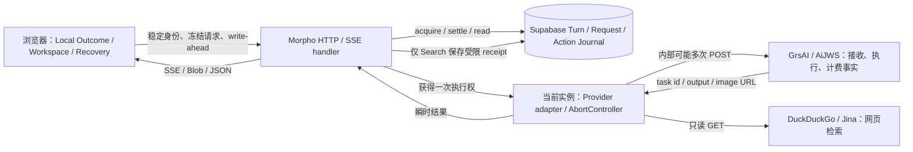

Morpho External Side-Effect & Provider Reliability Architecture Review

审计日期：2026-09-21（Asia/Shanghai）。证据基线：[GitHub main，2e801ed1558822e6cf46a0e19f7ff84654e7ae69](https://github.com/Whatnamed/Morpho/commit/2e801ed1558822e6cf46a0e19f7ff84654e7ae69)。结束前再次查询，main 未移动。

**结论：保留 A+，补齐外部执行与结果交付契约。当前还不能同时保证不重复付费执行、也不丢失已经完成的结果。**

A+ 已经较好地解决浏览器到 Morpho 的重复请求、本地效果去重、恢复描述符和 Local Outcome authority。但 Morpho 到 Provider 的提交没有同等保证：adapter 内部重发 POST，Provider identity 没有持久化，部分成功结果只存在于一次 HTTP/SSE 传输中。现有 canonical 文档明确承认 Image/Summary 丢失后不能重放；这是当前设计的能力边界。与此同时，文档中“幂等外部动作”“不重复 paid call”等表述比实际端到端保证更强。

本报告是调查、架构判断和契约设计，不是 Implementation Plan。没有修改项目代码、canonical 文档、数据库或部署，没有调用付费 Provider。

**证据范围与当前事实图**

通过 gh api 查询远端 main commit、远端 Git tree，并用 git ls-remote 再确认。D:/Morpho 的 HEAD 与其完全相同，工作区审计前后均干净；读取该版本代码，并额外通过 GitHub Contents API 验证 grsProvider.ts 的远端 blob SHA 与本地 Git object 一致。阅读了当前 architecture index、architecture.md、runbook、A+ migration ledger，以及产品规则中连续性、压缩、取消和保留已有结果的约束。

图中没有持久的 Provider task registry，也没有 Image/Text/Compaction 结果交付存储。浏览器重放先经过 Journal，但 adapter 内部的多次 POST 不再经过 acquisition，因此一次 counter/quota reservation 不等于一次 Provider 执行或一笔收费。

| 边界 | 当前真正拥有的事实 | 不能据此宣称的事实 |
|---|---|---|
| Browser / Coordinator / Lifecycle | 本地输入、已保存对象、已应用效果、确认和 Overall Local Outcome | Provider 已取消、没收费，或服务器结果可重取 |
| Server Journal | Morpho admission、身份/hash、顺序、quota/counter、观察到或推导的状态 | 第三方真实接收、账单、跨 Provider exactly-once |
| 当前运行实例 | 当前 fetch、AbortController、内存中的 response/task id、尚未交付的结果 | 重启、多实例、宿主终止后的持久事实 |
| Provider | 自己的任务执行和计费 | 浏览器已经持久保存、产品状态已正确应用 |
| Search receipt | 有界检索输出的 24 小时重交付 | 完整网页档案或无限期检索恢复 |

这一分工应保留。A+ 的冻结请求、稳定子 Action、同身份重放和本地 effect dedupe 都有价值。[当前 authority 与恢复边界](https://github.com/Whatnamed/Morpho/blob/2e801ed1558822e6cf46a0e19f7ff84654e7ae69/docs/architecture/architecture.md#L16-L52)

**必须分开的三类不确定性**

| 类型 | 典型情形 | 能证明什么 | 正确的恢复方向 |
|---|---|---|---|
| submission uncertainty | POST 已发送，连接重置/超时/网关 5xx，未拿到接收确认或 task id | Morpho 不知道是否已接收；不能证明未执行 | 按已验证幂等键重放，或按 client key 查询；两者都没有时保留未知 |
| execution uncertainty | task id 已知，但轮询暂时失败、实例消失或等待期限到达 | 已存在任务，最终执行状态未确认 | 查询同一 Provider task；恢复观察，不再次提交生成 |
| result delivery uncertainty | Provider 成功，输出在下载、settlement、HTTP/SSE 或本地保存途中丢失 | 生成成功与浏览器持久保存是两个事实 | 取得同一结果并重新交付，不重新生成 |

网络异常仅凭异常名称通常无法区分“未发出”与“已接收但响应丢失”。429、500、502、503、504 也不能脱离具体 Provider 契约统一作为“尚未执行”的证明。Provider task 查询的 404 可能涉及可见性延迟、节点或保留期，同样不能自动授权新生成。

**已确认的主要风险**

1. **P1：Provider POST retry 绕过 Journal 的一次执行权保证。**

   文本 adapter 对网络异常，以及 429/500/502/503/504，按 750/2000/4500 ms 退避，最多发送四次 POST /responses。stream 路径最终遇到 502/503/504 后，还会调用 buffered 路径，再进入一组 POST 重试。现有测试直接期待“四次 streaming POST + 一次 buffered POST”；持续网关错误时两组最多八次 POST，且受共同 deadline 约束。这不是八次 Journal acquisition，而是一个 acquired request 内的请求放大。

   更直接的执行不确定性窗口是 SSE 已出现 response.created，甚至已有语义事件，后来流提前结束或 response.failed：OpenAiCompatibleStreamError 会进入 buffered fallback。semanticEventsEmitted 仅作为通知传递，并不是禁止再提交的条件。新 POST 没有复用 Provider response id，也没有执行幂等键。已有 response id 时仍重新生成，是应优先收紧的行为。[文本重试与 fallback](https://github.com/Whatnamed/Morpho/blob/2e801ed1558822e6cf46a0e19f7ff84654e7ae69/src/server/ai/openaiCompatibleProvider.ts#L221-L391)、[现有回归测试](https://github.com/Whatnamed/Morpho/blob/2e801ed1558822e6cf46a0e19f7ff84654e7ae69/src/server/ai/openaiCompatibleProvider.test.ts#L441-L517)

   GrsAI 默认两个 generate attempts；无 fallback 时会对同一地址再次 POST，有多个地址时按 primary/fallback 列表尝试。触发包括非 Abort 的网络错误及 429/502/503/504，500 不在该 adapter 的 HTTP 重试集合。多个 fallback 配置时，实际尝试数跟地址列表走，未必只两次。发送的 body 只有模型、prompt、images、尺寸和 replyType，没有 clientRequestId / Action ID / Provider idempotency key。[GrsAI 发送及重试](https://github.com/Whatnamed/Morpho/blob/2e801ed1558822e6cf46a0e19f7ff84654e7ae69/src/server/image/grsProvider.ts#L67-L181)

   **已证实的是重复提交路径和缺失的幂等契约；没有真实账单证据证明生产已重复扣费。** 一次远端接收后丢响应就足以进入上述风险窗口，不需要复杂多机故障。

2. **P1：成功结果与交付没有形成可恢复链。**

   Image 下载完 Blob 后先 settle externallyCompleted，再发送 Blob。发送失败、响应丢失或浏览器 IndexedDB 保存失败后，相同 Action 的 replay 返回 409 external_action_result_unavailable。生成已经结束，用户仍可能永久拿不到这张结果。

   Compaction 解析和验证 Summary 后也是先 settle completed，再返回 Summary；它不把 Summary 保存于 Journal，完成后的 replay 同样返回 unavailable。文本 providerOutput 在 settlement 前通过 SSE 发出，但 Journal 不存输出；重放只返回状态。如果恢复得到 awaitingNextRequest 却没有对应 Tool payload，Coordinator 明确结束为 payload unavailable，不虚构 Tool，也不再执行 Provider。这是正确的 fail-closed 行为，但不能满足“已付费结果可恢复”的新目标。

   Search 是当前正例：settlement 与受限 receipt 一起落入数据库，再返回客户端，完成后可重交付；上限 32 KiB，最多五条来源，TTL 为 24 小时。它仍存在“已取回检索结果、但数据库尚未提交就崩溃”的窗口，以及 receipt 过期后的明确能力边界。[Image settlement/replay](https://github.com/Whatnamed/Morpho/blob/2e801ed1558822e6cf46a0e19f7ff84654e7ae69/src/app/api/ai/agent/turns/%5BturnId%5D/actions/image/handler.ts#L195-L255)、[Compaction](https://github.com/Whatnamed/Morpho/blob/2e801ed1558822e6cf46a0e19f7ff84654e7ae69/src/app/api/ai/agent/turns/%5BturnId%5D/actions/compaction/handler.ts#L132-L161)、[文本输出与 settlement](https://github.com/Whatnamed/Morpho/blob/2e801ed1558822e6cf46a0e19f7ff84654e7ae69/src/app/api/ai/agent/turns/%5BturnId%5D/requests/handler.ts#L253-L298)、[Search receipt](https://github.com/Whatnamed/Morpho/blob/2e801ed1558822e6cf46a0e19f7ff84654e7ae69/src/app/api/ai/agent/turns/%5BturnId%5D/actions/web-search/handler.ts#L129-L205)

   canonical ledger 本来就声明 Image binary/Summary 不属于 Journal，丢失后不重复 paid call。本次建议改变的是结果恢复契约，不是重新证明浏览器历史真实性。[文档明确的限制](https://github.com/Whatnamed/Morpho/blob/2e801ed1558822e6cf46a0e19f7ff84654e7ae69/docs/architecture/agent-runtime-a-plus-migration.md#L652-L671)

3. **P1：Provider task identity 过晚暴露，且没有持久化 query/resume。**

   GrsAI 已实现 GET /v1/api/result?id=...，但 task id 和 activeBaseUrl 只在当前调用栈中使用。只有 Blob 下载成功的 ok 返回值携带 providerTaskId，随后通过响应 header 交给浏览器保存。任务还在执行、轮询网络错误、下载失败、进程退出时，Journal 没有 task id、节点/账户范围或 result locator 可供下一实例接手。

   当前 profile 固定 replyType=json，虽然 adapter 容忍 pending 响应并轮询，却未主动选择文档支持的 async 模式。12 次轮询、默认 1.5 秒间隔耗尽后直接返回 failed；这只代表停止等待，不能证明 Provider 生成失败。已成功任务的下载错误也归入 failed。[当前 profile](https://github.com/Whatnamed/Morpho/blob/2e801ed1558822e6cf46a0e19f7ff84654e7ae69/src/server/image/profile.ts#L20-L43)、[任务与轮询](https://github.com/Whatnamed/Morpho/blob/2e801ed1558822e6cf46a0e19f7ff84654e7ae69/src/server/image/grsProvider.ts#L213-L325)

   GrsAI 当前文档确认 async、任务 id 和 GET result 可用；已取得的生成/查询 OpenAPI 未声明稳定幂等键、按 clientRequestId 查任务、跨节点去重范围、任务/URL retention 或可靠 cancel 契约。这是“未获得保证”，不是已经证明 Provider 没有这些能力。[GrsAI generate 文档](https://qmy27nhsd9.apifox.cn/452409160e0)、[查询文档](https://qmy27nhsd9.apifox.cn/452409577e0)

4. **P1：确认后生图没有经过 A+ External Action Journal。**

   正式 Agent Tool 的 wrapper 会注入 aPlusExternalAction；而 useWorkspaceConfirmationExecutionController 的 executeVisual 调用没有该字段，因此进入 workspaceVisualGenerationExecution 的 /api/ai/image 分支。该 route 仅做认证、参数检查、quota reservation 和调用 GrsAI，没有 Action acquisition 去重。确认 acknowledgement 保障本地确认语义，不是远端付费执行幂等证明。

   所以不能把 A+ Tool 路径的保证推广到所有生图入口。后续应覆盖付费 effect 本身，保留现有确认 UX。这里没有声称正常点击必然重复生成；确认后刷新或响应丢失没有相同的 durable recovery，是已确认的路径差异。[确认执行](https://github.com/Whatnamed/Morpho/blob/2e801ed1558822e6cf46a0e19f7ff84654e7ae69/src/features/workspace/useWorkspaceConfirmationExecutionController.ts#L220-L243)、[route 分支](https://github.com/Whatnamed/Morpho/blob/2e801ed1558822e6cf46a0e19f7ff84654e7ae69/src/features/workspace/workspaceVisualGenerationExecution.ts#L500-L549)、[独立 image route](https://github.com/Whatnamed/Morpho/blob/2e801ed1558822e6cf46a0e19f7ff84654e7ae69/src/app/api/ai/image/route.ts#L44-L86)

5. **P1/P2：终态混入未知事实，期限收敛会阻断后到的成功证据。**

   running/providerRunning 在 acquisition 时就写入，包括“实例尚未真正发送就退出”的情况；它们只能表示 Morpho 已占用执行权，不能证明 Provider 正在运行。网络异常、输出格式错误、图片下载错误可归入 externallyFailed；AbortSignal 可归入 externallyCancelled。这些状态都不能证明 Provider 未执行或未收费。

   SQL 已用 external_execution_state_unknown 保存部分不确定性，这是正确的谨慎意识；但状态主体仍被收敛为 externally_failed，且终态吸收。晚到的成功 settlement 将遇到 status_conflict。文本/Image/Compaction acquisition 的到期时间是 15 分钟；adapter 的整体 deadline 也是 15 分钟但开始更晚，没有留出 DB settlement 余量。边界附近的真实成功可能来不及结算，是代码和时序推导出的风险，本轮未注入真实数据库故障。

   Search 是两分钟 action deadline；receipt 24 小时。新建 Turn 时还会把超过 24 小时未更新的非终态 Turn 转为 tombstone，并在终态保留 30 天后清理。恢复保证必须声明期限，不能当作无限期账本。[deadline、未知收敛和迟到拒绝](https://github.com/Whatnamed/Morpho/blob/2e801ed1558822e6cf46a0e19f7ff84654e7ae69/supabase/migrations/20260729093000_add_agent_turn_external_actions.sql#L648-L684)、[清理规则](https://github.com/Whatnamed/Morpho/blob/2e801ed1558822e6cf46a0e19f7ff84654e7ae69/supabase/migrations/20260810025000_harden_agent_turn_admission.sql#L75-L123)

6. **P2：取消是实例内 best-effort；传输与执行生命周期并未完全解耦。**

   文本执行注册在模块级 Map<string, AbortController>。显式 cancel endpoint 读 Journal 后查该 Map，返回 accepted 和 observed；另一实例或另一 route bundle 不保证拥有同一 Map，取消意图没有持久写入。浏览器未读取 observed，随后停止本地流消费并查询 Journal。即使命中 Map，也只证明 abort 已发给本机 fetch，不证明第三方停止计算或停止收费。

   文本 SSE 的 cancel() 只停止显示，且不把 request.signal 传给 Provider，方向正确；但执行仍在 ReadableStream.start 内的异步任务中，没有 durable worker、任务接手或持久结果。Image/Search/Compaction 则直接传 request.signal。宿主是否传播断开、何时回收实例、有没有 cancel opt-in，会影响实际行为。因此不能把本地 SSE detach 测试当作 Vercel 上任务必然继续完成的证据。[实例级取消](https://github.com/Whatnamed/Morpho/blob/2e801ed1558822e6cf46a0e19f7ff84654e7ae69/src/server/ai/agentTurnExternalCancellation.ts)、[SSE 生命周期](https://github.com/Whatnamed/Morpho/blob/2e801ed1558822e6cf46a0e19f7ff84654e7ae69/src/app/api/ai/agent/turns/%5BturnId%5D/requests/handler.ts#L215-L336)

7. **P1：正式宿主与代码入口限制没有形成一个一致 contract。**

   A+ 通用入口和独立 image/chat 接受 36 MiB；A+ image 允许单张 data URL 8 MiB、合计 24 MiB。Vercel 当前官方文档列出的函数请求体上限仍为 4.5 MB。因此一部分应用允许的请求会在 handler 和 Journal acquisition 之前就被宿主拒绝。Base64 膨胀与其他 JSON 字段也必须计算。Compaction 的 4 MiB、Search 的 16 KiB 自身则低于该上限。[应用入口](https://github.com/Whatnamed/Morpho/blob/2e801ed1558822e6cf46a0e19f7ff84654e7ae69/src/server/ai/agentTurnRouteSupport.ts#L11-L18)、[Vercel Limits](https://vercel.com/docs/functions/limitations#request-body-size)

   代码统一 Provider budget 为 900 秒，route 未声明 maxDuration，仓库没有 vercel.json/vercel.ts。官方 Fluid Compute 默认 300 秒；Pro/Enterprise 一般最大 800 秒，当前还有满足条件的 1800 秒 beta，不能再简单说 Vercel 一定不支持 15 分钟。但代码没有建立所需部署 contract，实际套餐、控制台设置、runtime 和生产 deployment 未验证。增加时长本身也不能修复 response-loss 或重复 POST。[代码 deadline](https://github.com/Whatnamed/Morpho/blob/2e801ed1558822e6cf46a0e19f7ff84654e7ae69/src/server/ai/providerResponseBoundary.ts#L1-L8)、[Vercel duration](https://vercel.com/docs/functions/configuring-functions/duration)

   download helper 允许 16 MiB 图像；响应侧是否实际使用 Vercel streaming 豁免，需要宿主验证，不能仅凭 new Response(blob) 断言所有大结果必然失败。更可靠的交付 contract 是认证后的结果引用/下载能力，避免长生成任务与一次大 Blob 响应绑在一起。

   Vercel 的 request cancellation 需要按路径 opt-in；当前仓库未配置 supportsCancellation。after()/waitUntil 可延长本次 invocation 的清理时间，但仍受函数 deadline 约束，不构成跨实例持久执行。[取消语义](https://vercel.com/docs/functions/functions-api-reference#cancel-requests)、[waitUntil 生命周期](https://vercel.com/docs/functions/functions-api-reference/vercel-functions-package#waituntil)

**身份到底在哪层生效**

| 身份 | 当前用途 | 外部执行保证 |
|---|---|---|
| creationIdempotencyKey | 同一用户/本地项目的 Server Turn creation 去重 | 不发给 Provider |
| serverTurnId + requestId + stepSequence + requestHash | Request acquisition、顺序、重放校验 | 一次 route execution grant，不限制 adapter 内 POST 数 |
| Action ID + actionHash + kind + claim binding | External Action acquisition、quota/counter、同身份 replay | 不等于 Provider idempotency |
| clientRequestId / operationId | 浏览器图像对象和 Operation 去重、请求元数据、部分 hash/header | GrsAI generate body 不包含这些字段 |
| GrsAI providerTaskId | 当前调用栈轮询；成功响应后浏览器记录 | 没有持久 task registry 或跨调用 resume |
| 文本 responseId | adapter/stream parser 中观察到 | 没有持久记录、GET retrieve 或 stream resume |
| prompt_cache_key | 可选性能提示 | 不能证明去重、执行一次、收费一次或结果可取 |

还有两个应纳入边界的事实：Image/Compaction replay 会先重建当前 config/hash，模型、prompt contract 或 endpoint 配置变化可以使旧身份出现 hash conflict；专门的只读 query/redelivery 不应依赖重建新请求。Text requestHash 没有记录 baseUrl/account scope，未来接入 Provider identity 时必须补充明确的 namespace，而非假定模型名足以定位执行。

Text Request settlement 已通过 service-role-only verified-authority wrapper。External Action settlement 当前仍由用户 Supabase client 调用、SQL grant 给 authenticated，且函数接收 p_status/resultReceipt。它有用户/Turn/hash 绑定，但不是仅可信执行器可以提交的 Provider 证据通道。不能把这种 receipt 升格为不可伪造的 Provider 收据；未来结果 escrow/Provider observation 应使用可信写入边界。这是本次源码发现的 authority 限制，未做线上绕过测试，也不据此重审整个 Runtime。[External Action RPC 边界](https://github.com/Whatnamed/Morpho/blob/2e801ed1558822e6cf46a0e19f7ff84654e7ae69/supabase/migrations/20260729093000_add_agent_turn_external_actions.sql#L576-L728)、[后续仅保护 Text settlement 的 migration](https://github.com/Whatnamed/Morpho/blob/2e801ed1558822e6cf46a0e19f7ff84654e7ae69/supabase/migrations/20260812090000_harden_agent_tool_claim_settlement_boundary.sql)

**当前 retry 的判定**

| 动作 | 判定 | 适用条件或限制 |
|---|---|---|
| 同一 Morpho Request/Action 的 exact replay | 可保留 | Journal 已存在时不再 grant；若尚未 acquire，可能执行首次工作，所以并非字面纯 GET |
| 同一 settlement 的有界重试 | 安全方向 | 重试相同状态/receipt，不重发 Provider；原子提交及身份校验仍必需 |
| Journal 状态查询、已知 task id 的结果查询 | 安全方向 | 查询本身不能重新创建任务；Provider 状态/可见性契约需核实 |
| 同一结果 URL 的下载重试 | 不重复生成 | 保持安全下载校验、有效期和完整性验证 |
| GrsAI POST 网络错误/429/网关错误后切节点重发 | 无安全保证 | 不知道第一次是否已接收，未验证共享去重命名空间 |
| 文本/Compaction POST 网络错误/5xx 后重发 | 无安全保证 | 可能重复推理和计费；次数上限只限制损失大小 |
| 文本 SSE 中断后 buffered fallback | 高风险 | 第二次生成，不是取得第一次输出 |
| 明确 unsupported-field 400 后去掉 cache hint | 有条件可接受 | 必须是执行前拒绝；当前匹配还包含 generic unknown field 等，不能仅凭宽泛诊断视为证明 |
| 自有 Search 的 DDG/Jina GET 重取 | 可使用较宽松策略 | 读操作无生成副作用；仍有速率、时间、来源变化及未来计费成本 |
| 换 request/action/client ID 再来一次 | 新操作 | 不能叫恢复；涉及付费时需要明确的再次执行意图 |

**建议的最小可靠性模型**

保留 Local Outcome / Server External Status / Recovery authority separation。新增或扩展的仅是每个外部付费 effect 的执行证据和交付能力，不需要 server 重建 Workspace，也不需要通用 workflow graph。

一个稳定逻辑 effect 应关联冻结的 request fingerprint、Provider account/endpoint namespace、能力版本、提交尝试记录、已知 Provider task/response id，以及独立结果引用。现有 Action 可承担逻辑 effect 身份，但普通文本 Request 和确认后生图也必须被这个边界覆盖。不能把每次 HTTP attempt 当作新业务意图；也不能把 prompt 相同的两次主动生成误去重成一次。

不要再用单个 failed/cancelled/completed 同时表达三个轴。可以使用小的内部事实组合，而非构造一套复杂工作流状态机：

| 事实轴 | 最低需要区分的事实 | 更新依据 |
|---|---|---|
| submission | 尚未提交、提交中、确认已接收、是否接收未知、明确拒绝 | 可信执行器的发送记录与 Provider 接收证据 |
| execution observation | 未知、Provider 报告 queued/running、Provider 确认 succeeded/failed/cancelled | task 查询、可信响应或可验证 callback；附 observation 时间 |
| delivery | 结果尚未保留、可重取/已托管、客户端持久保存已确认、已过期/明确丢失 | 存储和交付事实；不改变 Provider 执行结论 |
| cancellation intent | 用户请求停止、执行器已观察、Provider 是否确认 | 意图和事实分开；与最终结果允许竞态 |

用户界面继续使用产品语言，例如“结果仍在确认”“已生成，正在取回”“已停止等待”。这些内部状态不应成为模型控制台。客户端 ACK 只证明该客户端声称已保存，可用于交付和清理策略；不升格为真实 Workspace 内容或 Overall Outcome 的服务端证明。收费状态默认 unknown，只有 Provider 账单/收据才能变为已收费或已退款；本轮不建议建设通用计费系统。

**Provider idempotency、task identity 与 query/resume**

稳定幂等键必须由服务端绑定到用户、逻辑 effect、Provider namespace 和冻结请求 hash，并在首次网络提交前持久保存。需要向 Provider 明确核实：是否原子去重并发请求、重复请求是否返回同一 task/result、收费是否去重、payload 不同是否冲突、键保留多久、primary/fallback 是否共享同一账户与去重域。仅增加一个 Provider 不识别的 Idempotency-Key header 没有作用。

若这些保证成立，在其有效窗口内可以重新提交同一 key 和 payload，从而取得同一任务。跨供应商/跨去重域的 failover 仍是新执行，不能用相同字符串假装共享幂等。若 key 已过期，不能默默以相同 ID 再提交。

拿到 task id 后应立即持久化 task id、Provider scope、取得时间和可查询能力，再进入轮询或下载。GrsAI 可以优先使用已文档化的 async 模式，把长执行交给 Provider，Morpho 通过短调用观察同一 task。实例退出后下一实例恢复查询，浏览器回连只订阅/查询该逻辑 effect。任一时刻只需要一个有界执行所有者或短租约，防止多个 observer 重复交付/结算；租约失效只允许接手观察，不授权无幂等保证的第二次 submit。

async 不消除第一次 task-id 响应丢失的窗口。若 Provider 无法按 client key 查回这个 id，仍然是 submission_unknown。建议把 submit、query、download、redeliver 四种能力分开建模；不能让“恢复”默认调用 generate。纯 query/redelivery 应直接查已保存记录，不要求用当前部署的 prompt/model/config 重建旧请求。

超时也应分开：提交响应期限、Provider 任务观察期限、每次宿主 invocation 期限、下载期限、结果保留期限。实例执行预算必须包含认证、DB、下载和 settlement 余量；不能把 Provider 的 15 分钟 budget 与从 acquisition 开始计时的 15 分钟 Journal expiry 视为同一时钟。超出等待期限转为需要 reconciliation 的未知事实，不作为 Provider 失败证据，也不释放重新生成权限。

晚到的 Provider 成功可以更新外部观察和提供可取回结果，同时保持用户已取消的本地 Outcome；不应自动继续后续 Tool、改写选择或开启新付费操作。真正的 Provider terminal 与“本机停止等待”的 administrative closure 应有区别。

**结果保留与 redelivery**

建议引入用途受限的 execution result escrow：它只暂存这次执行产生的结果，供同一身份重新取得，不是项目云存储，不是新的 Workspace/Memory authority。它是对当前“不存 Image/Summary payload”契约的明确演进，必须规定访问控制、容量、retention、删除与交付期限，不能悄悄改变隐私承诺。

Image 结果包含可信 Provider task/locator、下载并验证后的私有对象引用、mime/大小/content hash 和 resultVersion。拿到 Provider URL 后立即保存关联信息；如果 URL 会过期，应在有效期内把结果复制到受控暂存。不能把易过期的 URL 当作永久资产。若结果对象已写入但 Journal 绑定失败，使用稳定对象键/hash 重新绑定同一个结果；不重新生成。Journal 的可交付状态必须指向真实存在的结果。

Text 结果保存最小完整最终 envelope：outputText、规范化 tool calls、request identity 和结果版本；无需把所有 reasoning/SSE 事件永久存储。streamActivity 可继续是瞬时显示，最终 providerOutput/Tool batch 应可按同一 identity 重取。先持久保存结果及必要的 Tool claim，再发布最终可交付状态；浏览器重取后依靠现有稳定 effect IDs 继续/去重，不能因 redelivery 再执行已落地的本地操作。

Compaction 暂存已经校验的 Summary 与原始 source-boundary fingerprint、expected previous revision。重交付同一 Summary；应用时仍执行当前已有的源范围和 revision 检查。若本地 source/base 已变，拒绝应用旧结果，这属于本地适用性问题，不是 Provider 生成失败，也不能自动开始另一笔付费压缩。

客户端完成资产保存/本地写入后，可用 request/action identity + resultVersion/hash 进行幂等 ACK。ACK 丢失只导致再次交付相同结果，不能导致重新生成；server delivery 与 Local Outcome 分开。未 ACK 的结果不能仅因 HTTP send 成功就提前删除。保留窗口、任务查询窗口、Provider 幂等键窗口和本地 recovery 窗口必须协调，并向用户诚实声明边界。

只加 escrow 仍不能解决“Provider 已完成但结果从未到达 Morpho”的窗口；这一段需要 Provider retrieve/回调或 Provider 侧持久任务能力。暂存写入、索引绑定和本地 ACK 也不能与外部收费做一个数据库事务，因此需要基于稳定身份的重复查询/重交付，而不是宣称一笔跨系统事务。

**取消的现实保证**

持久记录 cancelRequested，由持有者及后续接手观察者读取；不要依赖某个 route 的内存 Map。提交前观察到取消，可以保证不再提交。提交后，若 Provider 支持可靠 cancel，就请求取消并记录其确认；若不支持，只能停止后续新操作或停止等待，继续保留已完成结果的取回能力。取消请求与成功到达可以并存，先后以证据记录，不能让取消丢弃已付费结果。

用户停止浏览器显示、Morpho 停止 fetch、Provider 确认取消、Provider 退款是四件事。即使可靠取消也未必退款。可以继续保留 Map 作为同实例加速，但它不是取消 authority。after()/waitUntil 仅用于本次 invocation 的有界收尾，不能替代持久记录和 Provider query。

**不同动作需要不同策略**

| 动作 | 当前恢复能力 | 建议策略与原因 |
|---|---|---|
| Image（含确认后生成） | Action replay 防重，但无持久 task/result；确认路径连该 Journal 也未覆盖 | 最严格：不对模糊提交自动重发；async task + 立即登记 + 同 task 查询 + 结果暂存和 ACK。一次随机图像重生成不是原结果 |
| 普通文本 Provider Request | 可查状态；最终输出与 Tool payload 不可重取；adapter 有自动重 POST | 默认不把流中断当作再生成许可；暂存最终 envelope。若产品选择低成本再生成，应明确标为新 attempt，禁止把两次 Tool batch 混在一起 |
| Compaction | 精确输入/源范围恢复好；Summary 完成后不可重取 | 优先重交付原 Summary，保留原始聊天。重新压缩是可能再次计费、且 Summary 可能不同的新执行；可以使用更宽松、但明确限额的产品策略 |
| 当前自有 Search | DDG/Jina GET；受限 receipt 24h；部分失败计数可保留 | 保留 receipt。丢失或过期后可允许有界重新检索，但应标明来源时间变化，不能把它伪装成原快照 |
| Provider 托管 Search | 独立 chat 路径可暴露 web_search_preview；正式 A+ 使用自有 Search Tool | 托管 Search 的成本/重试属于所属文本 Provider Request，不能套用 DDG GET 的“只读且无生成”判断 |

当前 Search 请求最多三个 query，并并行取得最多五个来源的 excerpt，默认 query/source timeout 分别为 8/5 秒。所有来源失败时仍可能返回含失败计数的空 receipt；completed 表示本次检索过程结束，不表示证据充分。这种 bounded partial result 语义可以保留。[实际 Search 实现](https://github.com/Whatnamed/Morpho/blob/2e801ed1558822e6cf46a0e19f7ff84654e7ae69/src/server/ai/webSearch.ts#L22-L99)

**Provider 能力不足时的选择与 trade-off**

| 已验证的 Provider 能力 | 可以承诺的恢复 | 代价或剩余窗口 |
|---|---|---|
| 稳定幂等键 + 按 key/task retrieve + 明确保留期 | 窗口内同一次逻辑执行的安全重试、查询和结果重交付 | 依赖 Provider 契约和可用性；结果仍应进入自有 escrow |
| 仅 task id 查询 | id 已保存后可恢复执行观察和取结果 | 首次接收确认/id 丢失仍未知；async 只缩小窗口，不消灭它 |
| 有可验证 callback、但无按 key 查询 | callback 可补回一部分响应丢失 | 必须能关联预先持久身份、校验来源、去重和处理乱序；不能假定当前 GrsAI 新接口已提供 |
| 无幂等、无可靠 retrieve | 不对未知提交自动重发，可保证恢复机制不主动重复提交 | 不能保证最终有结果。需要 Provider 侧人工对账/补取/退款，或让用户明确选择可能再次收费的重新生成 |
| 换用有强契约的 Provider | 可建立更强产品保证 | 成本、质量、延迟、隐私和迁移影响；不是本轮默认要求更换 |
| 独立常驻代理或 durable worker | 减少浏览器断开/serverless 回收造成的失联，集中保存响应 | 增加运维成本，仍无法消除代理到 Provider 的最后一跳响应丢失 |

没有可靠身份的 Provider 不能通过再加一层 outbox、queue、数据库锁或 workflow engine 被“包装”为 exactly-once。无响应时，世界 A（未收到）和世界 B（已执行收费，响应丢失）对 Morpho 可能完全一样；自动重新提交在 B 会重复，不提交在 A 无法推进。在缺少新的 Provider 证据时，两种保证不可同时无条件成立。

AiJWS 的实际接入由当前代码和配置契约确认，但本轮未取得可验证的官方幂等/保存 response/GET retrieve/cancel/relay 内部 retry 契约。不能把“OpenAI-compatible Responses”当作完整继承 OpenAI 的后台任务或取回能力，也不能推断 relay 自己没有重试。需要以具体 relay 的承诺和非生产契约验证建立能力档案。

**近期与未来的边界**

近期应解决的是影响现有付费行为的缺失契约：不确定提交后的自动 POST/fallback；所有付费图像入口的稳定身份；Provider task id 与结果持久关联；Image/Text/Compaction 的结果重交付；unknown、confirmed failure 与 delivery failure 的区分；宿主 body/duration 与应用边界；以及结果记录的可信写入权限。这些是明确的架构缺口，不需要等到多租户规模或长期离线任务出现。

近期的 Provider 能力确认应围绕实际 GrsAI/AiJWS，而非假设它们具备幂等：key 的执行/计费去重、按 client key 查询、task 与 URL retention、跨节点范围、取消语义、relay 自身重试。若没有保证，默认采用“未知不自动重发 + 原任务查询/人工对账 + 明确的新执行”策略，接受其可用性 trade-off。

仅在以下 trigger 出现时扩大架构：需要用户离线期间持续回收即将过期结果，才引入专用轮询/回收 worker；Provider 执行持续超出单 invocation 预算，才把提交与观察彻底分离到后台；Provider 提供可靠 callback，才加入最小 webhook inbox；并发/多区域带来争抢，再增加 fencing/所有者租约；要求精确成本对账或退款闭环，再建设 attempt 到账单的关联。无需现在引入通用 workflow engine、第三方 Agent framework 或重写 A+。

**已验证与未验证**

- 已验证：当前远端 commit、源码调用路径、canonical 契约、SQL 定义和 grant、Provider POST/request shape、结果 replay 行为、GrsAI 公开 API schema、Vercel 当前公开限制。
- 已执行：14 个相关 Vitest 文件，235 个测试全部通过（第一组 12 文件/196 tests；确认和图像执行两文件/39 tests）。覆盖 adapter retry/fallback、Journal replay、settlement retry、SSE detach/cancel、Image/Summary unavailable、客户端恢复与确认生成。它们使用 mock/fake，不是付费 Provider 或真实 Supabase 并发事务测试。
- 已确认风险路径，但未确认生产事故：重复提交可能重复计费；已完成结果可能丢失；跨实例取消可能未到达；Vercel 截断可能先于应用 deadline。没有实际重复扣费账单或生产故障注入证据。
- 未验证：当前生产部署是不是该 main、Vercel 套餐/Fluid/控制台配置、生产 Supabase schema/grants 的现状、Provider 私有 SLA/计费/幂等/retention、真实多实例取消和大 Blob 交付。仓库中的历史 rollout 记录没有被当作本轮线上验证。
- 无项目改动，所以未额外运行 lint/typecheck/build 或全量 A+ 审计。本轮产物仅在 automation 目录；未执行 migration、commit、push、发布或付费调用。

复核命令包括 gh api repos/Whatnamed/Morpho/commits/main、远端 git tree/contents API、git ls-remote、git rev-parse、git status、定向 rg/Get-Content，以及 npx.cmd --no-install vitest run 对所列 14 文件的测试。测试原始结果：[196 tests](C:/Users/hasee/.codex/automations/1/audit-2026-09-21/tests.json)、[39 tests](C:/Users/hasee/.codex/automations/1/audit-2026-09-21/confirmation-tests.json)。GrsAI OpenAPI 原文快照：[generate](C:/Users/hasee/.codex/automations/1/audit-2026-09-21/grs-generate.md)、[nano](C:/Users/hasee/.codex/automations/1/audit-2026-09-21/grs-nano.md)、[result](C:/Users/hasee/.codex/automations/1/audit-2026-09-21/grs-result.md)。

**对核心问题的回答**

Morpho 应把“重新提交生成”与“查询同一次执行、重新交付同一结果”严格分开：恢复默认只做后两者；只有 Provider 的稳定幂等契约或明确的未接收证据，才能授权自动重发。已取得的任务身份立即持久保存，成功结果在明确的保留窗口内可重复取得，客户端以已有稳定 effect IDs 幂等保存/应用，ACK 丢失不触发重新生成。

在 Provider 支持可靠幂等与结果取回、且各保留窗口和宿主契约满足的条件下，可以实现这两个目标。在能力缺失的 Provider 上，必须诚实保留未知状态和显式取舍；任何宣称仅靠 Morpho 恢复机制就能无条件同时做到的方案，都超出了现有证据与系统可实现边界。
